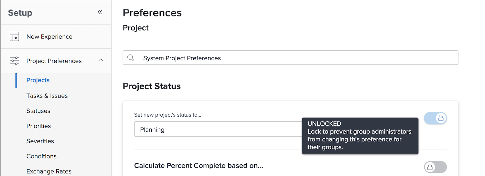
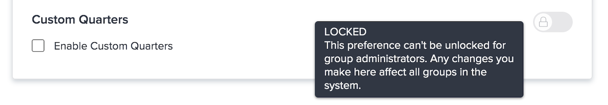

# Algemene standaardprojectinstellingen configureren

<!---
21.4 updates have been made
--->

In deze video leert u hoe u:

* Een aangepaste status wijzigen
* Algemene projectvoorkeuren instellen
* Planningen maken en gebruiken

>[!VIDEO](https://video.tv.adobe.com/v/335065/?quality=12&learn=on)

## Globale en groepsproject-, taak- en uitgaven-instellingen

Wanneer u het dialoogvenster [!UICONTROL Projects] instellingen in [!DNL Workfront]wordt de tekst &quot;[!UICONTROL System Project Preferences]&quot; in de zoekbalk boven in het venster. Dit laat u weten deze montages iedereen in uw [!DNL Workfront] systeem — het is een globale configuratie.

![[!UICONTROL Project Preferences] pagina in [!UICONTROL Setup]](assets/admin-fund-system-project-preferences-1.png)

Wanneer u het dialoogvenster [!UICONTROL Tasks & Issues] instellingen.

![[!UICONTROL Task & Issue Preferences] in [!UICONTROL Setup]](assets/admin-fund-task-issue-preferences-2.png)

Het is echter mogelijk dat niet elke groep in [!DNL Workfront] heeft hetzelfde project, dezelfde taak en dezelfde voorkeuren voor uitgaven nodig. Bijvoorbeeld, wil de marketing groep de status van een nieuw project plant terwijl de groep van de projectmanager de status van het Verzoek verkiest.

[!DNL Workfront] staat groepsbeheerders toe om bepaalde project, taak, en uitgevervoorkeur voor hun groepen aan te passen. Welke voorkeuren kunnen worden aangepast, wordt bepaald door [!DNL Workfront] systeembeheerder die de schakelaar van het slot/van het ontgrendelen gebruikt.

Begin door naar de [!UICONTROL Setup] gebied:

1. Selecteren **[!UICONTROL Setup]** in de **[!UICONTROL Main Menu]**.
1. Uitbreiden **[!UICONTROL Project Preferences]** in het linkermenu.
1. Selecteren **[!UICONTROL Projects]** of **[!UICONTROL Tasks & Issues]**, afhankelijk van de instellingen die u wilt wijzigen.

Vergrendel een voorkeur om te voorkomen dat groepsbeheerders die instelling voor hun groep aanpassen.

Ontgrendel de voorkeur om het voor groepsbeheerders ter beschikking te stellen om aan te passen.

Sommige instellingen kunnen niet worden ontgrendeld en blijven algemene systeeminstellingen.

### Voorkeuren voor groepen en subgroepen instellen

Voor instellingen die door de systeembeheerder zijn ontgrendeld, kunnen de groepbeheerders aanpassingen aanbrengen voor de groep(en) die zij beheren en voor subgroepen die onder die groepen zijn genest. Bovendien kunnen groepsbeheerders bepalen welke instellingen hun subgroepbeheerders kunnen wijzigen.

1. Selecteren **[!UICONTROL Setup]** in de **[!UICONTROL Main Menu]**.
1. Klikken **[!DNL Groups]** in het linkermenu.
1. Klik op de naam van de groep of subgroep om deze te openen.
1. Selecteren **[!UICONTROL Project Preferences]** of **[!UICONTROL Tasks & Issues Preferences]** in het linkermenu.
1. Breng de benodigde wijzigingen aan voor elk van de ontgrendelde voorkeuren.
1. Selecteren **[!UICONTROL Save]**.

![[!UICONTROL Project Status] sectie over [!UICONTROL Group] page](assets/admin-fund-group-preferences.png)

Als uw organisatie geen groepsbeheerders gebruikt, kan de systeembeheerder de voorkeursinstellingen voor de verschillende groepen beheren.

<!---
learn more URLs and guides
Create or edit a group status 
Group administrators 
Configure system-wide project preferences 
Configure project preferences for a group 
Configure task and issue preferences for a group 
Create and modify a group’s schedule 
--->
