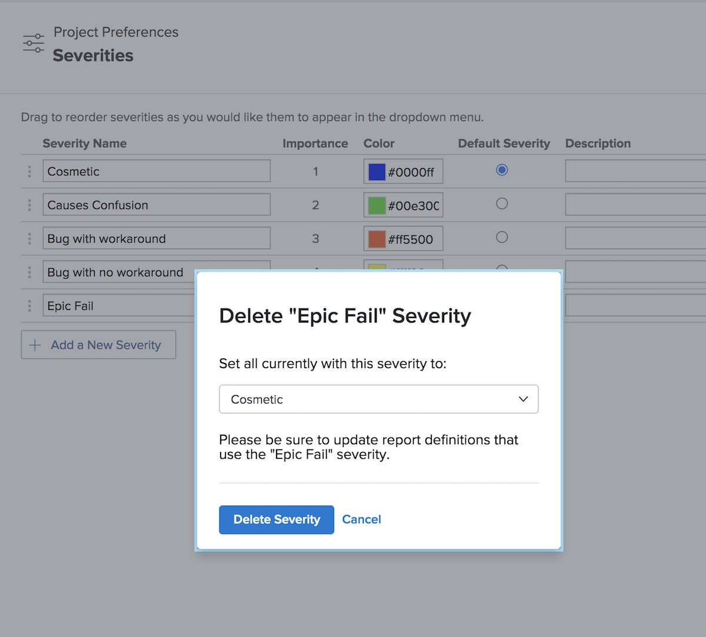

# Uitgiftesegmenten maken en beheren

## Inleiding tot het uitgeven van ernstmogelijkheden

Een strengheid kan worden gebruikt om aan te geven hoe ernstig een probleem is of hoe het het werk dat wordt uitgevoerd kan beïnvloeden.

![[!UICONTROL Severity] menu in het [!UICONTROL Issue Details] venster ](assets/admin-fund-severity-issue-details.png)

Het veld [!UICONTROL Severity] kan worden geopend in [!UICONTROL Issue Details] . Het kan ook in kolommeningen op lijsten en in douanerapporten worden omvat.

[!DNL Workfront] heeft vijf standaardwaarden:

* [!UICONTROL Cosmetic]
* [!UICONTROL Causes Confusion]
* [!UICONTROL Bug with workaround]
* [!UICONTROL Bug with no workaround]
* [!UICONTROL Fatal error]

Systeembeheerders kunnen deze standaardbestandsnamen wijzigen of nieuwe bestandsnamen maken.

Ernsten zijn alleen beschikbaar voor problemen in [!DNL Workfront] .

## Uitgiftesegmenten maken en beheren

Als systeembeheerder, kunt u nieuwe controles tot stand brengen, indien nodig, om het werkschema van de kwestie te voltooien.

![[!UICONTROL Severities] pagina in [!UICONTROL Setup]](assets/admin-fund-severity-section.png)

1. Klik op **[!UICONTROL Setup]** in de **[!UICONTROL Main Menu]** .
1. Vouw de sectie **[!UICONTROL Project Preferences]** in het linkermenu uit.
1. Selecteer **[!UICONTROL Severities]** .
1. Klik op **[!UICONTROL Add a New Severity]**.
1. Geef de ernst een naam die overeenkomt met het beoogde gebruik.
1. Het **[!UICONTROL Importance]** -getal komt overeen met de ernst van het probleem. Het hoogste getal komt overeen met de hoogste ernst. Het [!UICONTROL Importance] -nummer moet uniek zijn.
1. Selecteer een kleur voor uw prioriteit. Dit wordt gebruikt in grafiekrapporten en andere plaatsen in [!DNL Workfront].
1. Wijs een van de ernstopties aan als de **[!UICONTROL Default Severity]** . Dit wordt automatisch toegepast op alle nieuwe uitgaven in Workfront.
1. Voeg een beschrijving toe van de ernst, zoals de manier waarop het wordt gebruikt.
1. Klik buiten de velden om op te slaan.

![[!UICONTROL Severities] list ](assets/admin-fund-severity-new.png)

### De ernst wijzigen

Als een ernst niet meer relevant wordt voor uw uitgifteworkflows, kunt u deze hernoemen, verbergen of verwijderen.

Als een ernst niet meer nodig is, raadt [!DNL Workfront] u aan de ernst te verbergen (klik op het vak [!UICONTROL Hide] naast de ernst in het instellingsgebied). Hierdoor wordt de optie voor de ernst van de uitgave verwijderd uit het keuzemenu, maar blijft de ernst van de historische gegevens behouden, zodat deze nog steeds beschikbaar zijn voor rapportagedoeleinden.

![[!UICONTROL Hide] kolom gemarkeerd op [!UICONTROL Severities] pagina in [!UICONTROL Setup]](assets/admin-fund-severity-hide.png)

[!DNL Workfront] adviseert dat u **niet** een strengheid schrapt die op vroegere kwesties is gebruikt. Wanneer u een ernst verwijdert, wordt u gevraagd een andere ernst te vervangen. Dit kan historische gegevens veranderen en rapportering beïnvloeden.

<!---
learn more URLs
Create and customize issue severities
Update issue severity
--->
