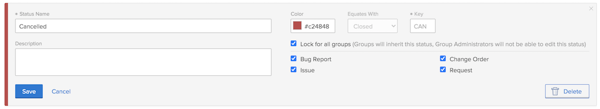
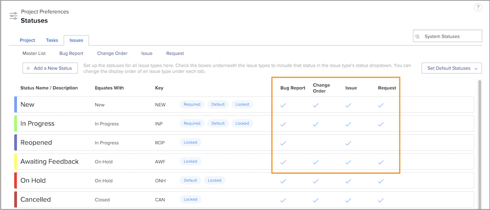

# Statussen voor het hele systeem aanpassen

[!DNL Workfront] biedt diverse standaardinstellingen voor de workflows voor het beheer van problemen van uw organisatie. Deze statussen kunnen worden hernoemd om de terminologie van uw organisatie aan te passen. En statussen kunnen worden toegewezen aan specifieke typen uitgaven.

Indien nodig kunnen aanvullende statussen worden gemaakt. Alleen systeembeheerders kunnen systeembrede statussen maken. Bovendien controleren de systeembeheerders welke statussen door groepsbeheerders kunnen worden uitgegeven.

![[!UICONTROL Issues] tab on [!UICONTROL Statues] pagina in [!UICONTROL Setup]](assets/admin-fund-all-issue-statuses.png)

## Bestaande statussen wijzigen

[!DNL Workfront] beveelt een minimumaantal statussen aan. Hierdoor wordt het gemakkelijker om de juiste status te kiezen voor gebruikers en wordt een kortere lijst met statussen gemaakt die moeten worden onderhouden.

U kunt een bestaande status bewerken om de naam, de typen uitgaven waaraan de status is toegewezen, de gerelateerde kleur enzovoort te wijzigen.

![Statuslijst van afgifte met [!UICONTROL Edit] optie gemarkeerd](assets/admin-fund-edit-issue-status.png)

1. Klikken **[!UICONTROL Setup]** in de **[!UICONTROL Main Menu]**.
1. Breid uit **[!UICONTROL Project Preferences]** in het linkerdeelvenster van het menu.
1. Selecteren **[!UICONTROL Statuses]**.
1. Selecteer **[!UICONTROL Issues]** en zorg ervoor [!UICONTROL System Statuses] in de rechterbovenhoek.
1. Selecteren **[!UICONTROL Master List]** om de statussen voor alle emissietypen te zien. Hier maakt of wijzigt u de status van een uitgave.
1. Houd de cursor boven de rechterkant van de status waarvan u de naam wilt wijzigen en klik op **[!UICONTROL Edit]**.
1. Geef de status een nieuwe naam of wijzig desgewenst een van de andere gegevens.
1. Vergrendel de status als deze instellingen op alle gebruikers in uw [!DNL Workfront] -instantie.
1. Ontgrendel de status zodat groepsbeheerders de status alleen voor hun groepen kunnen bewerken.
1. Schakel de selectievakjes in voor het type uitgave waarop de status moet worden toegepast.
1. Klik op **[!UICONTROL Save]**.

### Statustoewijzingen

Niet alle statussen kunnen aan alle emissietypen worden toegewezen. De [!UICONTROL Statuses] pagina bevat kolommen waarin wordt aangegeven voor welk type uitgave elke status kan worden gebruikt.

Als u alleen de statussen wilt zien die aan een specifiek type uitgave zijn toegewezen, klikt u op de naam van het type uitgave boven aan het venster.

![[!UICONTROL Issue] tabblad van [!UICONTROL Status] pagina met gemarkeerde kolommen](assets/admin-fund-statuses-issue-type.png)

Van hieruit kunt u de problemen naar de gewenste volgorde slepen in de [!UICONTROL Status] vervolgkeuzemenu.

Als u de status wilt bewerken, moet u teruggaan naar de [!UICONTROL Master List].
