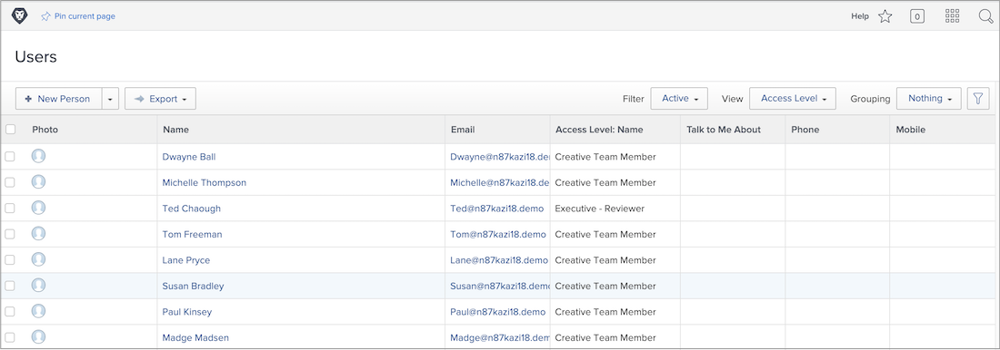

# Gebruikers bulksgewijs toevoegen

Het toevoegen van gebruikers één voor één kan tijdrovend en overweldigend zijn. [!DNL Workfront] staat een systeembeheerder toe om veelvoudige gebruikers tezelfdertijd toe te voegen gebruikend de de invoereigenschap.

![[!UICONTROL Import People] menuoptie](assets/admin-fund-adding-users-5.png)

1. Selecteren **[!UICONTROL Users]** van de [!UICONTROL Main Menu].
1. Selecteer de pijl op de **[!UICONTROL New Person]** en selecteert u **[!UICONTROL Import People]**.
1. Het venster dat opent, begeleidt u door het creëren van een spreadsheet van de gebruikers om in te voeren.
1. Download het voorbeeldbestand, dat een [!DNL Excel] spreadsheet.
1. Werk het spreadsheet met gebruikersinformatie (voornaam, achternaam, e-mailadres, toegangsniveau) bij volgens de instructies in het dossier zelf.
1. Selecteer **[!UICONTROL Choose File]** zodra de gebruikerslijst is opgeslagen.
1. Navigeer naar het spreadsheetbestand van de gebruiker en selecteer het.

De geïmporteerde gebruikers worden weergegeven in de [!UICONTROL Users] lijst. Bewerk indien nodig de informatie over individuele of meerdere gebruikers.

## Gebruikers importeren: De start gebruiken

[!DNL Workfront] verstrekt een schopstartmalplaatje om gegevens in het systeem in te voeren. Deze kan ook worden gebruikt voor het importeren van gebruikers. Voordat u de start gebruikt, [!DNL Workfront] raadt u aan samen te werken met uw [!DNL Workfront] adviseur, aangezien er overwegingen zijn zou u op de hoogte moeten zijn van.

<!---
paragraph below needs URL to article
--->

Zie Gegevens importeren in Workfront via Kick-Start voor meer informatie.

![[!UICONTROL Import Data] ([!UICONTROL Kick-Starts]) venster in [!UICONTROL Setup] gebied](assets/admin-fund-adding-users-8.png)

<!--
Learn more URLs
Import users
Import data into Workfront via Kick-Starts
-->
