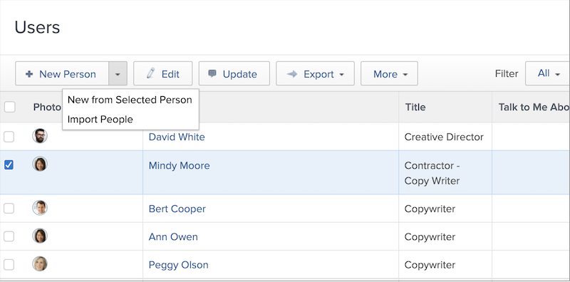

# Een individueel gebruikersprofiel maken

Wanneer een nieuwe werknemer wordt gehuurd, of iemand overbrengt in een afdeling gebruikend [!DNL Workfront], moet de systeembeheerder slechts één gebruiker tot stand brengen. Dit kan snel en gemakkelijk worden gedaan vanuit de [!UICONTROL Users] gebied in [!DNL Workfront].

1. Selecteren **[!UICONTROL Users]** van de **[!UICONTROL Main Menu]**.
1. Klik op de knop **[!UICONTROL New Person]** knop.
1. Voer de voor- en achternaam van de gebruiker in het dialoogvenster [!UICONTROL New Person] venster.
1. Voer het e-mailadres van de gebruiker in. Dit is hun [!DNL Workfront] login en moet binnen uw geval uniek zijn [!DNL Workfront].
1. Als u wilt dat de gebruiker een e-mail ontvangt over zijn nieuwe login, controleer het send uitnodigingsvakje.
1. Wijs de persoon een toegangsniveau toe. Dit verleent hun belangrijkste toestemmingen in [!DNL Workfront].
1. Wijs de gebruiker aan een huisgroep toe om ervoor te zorgen zij toegang tot het juiste werk hebben.
1. Selecteren **[!DNL Add this Person]** om het maken van de gebruiker te voltooien.

![[!UICONTROL New Person] venster](assets/admin-fund-adding-users-1.png)

De [!UICONTROL Show Advanced Options] Met deze koppeling wordt het venster met de volledige gebruikersgegevens geopend. Dit staat de systeembeheerder toe om extra organisatie en middel planningsinformatie zoals teams en baanrollen te plaatsen, plus persoonlijke informatie over de gebruiker (telefoonaantal, baantitel, enz.) in te gaan.

![[!UICONTROL New Person] venster na klikken op [!UICONTROL Show Advanced Options]](assets/admin-fund-adding-users-2.png)

Sommige van deze gegevens kunnen door de gebruiker worden gewijzigd, andere niet (afhankelijk van de toegangsrechten van de gebruiker).

## Een bestaande gebruiker kopiëren om een nieuwe gebruiker te maken

Gebruik een bestaande gebruiker in het systeem als basis voor het maken van een nieuwe aanmelding. Een deel van de bestaande gebruikersgegevens wordt gekopieerd, maar sommige gegevens moeten volledig worden ingevuld.

1. Selecteren **[!UICONTROL Users]** van de **[!UICONTROL Main Menu]**.
1. Selecteer de gebruiker u wilt kopiëren door de doos naast hun naam te controleren.
1. Selecteer de pijl op de **[!UICONTROL New Person]** en kies **[!UICONTROL New from Selected Person]**.
1. Vul de **[!UICONTROL Personal Info]** met de informatie van de nieuwe gebruiker.
1. Sommige velden worden van de oorspronkelijke gebruiker gekopieerd. Wijzig desgewenst de gegevens.
1. Selecteren **[!UICONTROL Add This Person]**.

![[!UICONTROL New Person] venster](assets/admin-fund-adding-users-4.png)

<!--
Learn more URLs
Add users
-->
