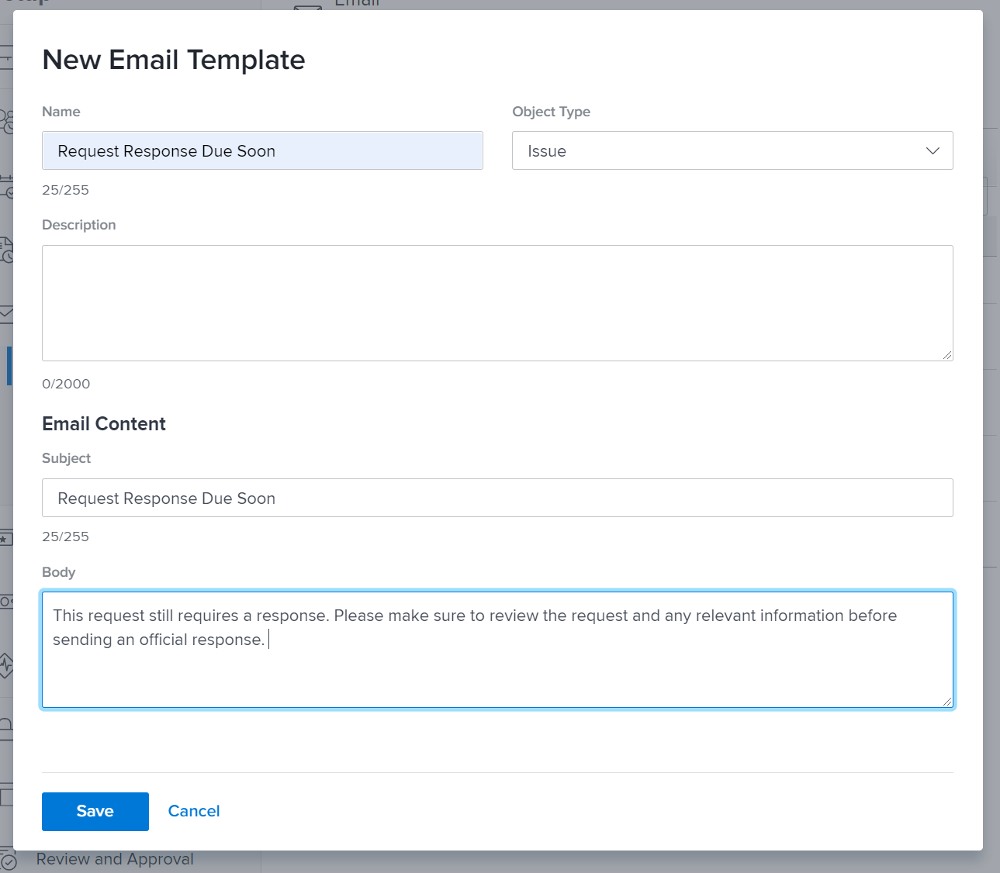

<!---
this has the same content as the system administrator notification setup and mangement section of the email and inapp notificiations learning path
--->

# Herinneringsmeldingen instellen

Herinneringsmeldingen worden gemaakt door systeembeheerders in het dialoogvenster [!UICONTROL Setup] gebied. Vervolgens kunnen ze worden gekoppeld en gebruikt door het project, de taak en geven ze eigenaars weer als herinneringen voor het moment dat het werk binnenkort of te laat komt.

Herinneringen zijn objectspecifiek en moeten handmatig aan het bijbehorende werkitem worden gekoppeld zodat het bericht kan worden verzonden.

**Een herinneringsmelding maken**

1. Klikken **[!UICONTROL Setup]** in de **[!UICONTROL Main Menu]**.
1. Klik op de knop **[!UICONTROL Email]** sectie.
1. Klik op de knop **[!UICONTROL Notifications]** sectie.
1. Klik op de knop **[!UICONTROL New Reminder]** tab.
1. Klik op de knop **[!UICONTROL +New Reminder Notification]** knop.
1. Selecteer het gewenste object voor het vervolgkeuzemenu.
1. Vul de vereiste gegevens in.
1. Klik op **[!UICONTROL Save]**.

![[!UICONTROL New Reminder Notification] venster](assets/admin-fund-reminder-notification-1.png)

Bij het instellen van de herinnering moet u rekening houden met een aantal zaken:

* **[!UICONTROL Reminder Notification Name]—** Dit is de naam die projectmanagers zullen zien wanneer zij een herinnering aan een voorwerp vastmaken. Zorg ervoor dat de naam beknopt maar beschrijvend is.
* **[!UICONTROL Qualifying Period]—** Het aantal uren, dagen, weken of maanden vóór/na de datum die is geselecteerd in de sectie Timing.
* **[!UICONTROL Timing]—** Geef op of de herinnering moet worden verzonden voor of na de geplande, geplande of feitelijke begin-/einddatum van het object. Opties voor tijdbladen hebben betrekking op de begindatum, einddatum of laatste updatedatum.
* **[!UICONTROL Criteria]—** Geef de criteria op om de te verzenden herinnering te kwalificeren. Welke opties beschikbaar zijn, is afhankelijk van de objectspecifieke herinnering.
* **[!UICONTROL Recipients]—** Selecteer naar wie de herinnering moet worden verzonden. De opties voor belanghebbenden zijn afhankelijk van het objecttype dat voor de herinnering is geselecteerd.

Nadat de herinneringsinstellingen zijn ingesteld en opgeslagen, kunnen objecteigenaars de herinneringsmelding gebruiken binnen [!DNL Workfront].

## E-mailaanpassing

Herinneringsberichten gebruiken een standaard-e-mailindeling en -bericht. Als u het e-mailbericht wilt aanpassen, kunt u een sjabloon maken.

<!---
paragraph above needs a hyperlink to an article
--->

<!---
learn more URLs
--->
