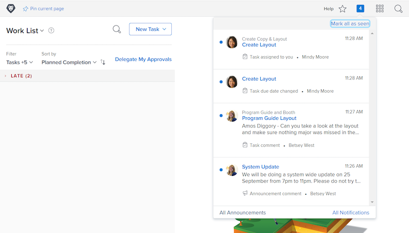

# Gebeurtenismeldingen in de app en e-mailen beheren

E-mail maakt deel uit van het dagelijks leven op het werk en op een paar dagen is de hoeveelheid e-mail die je krijgt overweldigend. Met [!DNL Workfront]systeembeheerders kunnen ervoor zorgen dat iedereen relevante en nuttige e-mails ontvangt over het werk waarmee ze zijn betrokken.

Workfront kan verschillende soorten berichten naar gebruikers verzenden. Sommige van deze meldingen worden op systeemniveau beheerd en zijn van invloed op alle gebruikers. Sommige meldingen kunnen zo worden ingesteld dat ze direct e-mailberichten genereren in een dagelijkse samenvatting. Of schakel e-mailberichten uit om alleen berichten te genereren in Workfront.

## Gebeurtenismeldingen

Een gebeurtenis is vergelijkbaar met een statuswijziging, een opmerking die is geplaatst of een toewijzing die is uitgevoerd en die een melding in de app kan activeren [!DNL Workfront].

U kunt echter bepalen voor welke gebeurtenissen u e-mailmeldingen wilt ontvangen door de opties in uw voorkeuren in of uit te schakelen.

Als u deze wijzigingen wilt aanbrengen, klikt u op uw naam in het menu [!UICONTROL Main Menu].

![Gebruikersnaam in [!UICONTROL Main Menu]](assets/admin-fund-user-notifications-02.png)

Klikken [!UICONTROL Edit] van de [!UICONTROL More] -menu.

Klikken [!UICONTROL Notifications] in de [!UICONTROL Edit Person] pop-upvenster.

![[!UICONTROL Edit Person] venster](assets/admin-fund-user-notifications-04.png)

Vanaf hier kunt u bepalen welke meldingen u direct, dagelijks of helemaal niet wilt ontvangen. Wijzigingen die u hier aanbrengt, gelden specifiek voor u en zijn niet van invloed op andere gebruikers in Workfront.

**[!UICONTROL Daily]**

Standaard zijn e-mails zo ingesteld dat ze direct worden verzonden. U kunt echter wel de e-mailmeldingsfrequentie wijzigen van [!UICONTROL Instant] tot [!UICONTROL Daily]en zorgt u ervoor dat u de informatie krijgt die u nodig hebt, wanneer u die wilt.

![[!UICONTROL Notification] deel van [!UICONTROL Edit Person] venster](assets/admin-fund-user-notifications-05.png)

Met de dagelijkse optie verzendt u een overzicht van de gebeurtenissen van de dag in één e-mail. Gebruikers ontvangen één e-mail voor elke groep die ze in het dialoogvenster [!UICONTROL Notifications] sectie.

De [!UICONTROL Information about Projects I Own] de sectie zal één dagelijkse e-mail produceren, [!UICONTROL Action Needed] e-mail, enz.

![[!UICONTROL Daily Digest] e-mailen voor [!UICONTROL Information about Projects I Own]](assets/admin-fund-user-notifications-06.png)

![[!UICONTROL Daily Digest] e-mailen voor [!UICONTROL Action Needed]](assets/admin-fund-user-notifications-07.png)

Selecteer niet alleen de optie voor dagelijks verzenden, maar stel ook een tijdstip in waarop deze e-mails moeten worden verzonden. Afhankelijk van wat het beste werkt, kunnen samenvattingse-mails worden verzonden voordat u &#39;s ochtends of vlak voordat u de dag verlaat aan het werk gaat.

![[!UICONTROL Email Daily Digest after] vervolgkeuzelijst in het dialoogvenster [!UICONTROL Edit Person] venster](assets/admin-fund-user-notifications-08.png)

**Helemaal niet**

De laatste optie is om de e-mailmeldingen volledig uit te schakelen.

![Geselecteerde melding uitgeschakeld [!UICONTROL Edit Person] venster](assets/admin-fund-user-notifications-09.png)

Als u dit besluit, weet u dat hoewel u geen e-mail ontvangt, het werk nog wordt toegewezen, op, en binnen bijgewerkt [!DNL Workfront]. Als u alle meldingen uitschakelt, ontbreekt het wellicht aan belangrijke informatie die u moet weten.

Er zijn enkele gevallen waarin [!DNL Workfront] heeft gezien dat gebruikers e-mailberichten uitschakelen. Als u bijvoorbeeld het grootste deel van uw werk via de [!DNL Workfront] mobiele app, kunt u uw e-mailmeldingen uitschakelen en alleen via de app meldingen ontvangen.

Ongeacht de [!UICONTROL Event Notifications] u besluit te ontvangen, zijn de berichten belangrijk voor het succes van het werk dat voor de doelstellingen van uw organisatie wordt gedaan.

## Recommendations

Er zijn een paar meldingen dat [!DNL Workfront] Aanbevolen wordt om deze optie te laten controleren, of het nu gaat om een directe e-mail of een dagelijkse samenvatting.

Voor de meeste gebruikers:

* [!UICONTROL A predecessor of one of my tasks is completed]
* [!UICONTROL Someone includes me on a directed update]
* [!UICONTROL Someone comments on my work item]
* [!UICONTROL The due date changes on a task I'm assigned to]

Specifiek voor projectmanagers:

* [!UICONTROL A project I'm on becomes active]
* [!UICONTROL A project I own gets behind]
* [!UICONTROL An issue is added to a project I own]
* [!UICONTROL Milestone task is completed on a project I own]

<!---
learn more URLs
Email notifications
guide: manage your notifications
--->
