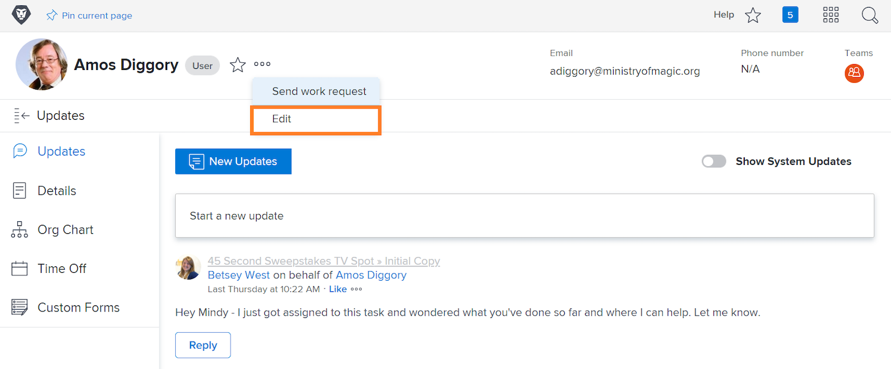

# Gebeurtenismeldingen in de app en e-mailen beheren

E-mail maakt deel uit van het dagelijks leven op het werk en op een paar dagen is de hoeveelheid e-mail die je krijgt overweldigend. Met [!DNL Workfront] kunnen systeembeheerders er echter voor zorgen dat iedereen relevante en nuttige e-mails ontvangt over het werk waarmee ze zijn betrokken.

Workfront kan verschillende soorten berichten naar gebruikers verzenden. Sommige van deze meldingen worden op systeemniveau beheerd en zijn van invloed op alle gebruikers. Sommige meldingen kunnen zo worden ingesteld dat ze direct e-mailberichten genereren in een dagelijkse samenvatting. Of schakel e-mailberichten uit om alleen berichten te genereren in Workfront.

## Gebeurtenismeldingen

Een gebeurtenis is vergelijkbaar met een statuswijziging, een opmerking die is geplaatst of een toewijzing die is uitgevoerd en die een melding in de app in [!DNL Workfront] kan activeren.

U kunt echter bepalen voor welke gebeurtenissen u e-mailmeldingen wilt ontvangen door de opties in uw voorkeuren in of uit te schakelen.

Als u deze wijzigingen wilt aanbrengen, klikt u op uw naam in het dialoogvenster [!UICONTROL Main Menu] .

![ Gebruikersnaam in [!UICONTROL Main Menu]](assets/admin-fund-user-notifications-02.png)

Klik op [!UICONTROL Edit] in het menu [!UICONTROL More] .

Klik op [!UICONTROL Notifications] in het pop-upvak [!UICONTROL Edit Person] .

![[!UICONTROL Edit Person] window ](assets/admin-fund-user-notifications-04.png)

Vanaf hier kunt u bepalen welke meldingen u direct, dagelijks of helemaal niet wilt ontvangen. Wijzigingen die u hier aanbrengt, gelden specifiek voor u en zijn niet van invloed op andere gebruikers in Workfront.

**[!UICONTROL Daily]**

Standaard zijn e-mails zo ingesteld dat ze direct worden verzonden. U kunt echter wel de berichtfrequentie voor e-mailberichten van [!UICONTROL Instant] naar [!UICONTROL Daily] wijzigen, zodat u de benodigde informatie krijgt, wanneer u deze nodig hebt.

![[!UICONTROL Notification] sectie van [!UICONTROL Edit Person] window ](assets/admin-fund-user-notifications-05.png)

Met de dagelijkse optie verzendt u een overzicht van de gebeurtenissen van de dag in één e-mail. Gebruikers krijgen één e-mail voor elke groep die ze in de sectie [!UICONTROL Notifications] zien.

Met de sectie [!UICONTROL Information about Projects I Own] wordt bijvoorbeeld dagelijks één e-mail gegenereerd, met de sectie [!UICONTROL Action Needed] wordt dagelijks één e-mail gegenereerd, enzovoort.

![[!UICONTROL Daily Digest] email for [!UICONTROL Information about Projects I Own]](assets/admin-fund-user-notifications-06.png)

![[!UICONTROL Daily Digest] email for [!UICONTROL Action Needed]](assets/admin-fund-user-notifications-07.png)

Selecteer niet alleen de optie voor dagelijks verzenden, maar stel ook een tijdstip in waarop deze e-mails moeten worden verzonden. Afhankelijk van wat het beste werkt, kunnen samenvattingse-mails worden verzonden voordat u &#39;s ochtends of vlak voordat u de dag verlaat aan het werk gaat.

![[!UICONTROL Email Daily Digest after] drop-down menu in het [!UICONTROL Edit Person] venster ](assets/admin-fund-user-notifications-08.png)

**helemaal niet**

De laatste optie is om de e-mailmeldingen volledig uit te schakelen.

![ Geselecteerd bericht dat in [!UICONTROL Edit Person] venster ](assets/admin-fund-user-notifications-09.png) wordt uitgezet

Als u besluit dit te doen, weet u dat hoewel u geen e-mailberichten ontvangt, het werk nog steeds wordt toegewezen, commentaar krijgt en binnen [!DNL Workfront] wordt bijgewerkt. Als u alle meldingen uitschakelt, ontbreekt het wellicht aan belangrijke informatie die u moet weten.

In [!DNL Workfront] zijn er enkele gevallen waarin gebruikers e-mailmeldingen hebben uitgeschakeld. Als u bijvoorbeeld het grootste deel van uw werk doet via de mobiele app van [!DNL Workfront] , kunt u uw e-mailmeldingen uitschakelen en alleen via de app meldingen ontvangen.

Ongeacht de [!UICONTROL Event Notifications] die u wilt ontvangen, zijn meldingen belangrijk voor het welslagen van het werk dat wordt uitgevoerd voor de doelstellingen van uw organisatie.

## Recommendations

[!DNL Workfront] raadt u aan een aantal meldingen dat u wilt laten controleren, hetzij voor een directe e-mail, hetzij voor een dagelijkse controlesamenvatting.

Voor de meeste gebruikers:

* [!UICONTROL A predecessor of one of my tasks is completed]
* [!UICONTROL Someone includes me on a directed update]
* [!UICONTROL Someone comments on my work item]
* [!UICONTROL The due date changes on a task I'm assigned to]

Specifiek voor projectmanagers:

* [!UICONTROL A project I'm on becomes active]
* [!UICONTROL A project I own gets behind]
* [!UICONTROL An issue is added to a project I own]
* [!UICONTROL Milestone task is completed on a project I own]

<!---
learn more URLs
Email notifications
guide: manage your notifications
--->
