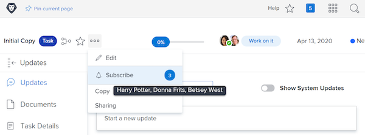

# Abonneren op tijdelijke objecten

Gebeurtenismeldingen werken bij u over het werk dat u hebt toegewezen. Het kan echter voorkomen dat u bepaalde onderdelen wilt volgen die u niet hebt toegewezen, omdat dit van invloed kan zijn op het werk dat u doet. Abonneren op een bepaald item is de perfecte oplossing.

U bent bijvoorbeeld geïnteresseerd in de voortgang van de taak Eerste kopie. U bent niet toegewezen aan deze taak, maar u bent verantwoordelijk voor het bewerken van die eerste kopie en wilt weten wat er gebeurt. U kunt zich abonneren op de taak en, wanneer updates worden uitgevoerd, een e-mailmelding ontvangen met een realtime update over de voortgang van dat werk.

Het is belangrijk om te weten dat e-mails met een abonnement en meldingen in de app alleen worden verzonden wanneer er opmerkingen over het item worden gemaakt. E-mails en meldingen worden niet verzonden voor andere acties, zoals wijzigingen in de vervaldatum of wijzigingen in de toewijzing.

Als u zich wilt abonneren op een tijdelijk onderdeel, moet u ten minste een machtiging voor het delen van een weergave voor dat onderdeel hebben.

![[!UICONTROL Task Access] window ](assets/admin-fund-user-notifications-11.png)

Zodra u toegang tot het het werkpunt hebt, onderteken aan het door:

1. Ga naar de landingspagina van het project, de taak, of de kwestie.
1. Klik op het menu **[!UICONTROL Actions]** .
1. Klik op **[!UICONTROL Subscribe]** .

![[!UICONTROL Subscribe] in taakmenu ](assets/admin-fund-user-notifications-12.png)

U kunt zien wie anders op het het werkpunt heeft geabonneerd door over het aantal naast [!UICONTROL Subscribe/Unsubscribe] in het menu te hangen.

 heeft ingetekend

Als u [!UICONTROL Manage] of [!UICONTROL Share] toestemmingen op het het werkpunt hebt, kunt u andere gebruikers aan een project, een taak, of een kwestie intekenen door:

1. Klik op het nummer naast de optie **[!UICONTROL Subscribe]** .
1. De naam toevoegen van de persoon of personen die u wilt abonneren op het werkitem.
1. Klik op **[!UICONTROL Save]** .

![[!UICONTROL Subscribe] window ](assets/admin-fund-user-notifications-15.png)

De personen die u abonneert, worden niet op de hoogte gesteld van het abonnement. Alle abonnees krijgen de toestemmingen van de Mening aan het punt. Als de abonnee echter al [!UICONTROL Contribute] - of [!UICONTROL Manage] -machtigingen voor het onderdeel had, blijven deze machtigingen ongewijzigd.

Een vermelding op het tabblad [!UICONTROL Updates] voor het afzonderlijke item geeft ook aan wie een abonnement heeft genomen en wanneer. Het tabblad [!UICONTROL Updates] logt ook in wanneer een gebruiker door iemand anders is geabonneerd.

![[!UICONTROL Updates] pagina op een taak die abonnement ](assets/admin-fund-user-notifications-16.png) toont

Als u het abonnement op een gebruiker wilt opzeggen, klikt u nogmaals op de ballon om het venster [!UICONTROL Subscribers] te openen. Klik vervolgens op de X naast de naam van de persoon. De gebruiker krijgt geen melding dat hij of zij het abonnement heeft opgezegd.

![[!UICONTROL Unsubscribe] menuoptie op een project ](assets/admin-fund-user-notifications-14.png)

<!---
learn more URL: Subscribe to items in Workfront
--->
