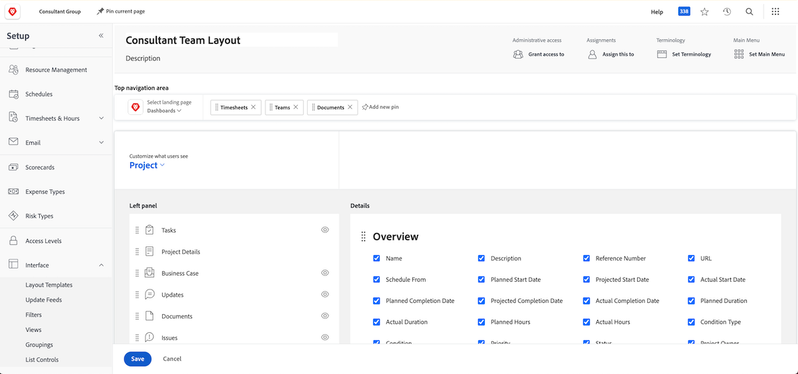
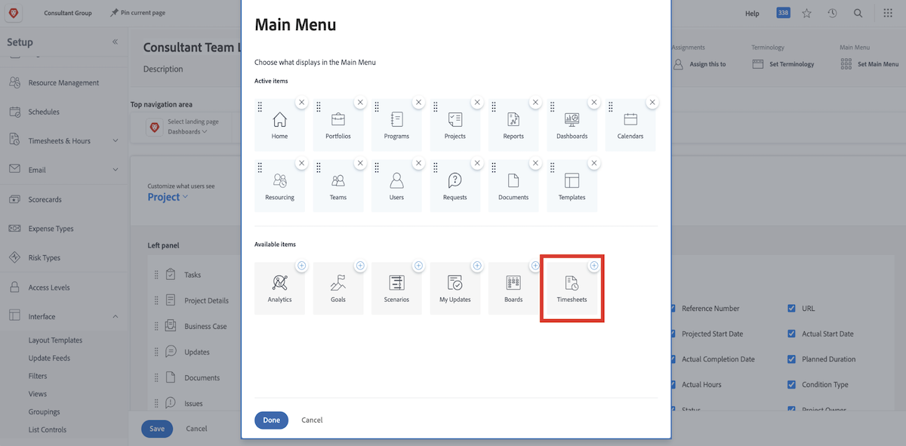
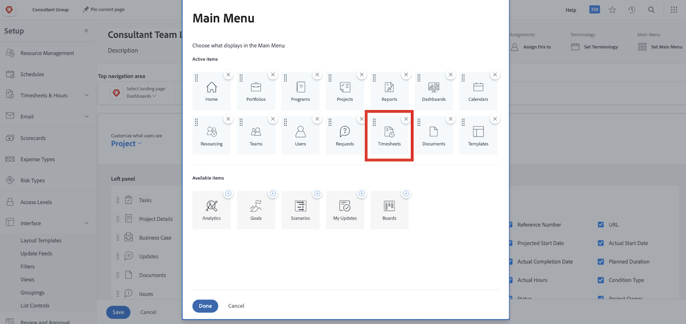

# Wat zijn lay-outsjablonen?

Workfront beschikt over veel goede tools om u te helpen uw werk te voltooien. Maar teveel van een goede zaak kan overweldigend zijn.

Met lay-outsjablonen kunnen systeembeheerders en groepsbeheerders de gebruikerservaring aanpassen en deze gebruikers de gelegenheid geven zich te richten op wat voor hen belangrijk is.

Bijvoorbeeld, registreert de meerderheid van uw organisatie geen tijd. Het consultantteam factureert echter wel klanten, zodat ze tijd moeten inloggen om een correcte facturering te garanderen. Met een lay-outmalplaatje, kunnen timesheets voor hen worden verborgen die hen niet nodig hebben en voor hen tonen die.

## Voordat u gaat bouwen

Workfront raadt u aan met uw gebruikers te spreken voordat u een lay-outsjabloon maakt. Als u diegenen inschakelt die de lay-outsjabloon zullen gebruiken, zoals de groepsbeheerders, wordt het plaatsen van de juiste informatie en gereedschappen voor de juiste mensen veel soepeler.

U hoeft geen wijzigingen aan te brengen nadat u een sjabloon hebt gemaakt. Blijf feedback krijgen over wat ze nodig hebben en willen zien en gebruiken. Lay-outsjablonen zijn bedoeld om gebruikers een schone en eenvoudige ervaring te bieden.
