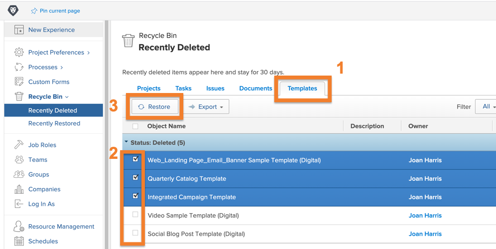
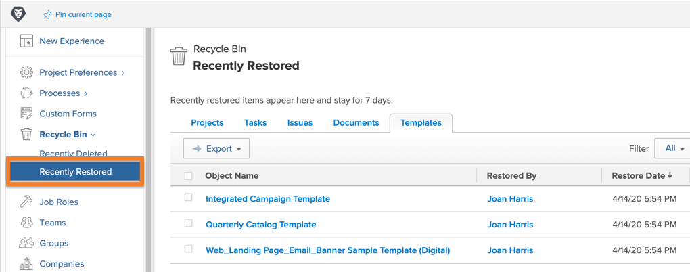

# Objecten uit de prullenbak herstellen

Het projectwerk gaat door vele veranderingen. U kunt iets schrappen, slechts om 30 minuten later te realiseren dat de taak of het document essentieel voor de kwestie was u probeert op te lossen.

Wanneer het object wordt verwijderd met de prullenbak, plaatst Workfront het object maximaal 30 dagen in de prullenbak. De systeembeheerder kan het object terugzetten naar de oorspronkelijke positie in Workfront, samen met alle informatie (updates, geregistreerde uren, documenten, enz.).

## Een object herstellen

1. Selecteer het **gebied van de Opstelling** in het **Belangrijkste Menu**.
1. Klik **KringloopBak** in het linkerpaneel.
1. Selecteer **onlangs schrapte**.

Elk herstelbaar object heeft een tab om het gemakkelijker te maken het item te vinden dat moet worden teruggezet.

1. Klik op de tab van het gewenste object.
1. Schakel het selectievakje naast de objecten die u wilt herstellen in.
1. Klik **herstellen** knoop.

Het object of de objecten die worden hersteld, worden kort weergegeven in een [!UICONTROL In Progress] -sectie. Nadat het scherm is vernieuwd, worden een of meer objecten niet meer op het scherm weergegeven omdat het is hersteld. De items worden weergegeven op de positie waar ze zich eerder in [!DNL Workfront] bevonden. U kunt ze controleren op het [!UICONTROL Recently Restored] -scherm.

De beheerders van de groep kunnen een project herstellen dat met de groep wordt geassocieerd zij, samen met om het even welke taken, kwesties, of documenten verbonden aan het project leiden.

<!--
learn more URL
Restoring deleted items
Viewing items that have been recently restored
-->
