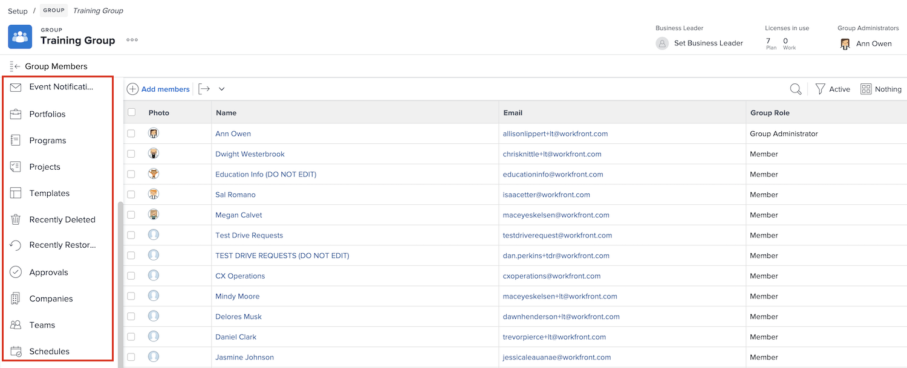

# Begrijp de behoefte aan groepsbeheerders

<!---
21.4 updates have been made
--->

Als u de systeembeheerder voor een groot bedrijf of een bedrijf met veel [!DNL Workfront] gebruikers bent, kan het tijdrovend zijn om de [!DNL Workfront] -instellingen voor elke groep en subgroep te behouden.

Als u groepbeheerders aanwijst die bepaalde beheerfuncties voor hun eigen groepen in [!DNL Workfront] kunnen uitvoeren, kunt u de belasting beter in evenwicht brengen wanneer het gaat om het bijwerken en onderhouden van het systeem.

Groepbeheerders hebben de neiging meer in overeenstemming te zijn met de dagelijkse uitdagingen van hun groep, zodat kunnen zij de behoeften van de groep beheren. Dat staat u toe, als systeembeheerder, om zich op de [!DNL Workfront] configuraties te concentreren die uw organisatie als geheel ten goede komen.

Enkele dingen die groepsbeheerders in [!DNL Workfront] kunnen doen zijn:

* Maak subgroepen en voeg gebruikers toe aan de subgroepen.
* Lay-outsjablonen maken voor hun groep.
* Goedkeuringsprocessen voor de groep maken.
* Workflowstatussen op groepsniveau maken.
* Open projecten, programma&#39;s en portfolio&#39;s die bij de groep horen vanaf de pagina van de groep.
* Projecten, taken en uitgaven op groepsniveau beheren.
* Tijdlijnvoorkeuren op groepsniveau beheren.
* Gebeurtenismeldingen op groepsniveau beheren.
* Meld u aan als andere groepsleden.
* Wijs een bedrijfsleider aan de groep toe.
* Beheer een bedrijf.

Als systeem- of groepsbeheerder kunt u subgroepen maken binnen de groepen en subgroepen die u beheert. Die subgroepen kunnen hun eigen groepsbeheerders worden toegewezen.

>[!NOTE]
>
>Er geldt een limiet van 14 niveaus voor subgroepen in één groep.

**Leer meer over groepsbeheerders**

<!---
bullet points below need hyperlinks
--->

Voor een lijst van welke systeembeheerders, groepsbeheerders, en subgroepbeheerders in [!DNL Workfront] kunnen doen, zie de artikelActies toegestaan voor verschillende types van beheerders.

## Een groep beheren

Beheer snel en efficiënt groepsleden, subgroepen, groepsstatussen, groepsprojectvoorkeuren en meer vanaf de groepspagina in [!DNL Workfront].

1. Selecteer **[!UICONTROL Setup]** in het menu **[!UICONTROL Main Menu]** .
1. Ga naar **[!UICONTROL Groups]** in het linkerpaneel.
1. Selecteer de naam van een groep om deze te openen.
1. Open de sectie waarin u updates wilt uitvoeren door erop te klikken in het linkerdeelvenster.

<!---
learn more URLs
Create and manage groups 
Create and manage subgroups 
Business leader overview 
--->
