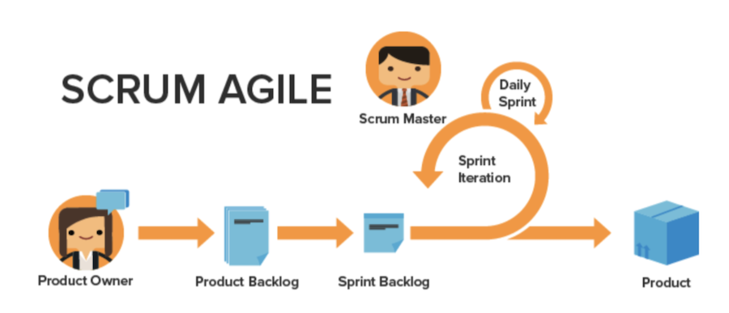

# Voordelen van het gebruik van Agile

## Mogelijkheid om snel aan te passen en te draaien

Zoals de naam suggereert, maakt de Agile methodologie teams beter in staat om richting en nadruk snel te veranderen. Software- en marketingbedrijven zijn zich vooral bewust van de tendens dat de vraag van week tot week verandert. Met Agile kunnen teams het werk dat ze doen opnieuw evalueren en in bepaalde stappen aanpassen om ervoor te zorgen dat wanneer het werk en het landschap van de klant veranderen, de focus ook voor het team verandert.

## Transparantie in het werk van een team

De mobiele teams gebruiken dagelijkse vergaderingen genoemd &quot;stand-ups&quot;om ervoor te zorgen het team zich op de geprioriteerde lijst van te ontwikkelen eigenschappen of producten concentreert te blijven. Ze ervaren niet langer de verwarring dat ze niet weten waaraan iedereen in hun team werkt. Zij houden regelmatig lusjes over wat het team van de dag voordien heeft verwezenlijkt, om het even welke kwesties/wegblokkades zij kunnen hebben die moeten worden behandeld, en wat zij van plan zijn om op die dag te werken.

Dankzij deze transparantie en een uniforme richting kan iedereen sneller vooruit gaan.

## Frequente feedback

Het laatste grote voordeel van het overnemen van het hulpmiddel zou de terugkoppel zijn die aan het eind van elke herhaling (herinner me: een herhaling is een vastgestelde hoeveelheid tijd waarin het team moet werken naar de voltooiing van specifieke te leveren punten) wordt opgenomen. De terugkoppel lijn staat een team toe om terug naar de laatste paar weken te kijken om te bepalen welke kwesties omhoog kwamen, hoe het plan zich vooruit kan veranderen, wat de klant nu nodig heeft als de vorige behoeften zijn veranderd, en lessen die als team zijn geleerd.
