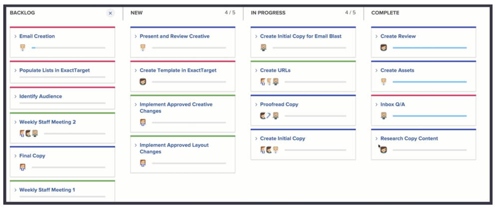

# Een Kanban-team maken

Het Creative Marketing Team gebruikt al een tijdje Scrum. Ze stellen de flexibele omgeving van een flexibel team op prijs, maar ze vinden het moeilijk om artikelen toe te wijzen aan een bepaald tijdsbestek omdat de prioriteiten voor hun team vaak veranderen.

Ze hebben een alternatief voor Scrum. Het heet Kanban.

Kanban werkt voor teams die niet willen definiëren waaraan ze werken binnen de tijdlijn die een op scrum gebaseerde herhaling vereist. In plaats daarvan, laat Kanban teams toe om onophoudelijk door hun achterstand te werken.

Laten wij het Creatieve Team van de Marketing van een team van het Trommel aan een team Kanban [ 1 ] schakelen. Breng deze wijziging aan in de sectie Gietijzer van de Team-instellingen.

Nadat u de methodologie verandert, moet u specificeren hoeveel verhalen een team Kanban in een tijd in elke kolom kan hebben door de &quot;grens van het WIP aan te passen.&quot; [ 2 ]. WIP staat voor werk in uitvoering. Het aantal u verkiest om hier te zetten hangt af van hoeveel actieve punten het team kan behandelen. Het zal op storyboard van het team tonen helpen hen herinneren als zij al dan niet oververdeeld zijn. U (en elk lid van het team met bewerkingsrechten) kunt de WIP-limiet ook rechtstreeks vanaf het storyboard wijzigen.

U kunt statuskolommen slepen en neerzetten om ze in de gewenste volgorde te plaatsen.

Kanban de teams kunnen ook verkiezen om het volgende verhaal op de achterstand automatisch op storyboard te hebben verschijnen wanneer een verhaal [ aantal 3 in hoogste beeld ] wordt voltooid ziet. Dit zal teams helpen die een ononderbroken het werkcyclus verkiezen.

In de onderstaande afbeelding ziet u hoe het eruitziet wanneer een nieuw artikel automatisch op het storyboard wordt weergegeven wanneer een artikel is voltooid.

Om uw voltooide werk efficiënter te beheren, blijven de verhalen standaard 14 dagen op het bord.

Indien nodig, kan die instelling worden aangepast aan tussen 1 en 30 dagen in het venster met teaminstellingen.

Hoewel dit een andere methode is, is het belangrijk om bij het werken in een flexibele omgeving de achterstand voortdurend in te halen door de artikelvereisten te bespreken en de prioriteit van het artikel aan te passen. Telkens als u de voorkeur aan de achterstand wilt wijzigen, moet u één lusje over naar het lusje van de Achtergrond bewegen om het anders te rangschikken.
