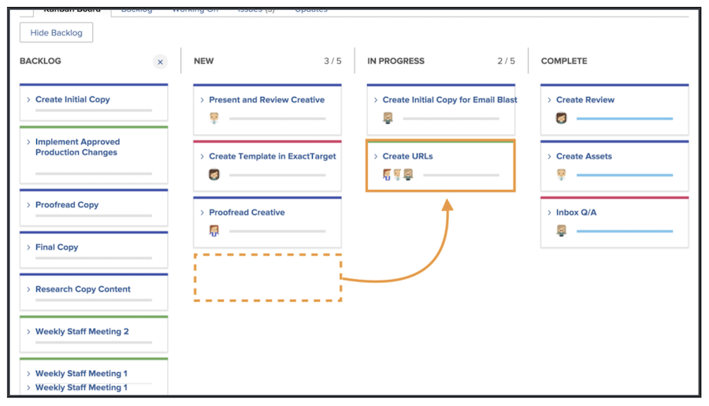

# Werk beheren als Kanban-team

Werk beheren als Kanban-team Artikelen toevoegen aan de Kanban-achterstand Er zijn meerdere manieren waarop u artikelen kunt toevoegen aan de achterstand van het Creative Marketing-team.

Het team kan artikelen rechtstreeks vanaf hun achterstand toevoegen.
Zij kunnen ook taken op een project worden toegewezen. Als het Creative Marketing-team verzoeken heeft die aan hen worden verpletterd, zullen die verzoeken op het lusje van de Verzoeken van het team verschijnen. Deze zullen op de achtergrond van het team verschijnen als het team het verzoek selecteert en het in een verhaal omzet.

## Het Kanban-bord gebruiken

Nadat u de prioriteit van artikelen op de achtergrond hebt ingesteld, is het tijd om naar het Kanban-bord te gaan. U kunt toewijzingen maken door de avatars van de teamleden die aan dat artikel zullen werken, naar de artikelkaart te slepen.

Naarmate vooruitgang wordt geboekt met artikelen, zal het team deze naar de juiste status op het storyboard verplaatsen. Teamleden kunnen de vlaggen van Kanban gebruiken om erop te wijzen of een verhaal op Spoor, Geblokkeerd, of Klaar is om te trekken. Dit deelt aan andere teamleden mee die de het werkpunten op spoor zijn en als zij klaar zijn om aan of niet te worden gewerkt.

De leden van het team kunnen updates aan de kaarten op het storyboard ook maken om veranderingen in dingen zoals beschrijving, status, of prioriteit te weerspiegelen. Ze doen dit door te klikken op het vervolgkeuzemenu op een artikelkaart en hun wijzigingen in het juiste veld aan te brengen [1].

## Uitvoering van Kanban-verhalen

U gebruikt een limiet van vijf artikelen voor Werk in uitvoering. Wanneer u naar uw board kijkt, ziet u dat wanneer u taken naar statuskolommen verplaatst, het aantal taken in elk pad rechtsboven in elke statuskolom wordt weergegeven.

Als u de limiet overschrijdt in een statuskolom die overeenkomt met Nieuw of Bezig, wordt een foutbericht weergegeven waarin wordt aangegeven dat u de limiet van het werk in uitvoering hebt overschreden.

Als uw team beslist dat zij meer of minder punten tegelijkertijd kunnen behandelen, kunt u (en andere teamleden met het uitgeven rechten) het Werk in Voortgang aantal van het storyboard veranderen door op het aantal van het WIP te klikken en het uit te geven om op uw nieuw besluit te wijzen.
