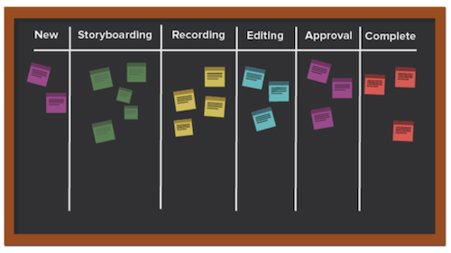
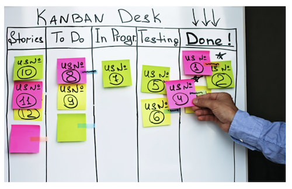

# Wat is de Kanban-methode en hoe werkt die?

In tegenstelling tot andere flexibele methoden die zich richten op een cyclisch proces, richt de Kanban-methodologie zich op een geoptimaliseerde workflow. Kanban streeft ernaar de werkstroom te verbeteren door het werk te visualiseren met behulp van een Kanban-bord, een grens te stellen aan de hoeveelheid werk die in uitvoering kan zijn, en de stroom te analyseren om voortdurende verbeteringen aan te brengen.

Laten we eens kijken naar enkele van de belangrijkste elementen van Kanban.

## Belangrijke spelers

De belangrijkste spelers in een Kanban-team zijn vergelijkbaar met die in een Scrum-team, behalve dat er geen Scrum master is. Het kan nog steeds zinvol zijn dat iemand als projectmanager of toezichthouder optreedt, maar theoretisch zou deze rol natuurlijk moeten voorkomen naarmate de behoefte zich voordoet.

## Visualisatie: Kanban board

U kunt uw Kanban-bord op verschillende manieren opmaken. Teams werken vanuit een board dat een willekeurig aantal kolommen kan bevatten. Elke kolom vertegenwoordigt de status van het werk dat wordt gedaan.

In het meest simplistische bord zou de eerste kolom kunnen zijn &quot;te doen,&quot;de tweede &quot;lopend,&quot;en derde &quot;volledig.&quot;

Vele bedrijven hebben hun eigen terminologie voor de kolomnamen, of zij kunnen zelfs elke stap in een proces vermelden, maar de bedoeling is het zelfde. De leden van het team bewegen hun verhalen van kolom aan kolom afhankelijk van welke staat het werk binnen is.

## Prioriteit

De leden van het team werken met een productmanager of een projectmanager om ervoor te zorgen de verhalen in de backlog en andere statuskolommen voorrang krijgen en dat het werk zich naar voltooiing blijft voortbewegen. De productmanager is nog verantwoordelijk voor het verzekeren van de stem van de klant wordt gehoord en het product beweegt in de correcte richting.

## Werk in proces beperken

Een uniek aspect van Kanban is dat teams een limiet hebben op hun capaciteit voor de hoeveelheid artikelen die ze op elk moment kunnen verwerken. Teams kiezen een bepaalde hoeveelheid verhalen die ze bereid zijn te hebben in hun &#39;doen&#39;- en &#39;in uitvoering&#39;-kolommen, en ze gaan niet over dat aantal om uitbarsting te voorkomen. Als een artikel eenmaal naar &quot;voltooid&quot; is verplaatst, wordt een artikel uit de backlog vervangen door de kolom &quot;te doen&quot;.

## Voortdurende verbetering

Kanban maakt een voortdurende verbetering mogelijk door teams een systeem te bieden waarmee hun doeltreffendheid kan worden gemeten. Ze kunnen duidelijk zien hoe hun werk werkt, hoe lang elk deel van de workflow duurt en hoe vaak ze hun producten op tijd van de deur krijgen. Hierdoor is het eenvoudiger om met verschillende manieren te experimenteren om de uitvoer te optimaliseren.
