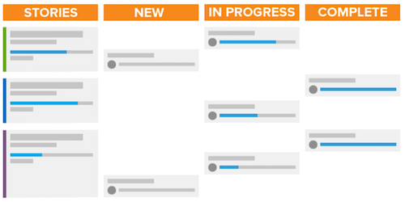

# Wat is de methode van de Trommel en hoe werkt het?

De methode Scrum omvat het flexibiliteitsmodel, maar verschilt van andere methoden in die zin dat het rollen heeft gedefinieerd voor diegenen die deel uitmaken van het team — zoals de eigenaar van het product, Master scum, enz. — en gedefinieerde praktijken om werkzaamheden te definiëren en te voltooien.

## Overzicht van het scrubteam

Wanneer u besluit of u wilt overschakelen naar Scrum, moet u de structuur van uw teams bekijken om te zien of deze gemakkelijk kunnen worden overgedragen naar de nieuwe methode. Een team van de Trommel heeft drie soorten leden: een eigenaar van het product, een master scrum en teamleden.

### Eigenaars van producten

De eigenaars van het product zijn eigenaar van het product en hebben het zicht op wat het product is of zal zijn. Zij zijn een stem voor de klant en de primaire bestuurder van bedrijfsbesluiten en de prioritering van producteigenschappen.

### Stramienen

Scrum masters helpen het team werk te doen door de benodigde middelen te vinden en consensus te creëren tussen het team om hun werk zo efficiënt mogelijk te laten verlopen. Zij vergemakkelijken ook de communicatie en consensus gedurende het hele proces.

### Teamleden

Een team is gewoonlijk dwars-functioneel en heeft leden met veel verschillende baanrollen en vaardigheidsreeksen. Ze zijn verantwoordelijk voor het plannen, uitvoeren en leveren van productstappen. Zij zullen van fysiek worden gevestigd op de zelfde plaats of het hebben van toegang tot hulpmiddelen profiteren die voor snelle en gemakkelijke samenwerking, zowel met elkaar door de dag als in hun dagelijkse opstand-up vergaderingen van het teamteam toestaan.

## Werken als een scrubteam

Nadat u deze belangrijke spelers hebt samengesteld, volgen ze een nieuwe workflowstijl om hun werk af te ronden en een product aan de klant te leveren. In vergelijking met de traditionele of watervalmethodologie zullen ze niet langer een lineair proces volgen om een plan voor een eindproduct op te stellen, en vervolgens de stappen of fasen doorlopen die nodig zijn om dat product te leveren. In plaats daarvan bouwen de teams van de Trommel eerst een achterstand.

### Een achterstand opbouwen

Het team van de Trommel bekijkt een lijst van prioritaire eigenschappen en gewenste functionaliteit die als verhalen wordt bedoeld. Zij moeten de klant vragen en als team bespreken wat zij willen/uit het systeem of het product nodig hebben zij gaan bouwen.

Zodra ze hun belangrijkste verhalen hebben gemaakt, moeten ze hun achterstand weggooien. Als team moeten ze vier belangrijke stappen doorlopen.

* Verdeel grote verhalen in kleinere stappen door te bespreken wat er voor elk verhaal moet gebeuren.

* Prioriteit geven aan hun verhalen en bepalen welke functies als eerste ontwikkeld moeten worden.

* Hiermee worden de vereisten en acceptatiecriteria verduidelijkt voor een artikel dat als gereed moet worden beschouwd.

* Schatting hoeveel inspanning het team moet uitbreiden om elk verhaal en de achterstand te voltooien. Dit kan in uren of in punten worden gedaan. Met punten kunt u zien hoe hard of complex het artikel is in plaats van de tijd te plannen die nodig is voor elke component van het artikel.

### Interferentieplanning

Nadat u de achterstand hebt gegroepeerd en er prioriteiten aan hebt toegewezen, is het tijd om de herhaling te plannen. (Veel organisaties gebruiken het woord &#39;sprint&#39; en &#39;iteration&#39; door elkaar.) Het team bepaalt welke artikelen moeten worden voltooid op basis van verhalen die als klaar worden beschouwd. Het team maakt taken en beslist over de duur van de herhaling.

### De herhaling uitvoeren

Het is nu tijd om de herhaling uit te voeren. Teamleden beginnen hun werk te doen zoals een traditioneel team zou doen, maar zij omvatten nu een snelle, dagelijkse vergadering genoemd een stand-up vergadering.

Leden van het team zullen letterlijk opstaan voor deze korte vergadering en drie vragen beantwoorden:

* Wat heb ik gisteren gedaan?
* Wat zal ik vandaag doen?
* Wat zijn de wegversperringen die zij hebben om de voortgang van hun taken te voorkomen?

Deze vergaderingen houden iedereen op dezelfde pagina en gaan snel verder.

## Een uitvouwdiagram en storyboard gebruiken om de voortgang te volgen

Als een team de drie primaire vragen in hun status beantwoordt, is het belangrijk dat ze de voortgang naar voltooiing van de herhaling volgen en volgen. Hierdoor kunnen ze bepalen of ze snel genoeg door hun artikelen bewegen om alle functies op tijd te leveren aan het einde van de iteratie. Dit kan in het scrubproces met twee componenten gebeuren.

### Storyboard

Met behulp van een storyboard verplaatsen teams hun artikelen door statuskolommen om te tonen wanneer de werkitems Nieuw, Bezig of Voltooid zijn.

### Burndown-grafiek

Een burndown grafiek kan worden gebruikt om te controleren als het team artikelen aan een snel genoeg tarief, of snelheid voltooit. In afzonderlijke iteraties of in de volledige productrelease kunt u Burndown-grafieken gebruiken.

