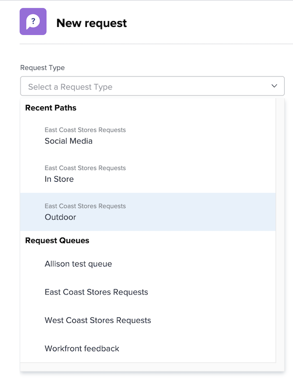

# Een aanvraag indienen

In deze video leert u hoe u:

* Ga naar het aanvraaggebied
* Een aanvraag indienen
* Verzonden verzoeken weergeven
* Een concept van een verzoek zoeken

>[!VIDEO](https://video.tv.adobe.com/v/336092/?quality=12&learn=on)

## Snelle en eenvoudige toegang tot wachtrijpaden voor aanvragen

Wanneer u in het dialoogvenster [!UICONTROL Request Type] veld, de laatste drie aanvraagpaden die u onlangs hebt verzonden om automatisch boven aan de lijst weer te geven. Selecteer een optie om een andere aanvraag in te dienen bij dezelfde wachtrij.

Onder aan de lijst staan alle wachtrijen voor aanvragen die u kunt openen. Als u niet zeker bent welke rij voor uw verzoek te gebruiken, gebruik het sleutelwoordonderzoek om snel en gemakkelijk te vinden u wenst.

Terwijl u in trefwoorden typt, [!DNL Workfront] brengt gelijken omhoog zodat kunt u de weg van de verzoekrij vinden die uw behoeften aanpast. Als u bijvoorbeeld een aanvraag wilt indienen voor een bericht op een sociale media, typt u &quot;sociale media&quot; in het dialoogvenster [!UICONTROL Request Type] en de lijst worden dynamisch bijgewerkt om overeenkomsten weer te geven.

Selecteer de gewenste optie, vul het aanvraagformulier in en verzend de aanvraag.

<!---
Learn more
Requests area overview
Create and submit Workfront requests
Guides
Make a work request
--->
