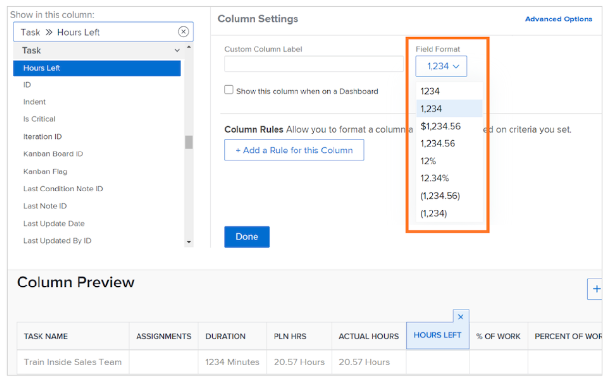
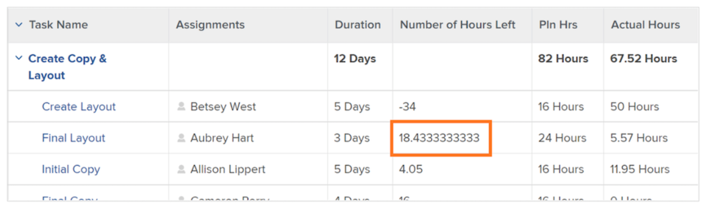
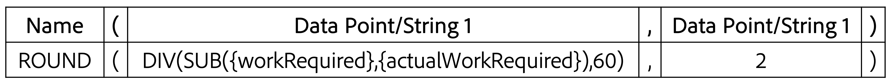

# Een SUB-, SUM-, DIV- of PROD-gegevensexpressie maken

In deze video leert u:

* Wat de expressies SUB, SUM, DIV en PROD doen
* Hoe te om een SUB gegevensuitdrukking op een berekend gebied tot stand te brengen

>[!VIDEO](https://video.tv.adobe.com/v/335177/?quality=12)

## Aanvullende informatie: ROUND-expressie

### Een ROUND-expressie maken

De expressie ROUND neemt een willekeurig getal en rondt dit af tot een bepaald aantal decimalen.

Meestal wordt de ROUND-gegevensexpressie gebruikt in combinatie met een andere gegevensexpressie en wanneer het indelingsveld als Tekst of Nummer wordt weergegeven.

Laten we een berekend veld maken om het verschil te bepalen tussen het aantal uren dat is gepland en dat daadwerkelijk is aangemeld voor een taak. Hiervoor is de SUB-expressie vereist en ziet deze eruit:

**SUB({workRequired},{actualWorkRequired})**

En aangezien de tijd in notulen wordt gevolgd en het aangewezen formaat is om de informatie in uren te tonen, moet de uitdrukking ook door 60 worden gedeeld en als dit kijken:

**DIV(SUB({workRequired},{actualWorkRequired}),60)**

Als de notatie wordt gewijzigd in Number bij het maken van het berekende veld in het aangepaste formulier, kunt u de getalnotatie wijzigen wanneer u het veld toevoegt in een weergave.

Als de veldindeling bij het maken van een aangepast veld echter als tekst blijft staan, kan de indeling niet gemakkelijk worden gewijzigd in de weergave. De expressie ROUND moet worden gebruikt om te voorkomen dat getallen zoals deze in uw project worden weergegeven:

<b>De ROUND-gegevensexpressie gebruiken in een berekend veld</b>

De expressie ROUND bevat de naam van de expressie (ROUND) en doorgaans twee gegevenspunten. Deze gegevenspunten kunnen een expressie of een veld in Workfront zijn, gevolgd door een getal dat aangeeft hoeveel decimalen u wilt gebruiken.

Een expressie zou als volgt zijn gestructureerd: ROUND(gegevenspunt, #)

In de uitdrukking die het verschil tussen geplande en daadwerkelijke uren berekent, gebruik deze uitdrukking - DIV (SUB ({workRequired},{actualWorkRequired}), 60) - als eerste gegevenspunt. Controleer vervolgens of het getal dat uit die expressie komt, niet meer dan 2 cijfers achter het decimaalteken bevat.

De expressie kan als volgt worden geschreven: ROUND(DIV(SUB({workRequired},{actualWorkRequired}),60),2).
