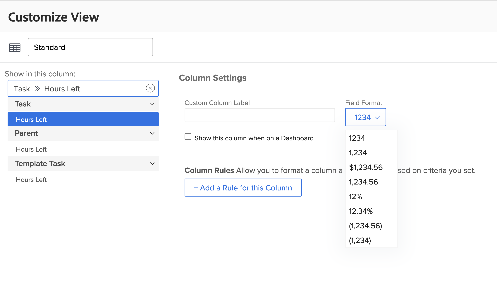

# Een SUB-, SUM-, DIV- of PROD-gegevensexpressie maken

In deze video leert u:

* Wat de expressies SUB, SUM, DIV en PROD doen
* Hoe te om een SUB gegevensuitdrukking op een berekend gebied tot stand te brengen

>[!VIDEO](https://video.tv.adobe.com/v/335177/?quality=12&learn=on&enablevpops)

## Aanvullende informatie: ROUND-expressie

### Een ROUND-expressie maken

De expressie ROUND neemt een willekeurig getal en rondt dit af tot een bepaald aantal decimalen.

Meestal wordt de ROUND-gegevensexpressie gebruikt in combinatie met een andere gegevensexpressie en wanneer het indelingsveld als Tekst of Nummer wordt weergegeven.

Laten wij een berekend gebied tot stand brengen om het verschil tussen het aantal uren te bepalen gepland en eigenlijk het programma geopend op een taak, die de uitdrukking SUB zal vereisen en als dit zal kijken:

**SUB ({workRequired}, {actualWorkRequired})**

En aangezien de tijd in notulen wordt gevolgd en het aangewezen formaat is om de informatie in uren te tonen, moet de uitdrukking ook door 60 worden gedeeld en als dit kijken:

**DIV (SUB ({workRequired}, {actualWorkRequired}), 60)**

Als de notatie wordt gewijzigd in Number bij het maken van het berekende veld in het aangepaste formulier, kunt u de getalnotatie wijzigen wanneer u het veld toevoegt in een weergave.

Als de veldindeling echter bij het maken van een aangepast veld als Tekst wordt gelaten, kan de indeling niet gemakkelijk worden gewijzigd in de weergave. De expressie ROUND moet worden gebruikt om te voorkomen dat getallen zoals deze in uw project worden weergegeven:

<b> Gebruik de ROUND gegevensuitdrukking op een berekend gebied </b>

De expressie ROUND bevat de naam van de expressie (ROUND) en doorgaans twee gegevenspunten. Deze gegevenspunten kunnen een expressie of een veld in Workfront zijn, gevolgd door een getal dat aangeeft hoeveel decimalen u wilt gebruiken.

Een uitdrukking zou als dit worden gestructureerd: ROUND (gegevenspunt, #)

In de uitdrukking die het verschil tussen geplande en daadwerkelijke uren berekent, gebruik deze uitdrukking - DIV (SUB ({workRequired}, {actualWorkRequired}), 60) - als eerste gegevenspunt. Zorg er vervolgens voor dat het getal uit die expressie niet meer dan 2 posities naar rechts van het decimaalteken loopt.

De uitdrukking zou als dit kunnen worden geschreven: ROUND (DIV (SUB ({workRequired}, {actualWorkRequired}), 60), 2).
