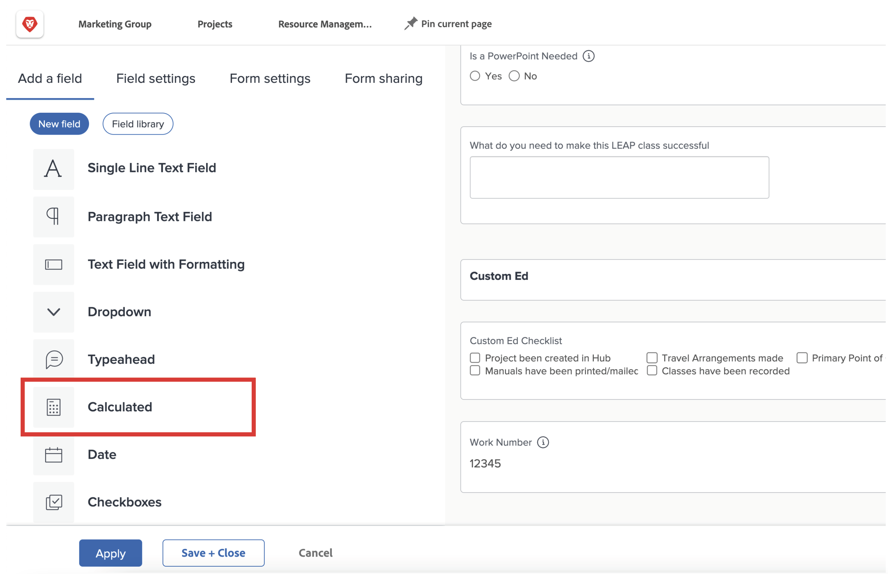
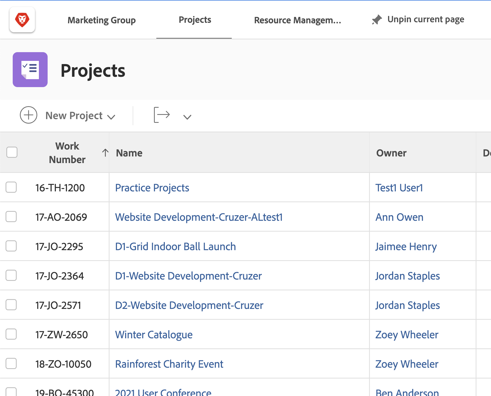

# Aan de slag met berekende velden en expressies

<!-- **Note**: The expression examples shown are simple and some may be mitigated by fields already supplied by  . However, the examples are used to illustrate the foundational knowledge needed in order to build expressions in Workfront.-->

Workfront biedt een verscheidenheid aan gebieden die op meerdere bedrijfsgebieden gemeenschappelijk zijn en die regelmatig voor werkbeheer worden gebruikt. Velden zoals geplande afsluitdatum, projectbudget, naam van de taakontvanger, enz.

Toch heeft elke organisatie specifieke gegevens voor zijn industrie en bedrijf die moeten worden verzameld om te begrijpen of de bedrijfsdoelstellingen worden verwezenlijkt. Uw organisatie wil bijvoorbeeld het volgende bijhouden:

* Aan welke branche zal een project bijdragen.
* Als de financiering afkomstig is van leveranciers, intern, of beide.
* Welke resolutie is nodig voor de gebruikte afbeeldingen.

Hoewel deze velden niet inherent in [!DNL Workfront] zijn ingebouwd, kunt u aangepaste gegevensinvoervelden en vooraf ingevulde, meerkeuzevelden maken via een aangepast formulier.

Dit leerpad richt zich op het berekende veld. U zult leren wat een berekend gebied is, de verschillende soorten informatie u in het berekende gebied door gegevensuitdrukkingen kunt trekken, en hoe te om die berekende gebieden te bouwen om uw gegevensinzameling en rapportering te verbeteren.

## Wat is een berekend veld?

In een berekend veld worden aangepaste gegevens opgeslagen die zijn gemaakt met gegevensexpressies en bestaande Workfront-velden.

Bijvoorbeeld, heeft uw organisatie een specifiek project nummering, of het werkaantal, systeem dat omvat:

* Jaar waarin het project is gemaakt,
* initialen van de eigenaar van het project, en
* Het [!DNL Workfront] projectreferentienummer.

Gebruikend uitdrukkingen op een berekend gebied, kunt u elk deel van informatie nemen die reeds in [!DNL Workfront] wordt opgeslagen en die unieke project identiteitskaart, of het het werkaantal tot stand brengen, die dan aan een rapport als dit kan worden toegevoegd:

Afhankelijk van de specifieke gegevens die nodig zijn, kunnen berekende velden eenvoudig zijn, waarbij een of twee expressies worden gebruikt of gecompliceerd, waarbij verschillende ingesloten expressies worden gebruikt. Houd er rekening mee dat Workfront alleen gegevens kan gebruiken die al zijn opgeslagen of die in het systeem zijn opgehaald voor berekende velden.

## Tekstexpressies

Met tekstexpressies kunt u zoeken naar, gegevens ontleden en informatie uit [!DNL Workfront] combineren om zinvollere gegevens te maken of meer inzicht te krijgen in het werk dat voor uw organisatie wordt uitgevoerd.

Tekstexpressies kunnen bijvoorbeeld worden gebruikt om:

* Toon &quot;meer dan $5.000&quot;wanneer projectuitgaven meer dan $5.000, of &quot;minder $5.000&quot;zijn wanneer de uitgaven onder dat zijn, in een kolom van een projectweergave.

* Geef elk project een uniek aantal dat het jaar omvat het project werd gecreeerd, het [!DNL Workfront] verwijzingsaantal van het project, de projectnaam, en de initialen van de projecteigenaar.

* Bouw een rapport dat van elk project een lijst maakt dat niet aan een portefeuille en/of programma wordt toegewezen zodat kunt u dit in uw managervergaderingen gebruiken.

Tekstexpressies kunnen in een aangepast veld worden gebruikt voor deze typen zoekopdrachten en combinaties in Workfront.

Wanneer u de mogelijke tekstexpressies bekijkt, ziet u verschillende opties.

Er zijn zes tekstexpressies die het vaakst worden gebruikt:

* CONCREET
* LINKS / RECHTS
* BEVATTEN
* IF
* ISBLANK