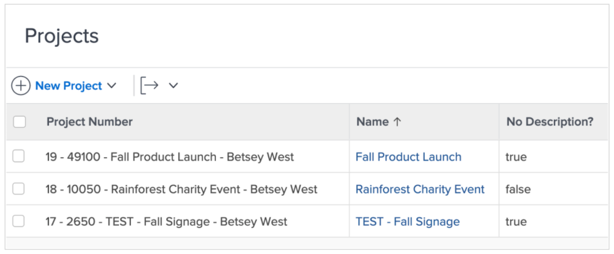
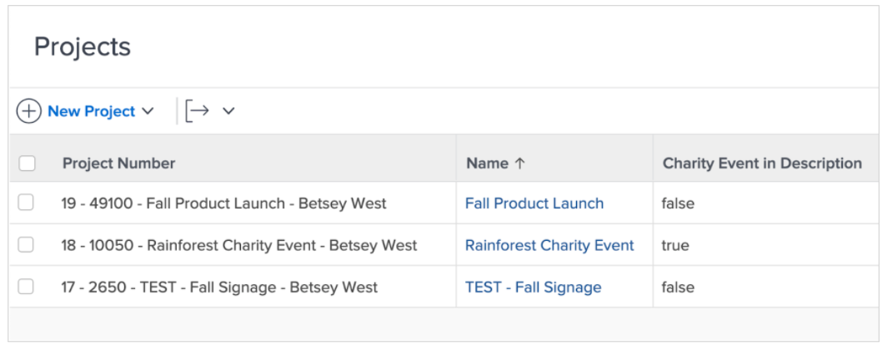

# De expressies ISBLANK en CONTAINS gebruiken

Zowel CONTAINS als ISBLANK uitdrukkingen worden gebruikt om eenvoudige waar of valse waarden te verstrekken. Het verschil is dat de ISBLANK-expressie controleert of het veld een waarde bevat, terwijl de CONTAINS-tekstexpressie zoekt naar een specifieke tekenreeks in een veld.

Bijvoorbeeld, om te zien of heeft een project een beschrijving, gebruik de uitdrukking ISBLANK. Als het beschrijvingsveld leeg is, retourneert de expressie de waarde true. Als het beschrijvingsveld niet leeg is, wordt de waarde false geretourneerd.

Als u wilt zoeken naar een specifieke waarde in de beschrijving, bijvoorbeeld &quot;liefdadigheidsgebeurtenis&quot;, gebruikt u de tekstexpressie CONTAINS. Als in de beschrijving &quot;liefdadigheidsgebeurtenis&quot; wordt gevonden, wordt in het berekende veld &quot;true&quot; weergegeven. Er wordt &quot;false&quot; weergegeven als er geen &quot;liefdadigheidsgebeurtenis&quot; wordt gevonden.

## ISBLANK

De ISBLANK-tekstexpressie bevat de naam van de expressie en één gegevenspunt.

**ISBLANK({data point})**

In het voorbeeld hierboven—waar u wilt weten of het project een beschrijving heeft—zou de expressie zijn:

ISBLANK({description})

## BEVATTEN

De tekstexpressie CONTAINS bevat de naam van de expressie, het woord of de woordgroep waarin u zoekt en het veld waarin u wilt zoeken.

**CONTAINS(&quot;frase&quot;),{fields})**

Zorg ervoor dat u aanhalingstekens plaatst rond het woord of de woordgroep waarnaar u zoekt, anders is de uitdrukking niet geldig.

In het bovenstaande voorbeeld (waarin wordt gezocht naar &quot;liefdadigheidsgebeurtenis&quot; in de projectomschrijving) zou de expressie als volgt zijn:

**CONTAINS(&quot;liefdadigheidsgebeurtenis&quot;,{description})**

**Opmerking**: De expressie CONTAINS is hoofdlettergevoelig. Als &#39;Charity Event&#39; bijvoorbeeld een hoofdletter is in het beschrijvingsveld, maakt u die zin in de expressie met een hoofdletter.

**CONTAINS(&quot;Charity Event&quot;,{description})**

Zowel zijn ISBLANK als CONTAINS uitdrukkingen goed om te gebruiken als u kijkt om te zien of is een waarde aanwezig. Het kan echter nuttiger zijn om te weten wat de waarde is, om deze te zien of om een of andere vorm van descriptor te hebben om een beter inzicht te verschaffen.

In plaats van alleen maar te weten dat een project is omgezet vanuit een aanvraag, wilt u bijvoorbeeld de naam van de oorspronkelijke aanvraag kennen.

In dat geval gebruikt u de expressie CONTAINS samen met een IF-expressie.

Vaak worden de ISBLANK- en CONTAINS-tekstexpressies gebruikt met een IF-tekstexpressie.
