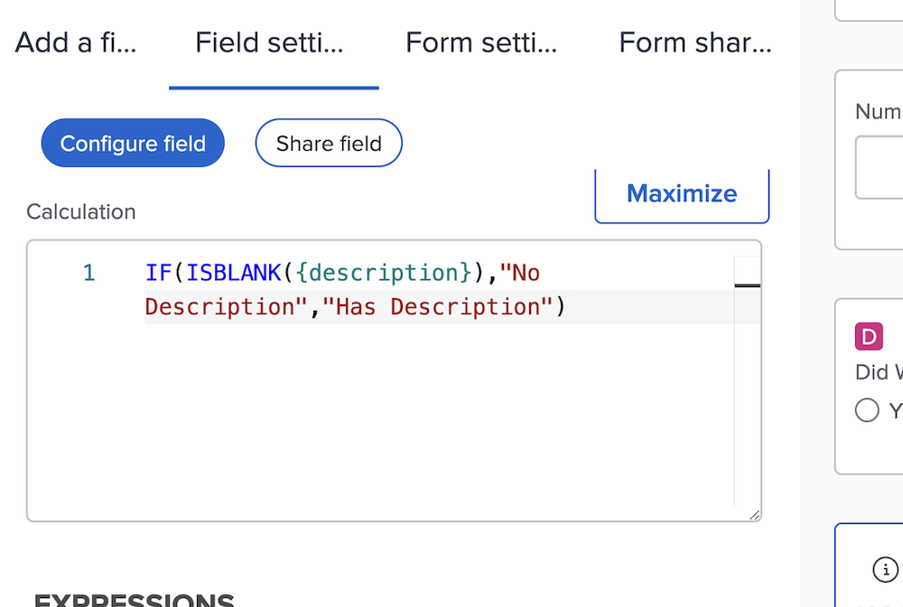

# Informatie over berekende velduitdrukkingen

Hier volgt een lijst met concepten die u goed kunt kennen wanneer u werkt met aangepaste berekende velden in Workfront.

## Hoofdlettergebruik in expressienamen

Als het gaat om expressienamen, is het belangrijk om te trainen. Bij het schrijven van een expressienaam kunt u hoofdletters, kleine letters of een combinatie van beide gebruiken.

De expressie moet echter als hoofdletters worden geschreven, anders herkent het systeem de expressie en slaat het veld op.

## Uren worden in minuten opgeslagen

Uren in de Workfront-database worden in minuten opgeslagen. Als u verwijst naar velden zoals Geplande Uren of Werkelijke Uren, verdeel door 60 om de tijd in uren en niet notulen te tonen.

## Tussenruimte heeft geen invloed op expressies

De aanbevolen manier om expressies te schrijven is met weinig tot geen spatiëring tussen elke expressie.

* IF (ISBLANK ({description}), &quot;Geen Beschrijving&quot;, &quot;heeft Beschrijving&quot;)

Als u echter met spatiëring kunt zien wat er gebeurt, kunt u wat afstand aan de expressies toevoegen. De extra spaties mogen niet verhinderen dat de expressie een waarde in [!DNL Workfront] verzamelt of berekent.

* IF (ISBLANK ({description}), &quot;No Description&quot;, &quot;Has Description&quot;)

De enige dingen die geen spaties tussen hen kunnen hebben zijn de gebieden en de krullende steunen. Anders ontvangt u een foutbericht en kunt u het veld of het aangepaste formulier niet opslaan.

## Aanhalingstekens moeten recht zijn

Wanneer u aanhalingstekens gebruikt in een expressie, moet u ervoor zorgen dat de aanhalingstekens recht (&quot;) zijn. Als de aanhalingstekens gebogen zijn (&quot;), blijft het [!DNL Workfront] -systeem het bericht &#39;Aangepaste uitdrukking ongeldig&#39; weergeven.

## Berekeningen worden bijgewerkt bij het opslaan en bewerken van formulieren

Dit is een belangrijk aspect van berekende velden dat u moet begrijpen.

De informatie die in een berekend veld wordt weergegeven, blijft ongewijzigd en wordt verouderd, tenzij het aangepaste formulier opnieuw wordt berekend.

Expressies kunnen worden vernieuwd met de optie Expressies opnieuw berekenen in het menu Meer van een object.

Je wilt het aantal dagen zien dat een uitgave geopend is. Maak een berekend veld met de expressie DATEDIFF, genaamd &#39;Open dagen&#39;.

* Veldnaam = open dagen
* expression = DATEDIFF({entryDate},$$TODAY)

Als de uitgave eenmaal is opgeslagen, kunt u het aantal dagen tussen het tijdstip waarop de uitgave is gemaakt of in Workfront is ingevoerd en de datum van vandaag weergeven op de detailpagina van een object of in een rapportweergave.

Wanneer u dezelfde detailpagina of rapportweergave de volgende dag weergeeft, verwacht u dat getal met één te verhogen. Als het getal vandaag 5 is, moet het morgen 6 zijn. De volgende dag moet 7 zijn, dan 8, enzovoort.

Het veld zal echter elke dag 5 worden weergegeven. Het veld moet opnieuw worden uitgevoerd of opnieuw worden berekend om de informatie te vernieuwen.

Een veld bijwerken met de optie Expressies opnieuw berekenen:

* Klik op de naam van het object om het te openen.
* Klik op het menu Meer.
* Selecteer Expressies opnieuw berekenen in de lijst.

U kunt ook meerdere expressies tegelijkertijd opnieuw berekenen met de functie &quot;bulkbewerking&quot; in een lijst of rapport. Stel dat u een rapport hebt gemaakt met een lijst met problemen in een kolom met de berekening Openen van dagen. Als u alle problemen in één keer opnieuw wilt berekenen:

* Selecteer alle problemen in het rapport.
* Selecteer de bewerkingsoptie om alle geselecteerde uitgaven bulksgewijs te bewerken.
* Klik op het label Aangepaste Forms aan de linkerkant om naar de sectie Aangepaste formulieren te schuiven.
* Schakel het vak Aangepaste expressies opnieuw berekenen onder aan de sectie Aangepaste Forms in.
* Klik op Wijzigingen opslaan.

Het scherm vernieuwt om bijgewerkte informatie in het berekende gebied te tonen.

**Nota**: Hoewel er andere manieren zijn om, uitdrukkingen op een berekend gebied bij te werken of opnieuw te berekenen, is dit de snelste en gemakkelijkste manier.

## Berekeningen kunnen variëren van formulier tot formulier binnen hetzelfde veld

Zodra een berekend veld op een aangepast formulier wordt opgeslagen en het aangepaste formulier wordt opgeslagen, wordt het berekende veld toegevoegd aan de veldbibliotheek zodat het kan worden gebruikt op andere aangepaste formulieren.

Als u echter een berekend veld op formulier A hebt en hetzelfde berekende veld op formulier B, dan is de eerste gedachte dat de berekeningen exact hetzelfde zijn. Dat is niet altijd het geval. Het berekende veld op formulier A kan op formulier B een geheel andere manier berekenen.

Wanneer een berekend aangepast veld wordt geselecteerd in de veldbibliotheek en wordt toegevoegd aan een aangepast formulier, wordt het veld toegevoegd maar is de berekening leeg. Een van de redenen hiervoor is dat de berekening kan verwijzen naar velden die niet bestaan voor een ander objecttype.

Bijvoorbeeld, hebt u een berekend gebied, &quot;Dagen aan Voltooid,&quot;gecreeerd om te bepalen hoe lang het duurde om een taak in een project te voltooien.

* WEEKDAYDIFF ({actualStartDate},{actualCompletionDate})

Je wilt hetzelfde doen voor een herhaling. U kunt dezelfde expressie gebruiken, maar de velden die beschikbaar zijn voor een taakobject, zijn niet altijd beschikbaar voor een herhalingsobject. Met [!DNL Workfront] kunt u dus de berekening maken met de juiste objectvelden.

**Pro-Tip**: Kopieer de berekende uitdrukking van de doos van de Berekening aan het gebied van Instructies wanneer het creëren van douanegebieden. Dit veld wordt niet gewist wanneer een berekend aangepast veld vanuit de veldbibliotheek aan het aangepaste formulier wordt toegevoegd.

Afhankelijk van de behoefte, kunnen de berekende gebieden in douaneformulieren vrij eenvoudig of zeer complex zijn. Expressies kunnen andere expressies en waarden insluiten of nesten om het detailniveau te bieden dat nodig is om een beter beeld te krijgen van wat er gebeurt met het werk dat binnen uw organisatie wordt uitgevoerd.

<!--Depending on the need, calculated fields in custom forms can be quite simple or very complex. Expressions can embed, or nest, other expressions and values to provide the level of detail needed to get a better picture of what is going on with the work being done at your organization. 

Most of the examples and exercises in this course have been relatively simple to provide a base understanding of the expressions most commonly used and how to build those expressions in a custom calculated field. 

Now you're ready to start building your own calculated custom fields.-->
