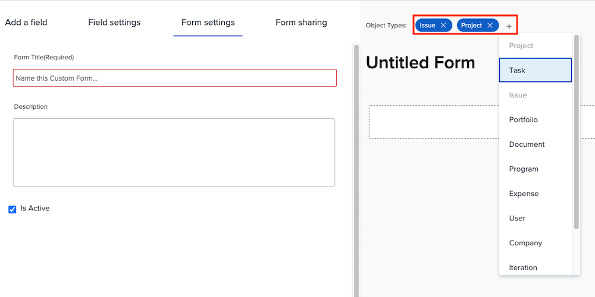

# Een aangepast formulier maken en delen

In deze video leert u hoe u:

* Bepalen welke objecten voor uw formulier moeten worden gebruikt
* Unieke velden toevoegen aan diverse indelingen
* Velden indelen met secties en logica
* Formulieren delen met andere gebruikers

>[!VIDEO](https://video.tv.adobe.com/v/335172/?quality=12)

## Aangepaste formulieren werken met meerdere objecttypen

Wanneer u op de knop [!UICONTROL New Custom Form] kunt u zoveel objecten selecteren als u wilt gebruiken in één aangepast formulier. Alle velden die u aan dit formulier toevoegt, zijn beschikbaar voor alle geselecteerde objecten wanneer het aangepaste formulier eraan wordt gekoppeld.

![Aangepast formuliervenster waarin de [!UICONTROL New Custom Form] objectopties](assets/create-custom-form.png)

Wanneer u een aangepast formulier bewerkt, kunt u alle geselecteerde objecttypen zien. U kunt objecttypen toevoegen aan of verwijderen uit deze lijst.

U wilt mogelijk een aangepaste vorm van type project en uitgave maken. Als u een uitgave als bijlage toevoegt, kunt u alle velden invullen die betrekking hebben op de uitgave. Als u later besluit de uitgave om te zetten in een project, wordt het aangepaste formulier automatisch geladen naar het project en zijn de gegevens die u in de velden van het aangepaste formulier voor uitgave hebt geplaatst, beschikbaar voor weergave of bewerking in het aangepaste formulier voor het project.

## Opties voor aangepaste velden

**[!UICONTROL Label]en [!UICONTROL Name] velden**

De [!UICONTROL Label] en [!UICONTROL Name] velden in een aangepast veld hebben verschillende doeleinden. [!UICONTROL Label] is de veldnaam waarin gebruikers worden weergegeven [!DNL Workfront]. [!UICONTROL Name] is wat kan worden gebruikt met integratie, zoals API.

![Aangepast formuliervenster weergeven [!UICONTROL Label] en [!UICONTROL Name] velden](assets/custom-forms-field-label-and-name.png)

Dit verstrekt de flexibiliteit om het gebruiker-onder ogen ziet etiket te veranderen om veranderingen in uw organisatie aan te passen, zonder integraties of andere verbindingen te beïnvloeden die op een specifieke gebiedsnaam vertrouwen.

**[!UICONTROL Text Field with Formatting]**

De [!UICONTROL Text Field with Formatting ]bevat basisgereedschappen voor tekstopmaak waarmee gebruikers vette, cursieve of onderstreepte tekst kunnen toevoegen terwijl ze het veld invullen op een aangepast formulier.

![Aangepast formuliervenster weergeven [!UICONTROL Text Field with Formatting] option](assets/custom-forms-text-field-with-formatting.png)

Het veld heeft ook een limiet van 15.000 tekens, zodat er voldoende ruimte is om essentiële informatie te verschaffen en opmaak te gebruiken die het voor anderen gemakkelijk maakt om te lezen.

**[!UICONTROL Typeahead]field**

De [!UICONTROL Typeahead] In dit veld kan het systeem automatisch een lijst met opties vullen op basis van het object dat voor het veld is geselecteerd.

![Aangepast formuliervenster weergeven [!UICONTROL Typeahead] veldoptie](assets/custom-forms-typeahead-1.png)

Als u bijvoorbeeld een [!UICONTROL Typeahead] veld Naam marketingmanager en selecteer [!UICONTROL User] als het objecttype waarnaar wordt verwezen, wordt een lijst met gebruikersnamen weergegeven wanneer een gebruiker dat veld invult op een aangepast formulier. De [!UICONTROL Typeahead] is bedoeld om uw aangepaste gegevens te verbinden met informatie die in het systeem is vastgelegd en om te voorkomen dat u handmatig veel opties in vervolgkeuzelijsten hoeft te behouden.

![Aangepast formuliervenster weergeven [!UICONTROL Typeahead] vervolgkeuzemenu](assets/custom-forms-typeahead-2.png)
