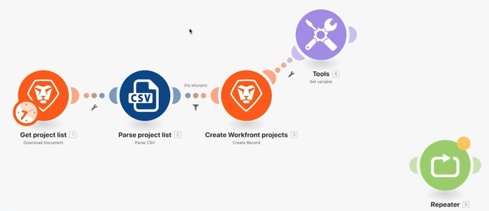
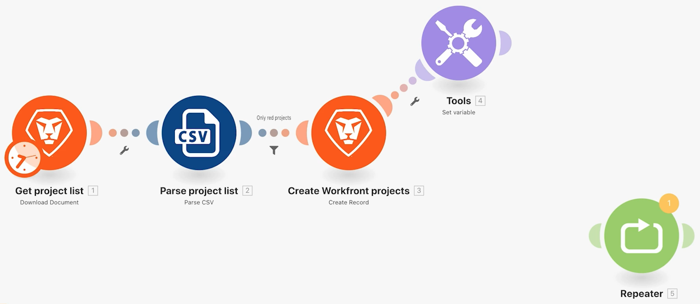

# Eerdere versies openen

Leer hoe te om aan een vorige versie van een scenario terug te keren.

## Overzicht van oefening

Ontdek hoe u vorige versies kunt herstellen nadat u wijzigingen in een scenario hebt aangebracht en het meerdere keren hebt opgeslagen.

## Te volgen stappen

1. Kloon uw Gebruikend het machtige filterscenario en noem het &quot;Toegang tot vorige versies.&quot;
1. Voeg een Vastgestelde veranderlijke module na de Create Workfront projectenmodule toe. Geef de variabele &quot;Test&quot; een naam.
1. Sleep het naar een nieuwe positie en sla het scenario op.

   

1. Voeg een module van de Repeater toe, ontkoppel het van de vorige module, en sparen opnieuw het scenario.

   

1. Verwijder nu alle modules en sla deze op.
1. Klik in de werkbalk op het menu met drie punten en klik op de optie Vorige versies. De keuzelijst bevat de datum- en tijdstempels voor elke opgeslagen versie.

   

1. Kies een vorige versie en merk op hoe het scenario in de ontwerper aan waar terugkeert u bewaarde.
