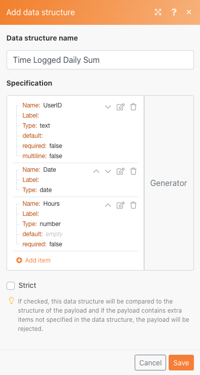

# Gegevensstructuren

Transformeer gegevens van een bronbestand naar een doelbestand.

## Overzicht van oefening

Open een CSV-bestand dat een lijst met tijdgegevens bevat. Deze tijdgegevens worden gedurende minuten vastgelegd door meerdere gebruikers. Het doel is deze informatie te nemen en een nieuwe CSV te produceren die de totale tijd, in uren toont, die door elke gebruiker, elke dag wordt geregistreerd.

In dit scenario opent u een bestand dat een lijst bevat met tijdgegevens voor gewerkte minuten, zoals de datum en tijd, het aantal minuten dat is ingevoerd en het e-mailadres van wie de gegevens heeft ingevoerd. Er zijn 100 inzendingen, waarvan sommige door dezelfde individuen zijn gemaakt en sommige op dezelfde dag als andere.

Als u een bestand wilt maken waarin de totale tijd in uren wordt weergegeven die elke dag door elk individu wordt gewerkt, gaat u als volgt te werk:

1. Haal in de triggermodule een bestand op uit de Workfront-map. Download het bestand.
1. In de eerste module CSV, ontleed de gegevens van de tijdingang aan output één bundel voor elke tijdingang. Dit is een iterator.
1. De eerste module van Hulpmiddelen is een numerieke aggregator. Hiermee voegt u alle minuten samen en groepeert u de rijen per e-mailadres en vervolgens op datum. Het resultaat is het totaal aantal minuten dat elke dag per e-mailadres is gewerkt.
1. De tweede module van Hulpmiddelen is een Vastgestelde module van de Variabele. Gebruik deze optie om de minuten op te maken om deze met 60 decimalen te delen en om te afronden naar 2 decimalen.
1. Stel het uitvoerbestand in in de tweede CSV-module.
1. Upload het CSV-bestand in de uiteindelijke module naar Workfront.

## Te volgen stappen

**Download het bestand van Workfront.**

1. Selecteer &quot;_Fusion1.0JanTime.csv&quot; in de map Workfront &quot;Fusion Exercise Files&quot; en klik op Documentdetails.
1. Kopieer het eerste id-nummer van het URL-adres.
1. Maak een nieuw scenario. Geef deze de naam &#39;Gegevensstructuren maken en gebruiken&#39;.
1. Start met de module Download Document vanuit de Workfront-toepassing.
1. Stel uw Workfront-verbinding in en neem de document-id op die u van de Workfront-URL hebt gekopieerd.

   

   **Parseer de gegevens van de tijdingang.**

1. Voeg een andere module toe en selecteer CSV parseren.
1. CSV-bestand parseren voor 7 kolommen. Controleer CSV bevat kopballen doos. Kies het scheidingsteken voor komma&#39;s en plaats Gegevens in het CSV-veld.

   

1. Klik eenmaal op Uitvoeren om de uitvoer weer te geven.
1. Open de uitvoeringscontrole om de input en de output van de Parse CSV module te zien. Er is één bundel (een CSV-bestand) als invoer en meerdere bundels als uitvoer (één bundel voor elke rij in het CSV-bestand). Het moet er ongeveer als volgt uitzien:

   

   **Zet vervolgens de gegevens om in het gewenste uitvoerformulier, waarbij de geaggregeerde tijdtotalen worden uitgedrukt in uren in plaats van minuten.**

1. Voeg een module voor het gereedschap Numerieke aggregatie toe.
1. Selecteer de bronmodule, die de ParseCSV module is.
1. Selecteer SUM voor de statistische functie.
1. Het veld Waarde is kolom 7 van het CSV-bestand. Dit zijn de minuten die door elke gebruiker worden geregistreerd.
1. Als u de velden op groep wilt optellen, klikt u op Geavanceerde instellingen en stelt u Groeperen in op e-mail (kolom 4), datum (kolom 5).

   + Deze som wordt voor elke combinatie van het e-mailbericht en de datum berekend. Plaats een komma tussen kolom 4 en kolom 5. Dit wordt later als scheidingsteken gebruikt.

   **Uw toewijzingspaneel moet er als volgt uitzien:**

   

1. Klik eenmaal op Uitvoeren om de uitvoer van de aggregatie te controleren.

   **De uitvoerbundels moeten er als volgt uitzien:**

   

   **Zet nu de samengevoegde minuten om in uren.**

1. Voeg nog een gereedschapsmodule toe en selecteer Variabele instellen.
1. Geef de variabele &quot;Uren&quot; een naam.
1. Stel de waarde van de variabele in op formatNumber(result/60;2;.;,)

   **Uw toewijzingspaneel moet er als volgt uitzien:**

   

   **Vervolgens haalt u de waarden op die zijn ingesteld voor het uitvoerbestand. U wilt de userID en de datumwaarde die voor de groepen worden gebruikt. Je wilt ook de uren die berekend werden.**

1. Voeg een andere module-CSV module toe gebruikend de aggregator creëren CSV (geavanceerd).
1. De bronmodule is Tools - Numerieke aggregator.
1. Klik op Toevoegen in het veld Gegevensstructuur en geef onze gegevensstructuur de naam &quot;Dagelijkse aangegeven tijd&quot;.
1. Klik op Item toevoegen om het eerste item te maken.
1. Geef het item de naam &quot;UserID&quot; en stel het type in op Text. Klik op Toevoegen.
1. Klik nogmaals op Item toevoegen om het tweede item te maken.
1. Geef het item de naam Datum, stel het type in op Datum en klik op Toevoegen.
1. Klik nog een keer op Item toevoegen.
1. Geef het item de naam &quot;Uren&quot;, stel het type in op Nummer en klik op Toevoegen.

   **Uw gegevensstructuur moet er als volgt uitzien:**

   

1. Klik op Opslaan om de gegevensstructuur Tijd geregistreerd voor dagelijkse som te voltooien.

   **Nu geeft u de waarden op voor de drie velden die u zojuist hebt gemaakt. Deze drie velden worden weergegeven in het deelvenster voor CSV-toewijzing.**

1. Klik in het veld Gebruikersnaam en kies GET op het tabblad Algemene functies. In de eerste parameter, zet SPLIT van de tekst en binaire functies tabel. De eerste parameter voor de functie SPLIT is het Sleutelgebied. Voeg een komma als scheidingsteken en 1 als index toe. Dit geeft aan dat u wilt dat de GET het eerste veld in de array Key ophaalt.
1. Kopieer deze expressie naar het veld Datum. Wijzig de index van 1 tot en met 2 in de tweede waarde in de array.
1. Voeg voor het veld Uren het veld Uren toe met het gereedschap Variabele instellen.

   **Het deelvenster voor CSV-toewijzing moet er als volgt uitzien:**

   

   **Als u het scenario nu in werking stelt, zou u deze output moeten zien:**

   

   **Voeg nu een module toe om deze uitvoer als een document te laden naar een bestaand project in Workfront.**

1. Open het project in Workfront en kopieer de project-id van URL.
1. Ga terug naar het scenario in Fusion en voeg een andere module-de module van het Document van de Upload van Workfront toe app.
1. Plak de project-id in het veld Verwante record-id.
1. Kies Project voor het Verwante type van Verslag.
1. Kies de optie Kaart voor het bronbestand.
1. Gebruik voor de documentnaam de bestandsnaam die u hebt gedownload en voeg &quot;Bijgewerkt&quot; vóór de naam toe.
1. Voor de inhoud van het Dossier, gebruik de output van de Tekst van de Create CSV module.

   **Uw toewijzingspaneel moet er als volgt uitzien:**

   

1. Klik op OK en sla het scenario op.
1. Klik eenmaal op Uitvoeren om het scenario uit te voeren.

   **Controleer de uitvoeringscontrole in de module Document uploaden om te bevestigen dat het document is geüpload.**

   
