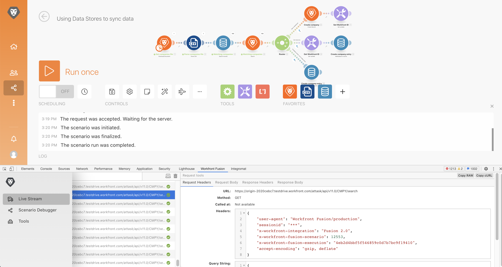
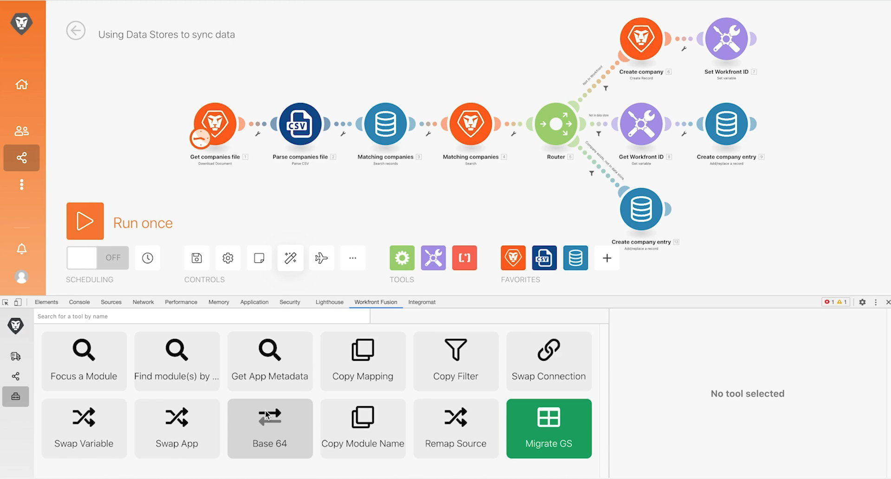

# Uitoefening van gereedschap Ontwerpen

Verbeter uw mogelijkheden om een scenario problemen op te lossen en complexe configuraties te verlichten gebruikend het Dev hulpmiddel.

## Overzicht van oefening

Installeer en gebruik de verschillende gebieden in Workfront Dev hulpmiddel om dieper in verzoeken/reacties en geavanceerde scenario ontwerptrucs te duiken.

>[!NOTE]
>
>Het hulpmiddel van de Ontwikkelaar van de Fusie van Workfront is slechts beschikbaar in browser van Chrome wanneer het gebruiken van het [&#x200B; hulpmiddel van de ontwikkelaar van Chrome &#x200B;](https://developer.chrome.com/docs/devtools/).

## Te volgen stappen

**installeer het Dev hulpmiddel.**

1. Download het document &quot;workfront-fusion-devtool.zip&quot; in de map Fusion Exercise Files in het teststation.
1. Pak de ZIP-bestanden uit in een map.
1. Open een lusje in Chrome en ga **chrome://extensions** in.
1. Schakel in de modus Ontwikkelaar met behulp van de schakelaar in de rechterbovenhoek in en klik vervolgens op de knop &quot;Niet-verpakt laden&quot; die linksboven wordt weergegeven. Selecteer de map met het gereedschap Dev (dit is waar u het hebt uitgepakt).

   

1. Nadat u de verpakking hebt verwijderd, wordt het gereedschap Ontwikkelen bij de andere extensies weergegeven.

   

   **gebruik de Levende Stroom.**

1. Begin door &quot;het Gebruiken van de Opslag van Gegevens aan synchronisatiegegevens&quot;scenario te openen.
1. Open het gereedschap Dev door F12 of de functie F12 te typen. U kunt ook op het menu met drie punten in de adresbalk van Chrome klikken en naar Developer Tools navigeren.

   

1. Klik op het tabblad Workfront Fusion en selecteer vervolgens Live Stream in de lijst aan de linkerkant.
1. Klik eenmaal op Uitvoeren om gebeurtenissen weer te geven zoals deze plaatsvinden.
1. Klik op een gebeurtenis om tabbladen aan de rechterkant weer te geven voor Request-headers, Request-body, Response Headers en Response Body.

   

   **gebruik Debugger van het Scenario**

1. Selecteer Foutopsporing Scenario en klik een module om informatie over de verrichtingen van die module te zien.

   

1. Navigeer naar het tabblad Historie. Klik Details op een uitvoering om de details van de moduleverrichting voor een specifieke uitvoering te onderzoeken.

   

   **Gebruik de Hulpmiddelen**

1. Ga terug naar de scenarioontwerper en selecteer Hulpmiddelen in het Dev hulpmiddel. Hier worden de beschikbare gereedschappen weergegeven.

   

+ Focus op een Module - Zoek en open snel een module door de module identiteitskaart te gebruiken.
+ Module(s) zoeken door Toewijzing - zoek een scenario met een trefwoord om toegewezen waarden en/of sleutels in modules te zoeken.
+ App-metagegevens ophalen - Bekijk de metagegevens voor de geselecteerde app in een scenario.
+ Toewijzing kopiëren - kopieert toewijzingen van de ene module naar de andere. U kunt ook de module in de ontwerper klonen.
+ Filter kopiëren - kopieert een filter. Het filter wordt altijd toegewezen aan de module op het recht is.
+ Verbinding wisselen - Het gereedschap neemt de verbinding van de geselecteerde module en stelt dezelfde verbinding in met alle modules van dezelfde app in het scenario. Dit is nuttig als u de verbinding door een voltooid scenario moet veranderen. Met dit gereedschap kunt u voorkomen dat alle toewijzingen verloren gaan en tijd besparen.
+ Variabele wisselen - zoekt alle instanties van de opgegeven variabele in het hele scenario of in één module en vervangt deze door het nieuwe scenario. Jokertekens worden niet ondersteund. Als u per ongeluk een waarde door het volledige scenario in kaart hebt gebracht, kan dit u gemakkelijk voor de correcte waarde ruilen.
+ App wisselen - de opgegeven app wisselen voor een andere app.
+ Basis 64 - codeer de ingevoerde gegevens aan Base64 of decoder Base64. Nuttig wanneer u naar bepaalde gegevens in het gecodeerde verzoek wilt zoeken.
+ Naam van module kopiëren - kopieert de naam van de geselecteerde module naar het klembord.
+ Source opnieuw toewijzen - Wijzig de toewijzingsbron van de ene module in de andere. U moet eerst de module aan gebruik als bronmodule aan de route in een scenario toevoegen.
+ Migratie van besturingssysteem - speciaal gemaakt om Google Sheets-modules (verouderd) bij te werken naar de nieuwste Google Sheets-versie. Het voegt een nieuwe versie van de module net na de erfenisversie van de module in de scenario route toe.
