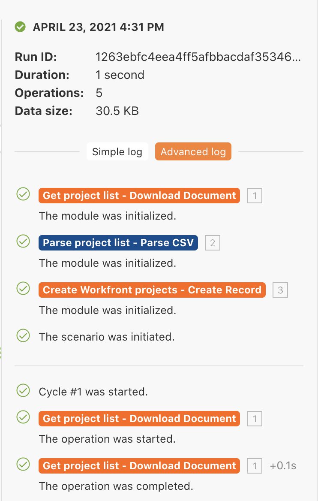

# Uitvoeringshistorie

De details van het overzicht en van de controle over vroegere uitvoeringen en scenario configuraties.

## Overzicht van oefening

Herzie de uitvoeringsgeschiedenis voor het &quot;Gebruikend het machtige filter&quot;scenario om te begrijpen wat gebeurde toen de uitvoeringen voorkwamen en hoe zij werden gestructureerd toen zij werden in werking gesteld.

## Te volgen stappen

1. Open uw &quot;Gebruikend het zou filterscenario&quot;.
1. Klik vanaf de overzichtspagina op het tabblad Historie (boven, onder de naam van het scenario).

   

1. Zoek een uitvoering en klik op de detailknop om een pagina te openen waarop de specifieke uitgevoerde (of niet uitgevoerde) bewerkingen in het rechterdeelvenster worden weergegeven. In het linkerpaneel, kunt u het scenario onderzoeken zoals het op het tijdstip van uitvoering was.

   

1. Wanneer u op een module klikt in het deelvenster met scenario&#39;s, wordt een deelvenster met een modulecontrole weergegeven met informatie over de instellingen van de module. Klik op de uitvoeringcontrole naast een module of filter om te zien op welke bundels informatie werd uitgevoerd.

   

   

1. Blader in het rechterdeelvenster door het logbestand Eenvoudig of klik erop om de details van de &#39;play-by-play&#39; van de uitvoering weer te geven.

   + U kunt zien wanneer de verrichtingen in modules werden voltooid en wanneer de bundels (of niet) door filters overgingen.

   

   + Klik op een logitem om het bewerkingspaneel in het deelvenster met scenario&#39;s te openen. De logboekbestanden worden in chronologische volgorde weergegeven van het tijdstip waarop ze zijn opgetreden.

   

1. Het logbestand Geavanceerd bevat vergelijkbare informatie. Het biedt echter meer informatie over het aantal cycli dat per uitvoering is uitgevoerd en u kunt dieper graven in welke bundels informatie in elke cyclus zijn verwerkt.

