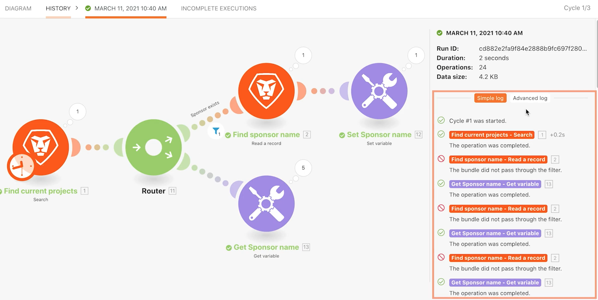

# Bezig met verkennen van reeksen, cycli en bundels

Begrijp hoe de looppas, de cycli, en de bundels zich gebruikend de uitvoeringsgeschiedenis van een scenario gedragen.

## Overzicht van oefening

De praktijk met verschillende scenario configuraties om het gebruiken van looppas en cycli te onderzoeken.

## Te volgen stappen

1. Kloon het scenario genoemd &quot;het Delen van variabelen tussen het verpletteren van wegen.&quot; Noem het nieuwe scenario &quot;het Delen variabelen tussen het verpletteren van wegen - de test van Cycli.&quot;
1. Verwijder de module Een e-mailbericht verzenden omdat deze niet nodig is voor deze test.

   **Opstelling uw scenario om 3 cycli per looppas te verwerken. Proces 5 projecten in elke cyclus.**

1. Klik de trekkermodule en verander het Maximale gebied in 5, zodat slechts 5 projecten in elke cyclus worden verwerkt.
1. In de criteria van het Onderzoek, verwijder de tweede filter die het onderzoek tot één enkel project beperkt.
1. Klik op OK.

1. Open op de Fusion-werkbalk de Scenario-instellingen en wijzig het veld Max. aantal cycli van 1 naar 3.
1. Klik op OK.

   

   **Plan het scenario om elke minuut te lopen.**

1. Klik op het klokpictogram bij de triggermodule en wijzig het veld Minuten in 1 minuut.

   

1. Vervolgens schakelt u de planningstoets onder de knop Eén maal uitvoeren naar Aan. Sla uw scenario op.

   

1. Ga naar de Geschiedenis van de Uitvoering voor het scenario en bekijk aangezien een nieuw geschiedenisverslag binnen de volgende minuut verschijnt. Mogelijk moet u de pagina vernieuwen.

   

1. Klik de knoop van Details van een looppas. Klik door het Eenvoudige login in het juiste paneel, gelijkend op wat u in het gedeelte van de uitvoeringsgeschiedenis van de opleiding van de Fusie van Workfront deed.
1. Records van verwerkte bewerkingen worden opgedeeld in cycli.

   

1. Met een vervolgkeuzemenu rechtsboven in het venster kunt u de drie cycli selecteren die u instelt om elke keer te worden uitgevoerd.

   
