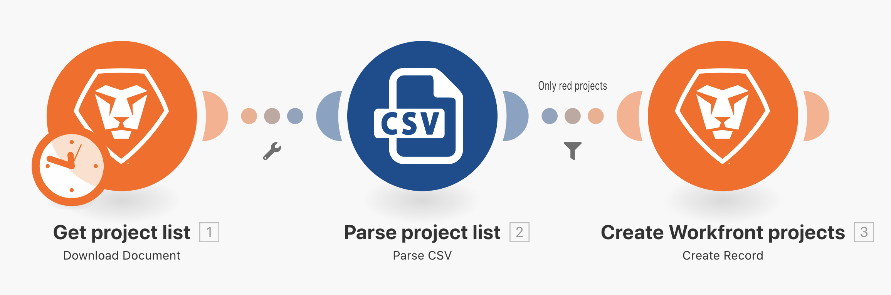

# Filteroefening

Leer hoe u het filter tussen modules gebruikt om alleen bepaalde typen bundels mogelijk te maken.

## Overzicht van oefening

Voeg een filter tussen de twee modules in het Buiten basistoewijzingsscenario toe om slechts projecten tot stand te brengen die een &quot;Rode&quot;projectkleur in het Csv- dossier hebben.

## Te volgen stappen

1. Maak een kloon van het scenario &quot;Buiten de basistoewijzing&quot; en noem dit scenario &quot;Het filter Mengheid gebruiken&quot;.

   **voeg een filter vóór Create Workfront projectenmodule toe om rode projecten slechts toe te staan om worden gecreeerd.**

   

1. Voeg een filter toe door op de stippellijn te klikken die de modules verbindt of door op de moersleutel te klikken en een filter instellen te selecteren.
1. Gebruik het veld Label om het filter Alleen rode projecten een naam te geven.
1. Wijs in het veld Voorwaarde het veld Projectkleur toe (kolom 3 in het CSV-bestand). Selecteer de operator Gelijk aan (hoofdlettergevoelig) en typ vervolgens &quot;rood&quot;.
1. Klik op OK.

   

   **Test de filter en verifieer de resultaten.**

1. Klik op Opslaan om het scenario op te slaan en vervolgens eenmaal uit te voeren.
1. Klik op de uitvoeringscontrole voor het filter om te zien hoe elke bundel door het filter is gecontroleerd en of deze al dan niet is doorgegeven aan de module Workfront-projecten maken.

   

1. Zoek de projecten die in uw Workfront-exemplaar zijn gemaakt.
