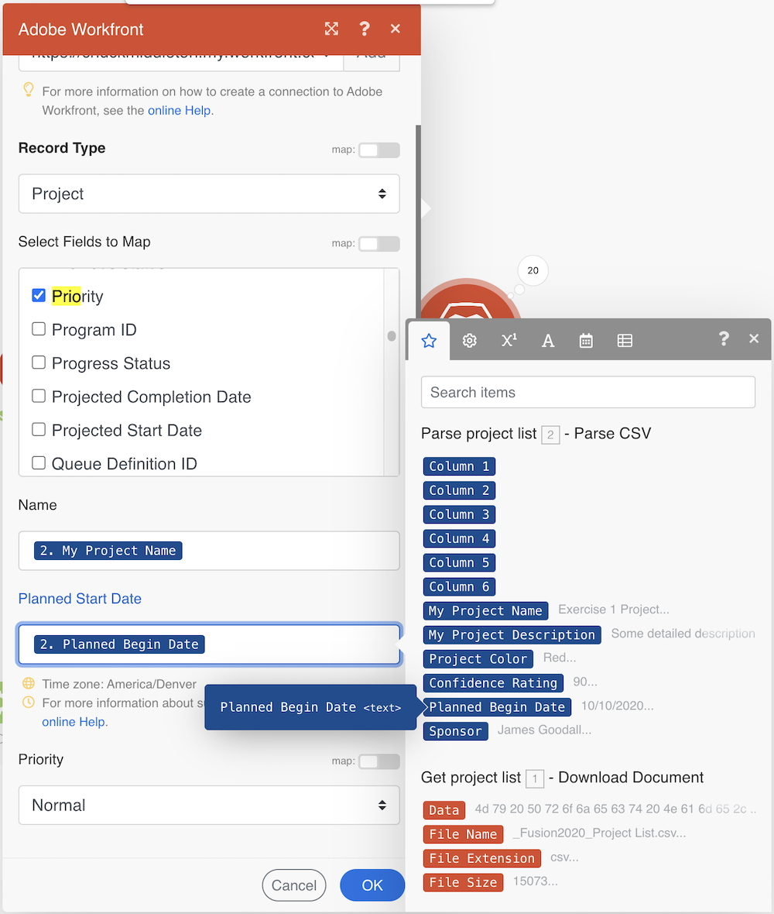

# Eerste scenario

Leer enkele basistips voor navigatie voor wanneer u zich voor het eerst aanmeldt bij Workfront Fusion en voor het maken van uw eerste scenario.

## Vereisten

1. Voor deze oefening is een Workfront-teststation vereist. U kunt een aanvraag indienen door het formulier in te vullen [dit formulier](https://forms.office.com/r/f1J8HRGrNY). Als u geen toegang hebt tot het formulier, stuurt u uw naam, e-mailadres en bedrijfsnaam naar wfttstdr@adobe.com.
1. De oefeningen van de fusie veronderstellen u de walkthrough video hebt bekeken die aan de oefening beantwoordt. In dit geval is het [Eerste analyse van het scenario ontwerp](https://experienceleague.adobe.com/docs/workfront-learn/tutorials-workfront/fusion/understand-the-basics/initial-scenario-design-walkthrough.html?lang=en).

## Overzicht van oefening

Maak een nieuw project in Workfront voor elke rij in het CSV-bestand van de projectlijst.

## Te volgen stappen

1. Maak een map in de sectie Scenario met de naam &quot;Fusion enablement oefeningen&quot;.
1. Klik in de map en klik vervolgens op Een nieuw scenario maken.

   

1. Zoek op de volgende pagina naar Workfront en selecteer die app. Klik vervolgens op Doorgaan.
1. Linksboven in het scherm van de scenarioontwerper wijzigt u de naam van uw scenario in &quot;Initiaal scenario-ontwerp&quot;
1. Klik op de lege triggermodule midden in het scherm en selecteer de Workfront-toepassing en selecteer vervolgens de module Document downloaden.

   **Verifieer de verbinding van de module aan uw Workfront rekening.**

1. Klik op de knop Toevoegen als u voor het eerst een verbinding wilt maken.

   

1. Geef de verbinding een naam, bijvoorbeeld &quot;Mijn Workfront 2020&quot;

   

1. Voer de URL in van **Workfront-exemplaar** en klikt u op Volgende.

   

1. Voer uw wachtwoord in en klik op Aanmelden.

   **De verbinding is tot stand gebracht. Voer nu de document-id in van het document dat u van Workfront wilt downloaden.**

   

1. Ga terug naar Workfront. Selecteer &quot;_Fusion2020_Project List.csv&quot; in de map &quot;Fusion Exercise Files&quot; en klik op Documentdetails in het linkerdeelvenster. Kopieer het document-id-nummer van het URL-adres (dit is het eerste lange getal in de URL).

   

1. Ga terug naar Fusion en plak het nummer in het veld Document ID en klik op OK.
1. De beste praktijken moeten modules anders noemen aangezien u hen creeert. Klik met de rechtermuisknop op de Workfront-module en kies Naam wijzigen. Noem de module &quot;krijgt projectlijst.&quot;

   **Vervolgens parseert u het CSV-bestand dat u net hebt gedownload, zodat u elke rij in het bestand kunt openen. U zult deze informatie gebruiken wanneer u een project van elke rij creeert.**

1. Klik de rechterkant van de module van Workfront om een andere module toe te voegen. Zoek naar CSV app en selecteer de Parse CSV module.
1. CSV van de opstelling ontleedt CSV voor 6 kolommen, CSV bevat kopballen, komma delimiterType, en zet Gegevens in het CSV gebied. Klik vervolgens op OK.

   

1. Wijzig de naam van deze module &quot;Projectlijst parseren.&quot;
1. Klik onder aan de ontwerper van het scenario op Opslaan om het scenario op te slaan.
1. Klik eenmaal op Uitvoeren om de uitvoer weer te geven.

   >[!NOTE]
   >
   >Negeer de waarschuwing dat een transformator niet de laatste module moet zijn (dit is waar, maar maakt niet uit voor deze test). Klik op Toch uitvoeren.

   

1. Open de uitvoeringscontrole op de Parse CSV module om de input en de output van de module te zien. Er is één bundel (een CSV-bestand) als invoer en meerdere bundels als uitvoer (één bundel voor elke rij in het CSV-bestand). Het moet er ongeveer als volgt uitzien:

   

   **Voeg een module toe om een project voor elke rij in het Csv- dossier tot stand te brengen.**

1. Voeg nog een module toe. Selecteer de Workfront-toepassing en kies de module Record maken.
1. Stel het recordtype in als Project.

   >[!TIP]
   >
   >Zoek ernaar door een paar letters te typen, zoals *proj*, om er meteen naar te gaan.

1. Dan gebruik Cmd/Ctrl+G om Naam (projectnaam) te vinden. Schakel het selectievakje naast Naam in. Het veld wordt hieronder weergegeven.
1. Schakel nu de selectievakjes naast Geplande begindatum en prioriteit in.
1. Klik in het veld Naam zodat het deelvenster Toewijzing wordt weergegeven. Klik het Kolom 1 gebied van de ParseCSV module om het aan het gebied van de Naam toe te voegen. Dit is de projectnaam van het CSV-bestand.
1. Voor de Geplande Datum van het Begin, klik Kolom 5 van de ParseCSV module.
1. Kies Normaal in het keuzemenu voor Prioriteit.

   **Uw toewijzingspaneel moet er als volgt uitzien:**

   

1. Klik op OK.

   >[!NOTE]
   >
   >Als u niet O.K. klikt en per ongeluk terug in de ontwerper klikt, slaat uw werk niet op en u zult opnieuw in kaart moeten brengen.

1. Klik met de rechtermuisknop op de Workfront-module en geef deze de naam &#39;Workfront-projecten maken&#39;.
1. Sla uw scenario op en klik eenmaal op de knop Uitvoeren.
1. Klik op de uitvoeringcontrole rechtsboven in de laatste module.

   + Er zijn 20 bewerkingen uitgevoerd. Elke bewerking nam een bundel, dat wil zeggen één rij, van het CSV-bestand als invoer- en uitvoerbundel, dat een project was dat in Workfront was gemaakt. De project-id van het gemaakte project wordt weergegeven met de uitvoerbundel.

   

   **Notities gebruiken**

1. De hulp van nota&#39;s leidt tot meer zichtbaarheid in het scenario ontwerp. Als u een notitie wilt toevoegen aan de module Workfront-projecten maken, klikt u met de rechtermuisknop en selecteert u Notitie toevoegen. Er verschijnt een deelvenster rechts van het ontwerpvenster, zodat u een notitie kunt toevoegen aan de module. Typ &quot;Een project maken met de naam, de geplande begindatum en de prioriteit die uit het CSV-bestand zijn toegewezen.&quot;
1. Voeg nog een opmerking toe om te beschrijven wat de triggermodule (de eerste Workfront-module) doet.
1. Sluit het deelvenster Notities door op de X in de rechterbovenhoek te klikken.

   + U opent de notities opnieuw door op de knop Notities op de onderste werkbalk te klikken of door met de rechtermuisknop op een module te klikken en een nieuwe notitie toe te voegen.
   + Notities worden in omgekeerde chronologische volgorde gesorteerd.
   + Zodra notities zijn toegevoegd, verschijnt er een oranje stip op de knop Notities.

   

1. Sla het scenario op door op de knop Opslaan op de werkbalk met besturingselementen te klikken.
1. U kunt de projecten bekijken die in uw instantie van Workfront worden gecreeerd.
