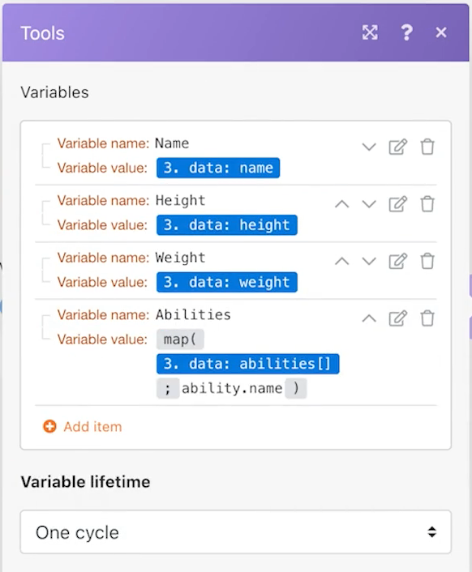

# Inleiding tot universele aansluitingen

Vergroot uw begrip van het werken met REST universele schakelaars en het werken met de teruggekeerde gegevens.

## Overzicht van oefening

Gebruikend een karakter Pokemon in een spreadsheet, roep de Pijn API door een schakelaar van HTTP om meer informatie over dat karakter te verzamelen en te posten.

## Te volgen stappen

**Download het Csv- dossier van Workfront.**

1. Selecteer &quot;_Fusion2020_Shipping Manifest.csv&quot; in de map Workfront &quot;Fusion Exercise Files&quot; en klik op Documentdetails.
1. Kopieer het eerste id-nummer van het URL-adres.
1. Maak een nieuw scenario in Workfront Fusion. Noem het &quot;Gebruikend universele schakelaars.&quot;
1. Start met de module Download Document vanuit de Workfront-toepassing.
1. Stel uw Workfront-verbinding in en neem de document-id op die u van de Workfront-URL hebt gekopieerd.
1. Wijzig de naam van deze module &quot;Verzendmanifest downloaden&quot;.

   

   **ontleed de verschepende duidelijke gegevens.**

1. Voeg een andere module toe en selecteer CSV parseren.
1. CSV voor elf kolommen instellen. Controleer CSV bevat kopballen doos. Kies het komma delimiterType, en zet Gegevens van de module van het Document van de Download op het CSV gebied.

   

1. Wijzig de naam van deze module &quot;Parse Shipping manifest&quot;.
1. Sla het scenario op en klik eenmaal op Uitvoeren, zodat u de gegevens uit het CSV-bestand in de volgende stappen kunt zien.

   **krijgt de gegevens van Pokemon gebruikend de universele schakelaar.**

1. Voeg een HTTP Make een Request module toe.
1. Op het URL gebiedsgebruik `https://pokeapi.co/api/v2/pokemon/[Character]`, waar [ Karakter ] aan Kolom 3 van de Parse CSV module in kaart wordt gebracht.
1. Schakel het selectievakje Reactie pareren in.
1. Selecteer Geavanceerde instellingen tonen en schakel het selectievakje naast &quot;Alle frames als fouten evalueren&quot; in.
1. Klik op OK en wijzig de naam van de module &quot;Info over pokemon ophalen&quot;.

   **Uw toewijzingspaneel zou als dit moeten kijken:**

   

   **In dit deel van de oefening, wilt u slechts rij 1 in het Csv- dossier verwerken.**

1. Voeg een filter toe vóór de module Get Pokemon Info. Geef deze de naam &quot;Alleen rij 1&quot;.
1. Stel de voorwaarde zodanig in dat alleen id nummer 1 wordt doorgegeven. Id nummer 1 staat in rij 1 en ID-veld bevindt zich in kolom 1 in het CSV-bestand.

   

1. Sla het scenario op.
1. Klik op Eenmaal uitvoeren en bekijk het foutbericht dat u ontvangt in HTTP Make a request module.

   >[!IMPORTANT]
   >
   >In het veld URL van invoergegevens wordt de naam van het teken met hoofdletters weergegeven. Dit werkt niet voor het maken van die API-aanroep omdat tekennamen in kleine letters moeten worden geschreven.

   

1. Gebruik het mappingpaneel op HTTP maak een verzoekURL gebied om het &rbrack; gebied van het Teken &lbrack; te maken allen kleine letters gebruikend de **lagere** functie.

   

   **de informatie van de Kaart terug van API gebruikend de Vastgestelde veelvoudige variabelen module.**

1. Voeg de module Meerdere variabelen instellen toe na Info van menu ophalen. Kaartnaam, hoogte, gewicht en mogelijkheden.
1. Aangezien het veld Abilities een array is, moet u niet vergeten de kaartfunctie te gebruiken om toegang te krijgen tot de naam van elke mogelijkheid in de array.

   

   **stel het scenario zonder de filter in werking om een andere fout te ontdekken.**

1. Als u alle rijen in het CSV-bestand wilt verwerken, verwijdert u het filter Alleen rij 1:

   + Klik op het filterpictogram om dit te bewerken.
   + Verwijder het filterlabel.
   + Verwijder de voorwaarde.
   + Klik op OK.

1. Sla het scenario op en klik eenmaal op Uitvoeren.
1. Er treedt een fout op in de module Get Pokemon Info. Er is een superheld-teken doorgegeven aan de Pokemon-API.

   >[!NOTE]
   >
   >In de analyse van Routers, zult u zien hoe te om deze fout op te lossen door een afzonderlijke weg tot stand te brengen om superhelden te verwerken.

   
