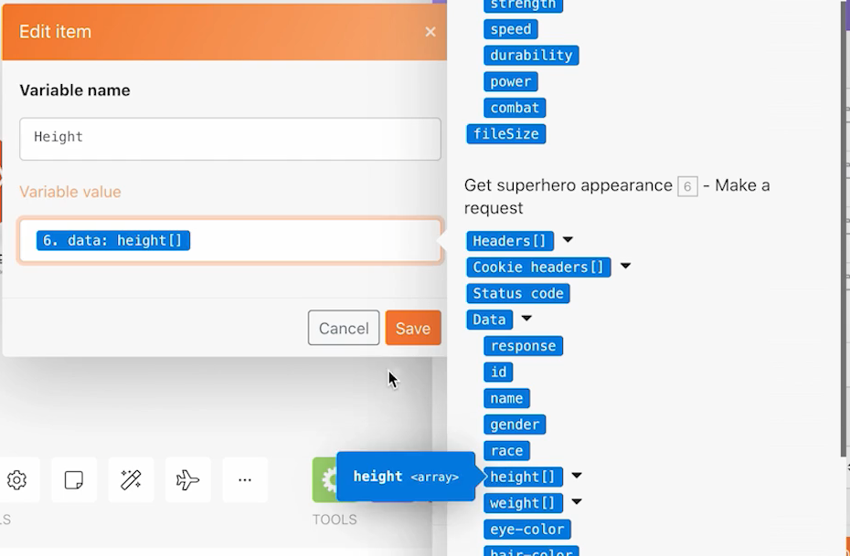

# Routers

Begrijp het belang van routers en hoe zij kunnen worden gebruikt om verschillende modules voorwaardelijk te verwerken.

## Overzicht van oefening

Gebruik een router om de bundels van Pokemon versus van superhelden onderaan de correcte weg over te gaan, dan creeer een taak voor elk karakter.

## Te volgen stappen

1. Kloon het Gebruikende universele connectorscenario van de vorige oefening. Noem het &quot;Creërend verschillende wegen gebruikend routers.&quot;

   **creeer een nieuwe weg voor superhelden door modules te klonen en een router toe te voegen.**

   

1. Klik met de rechtermuisknop op de informatiemodule Pokemon ophalen en kies Klonen. Als u eenmaal gekloond hebt, sleept u de code en sluit u deze aan op de lijn tussen de nieuwe HTTP-module en de CSV-module parseren.

   >[!NOTE]
   >
   > Bericht hoe het automatisch een router met twee wegen toevoegt.

1. Geef deze module de naam &#39;Weergave van superheld ophalen&#39;.
1. Clone this module, move the clone to the right, and name it &quot;Get superhero abilities.&quot;
1. Kloont de module Gereedschappen en verplaatst deze naar het einde van het tweede pad.
1. Klik op de werkbalk op het pictogram van de werkbalk - de knop Automatisch uitlijnen.

   **Uw scenario zou als dit moeten kijken:**

   

   **daarna, gaat u de in kaart gebrachte waarden in de nieuwe gekloonde modules veranderen.**

1. Ga naar <https://www.superheroapi.com/> en gebruik uw Facebook-account om een toegangstoken te krijgen.

   >[!NOTE]
   >
   >Als u moeite hebt om uw eigen superheldtoken te openen, kunt u dit gedeelde token gebruiken: 10110256647253588. Houd rekening met het aantal keren dat u de superheld-API aanroept, zodat dit gedeelde token voor iedereen blijft werken.

1. Open de instellingen voor de weergave Superheld ophalen en wijzig de URL in `https://www.superheroapi.com/api/[access- token]/332/appearance` . Zorg ervoor dat u uw toegangstoken opneemt in de URL. Klik op OK.
1. Open de instellingen voor de functie Superhero en wijzig de URL in `https://www.superheroapi.com/api/[access- token]/332/powerstats` . Zorg ervoor dat u uw toegangstoken opneemt in de URL. Klik op OK.
1. Klik met de rechtermuisknop op elke superheldmodule en selecteer Alleen deze module uitvoeren. Hierdoor wordt de gegevensstructuur gegenereerd die u voor toewijzing moet zien.
1. Nadat u beide uitvoert, verander het aantal &quot;332&quot;op elk gebied URL in Kolom 4 die van de Parse CSV module in kaart wordt gebracht.

   

   **nu kunt u in de Vastgestelde veelvoudige variabelen module in de superheldweg klikken en de naam, de hoogte, het gewicht, en de capaciteiten bijwerken.**

1. Werk de gebieden van de Naam en van de Abonnementen van Get superheldmogelijkheden module-Module 8 bij.

   

1. Werk de gebieden van de Hoogte en van het Gewicht van de Get superheldverschijningsmodule-Module 6 bij.

   

   **wanneer u wordt gedaan, zouden uw variabelen als dit moeten kijken. Merk op dat de moduleaantallen op de gebiedswaarden verschijnen.**

   

1. Klik op OK en sla het scenario op.

   **creeer een andere weg om een taak per karakter tot stand te brengen.**

1. Maak in Workfront een leeg project. Geef het project de naam &quot;Shipping Manifest Project&quot; en kopieer de project-id van de URL.
1. Keer aan de Fusie van Workfront terug en klik in het centrum van de router om een andere weg tot stand te brengen.

   

1. Klik in het midden van de lege module die wordt weergegeven en voeg een recordmodule maken toe vanuit de Workfront-app.
1. Plaats het Type van Verslag aan Taak en selecteer identiteitskaart van het Project van de Gebieden aan de sectie van de Kaart.
1. Plak de project-id die u uit Workfront hebt gekopieerd in het veld Project-id.
1. Selecteer nu het veld Naam in de sectie Velden aan kaart.
1. Noem de taak &quot;[ Karakter ] van [ Franchise ],&quot;het nemen van de karakternaam en de franchise naam van het Csv- dossier. Kolom 3 is de tekennaam en kolom 2 is de naam van de franchise.

   

1. Klik op OK en wijzig de naam van deze module in &quot;Een taak maken voor elk teken&quot;.

   **voegt filters toe zodat kan het scenario zonder fouten lopen. U wilt slechts de karakters van Pokemon onderaan de hoogste weg gaan, slechts superheldkarakters om onderaan de middenweg te gaan, en alle karakters om onderaan weg te gaan.**

1. Klik op de stippellijn links van de informatiemodule Pokemon ophalen om het eerste filter te maken. Geef het de naam &quot;Pokemon-teken&quot;.
1. Hiervoor is alleen toestemming vereist voor records waarbij de franchise (kolom 2) gelijk is aan &quot;Pokemon&quot;. Kies de operator &quot;Gelijk aan&quot; voor tekst.
1. Klik op de stippellijn links van de weergavemodule Get superhero om het volgende filter te maken. Geef het &#39;Superhero-teken&#39; een naam.
1. Omdat superhelden uit diverse franchises kunnen komen, gebruik het gebied van identiteitskaart Superhero (Kolom 4) om te bepalen of een karakter superhero of niet is.

   **Uw filters zouden als dit moeten kijken:**

   {het Beeld 11 van 10} Routers ](../12-exercises/assets/routers-walkthrough-11.png)

1. Sla het scenario op en klik eenmaal op Uitvoeren. Gebruik de inspecteurs van de uitvoering om te verifiëren alle verrichtingen succesvol waren, en controletaken die in uw project van Workfront werden gecreeerd.

   
