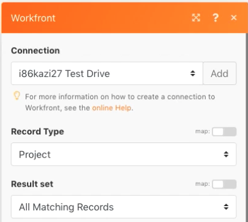
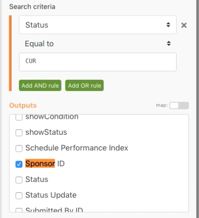
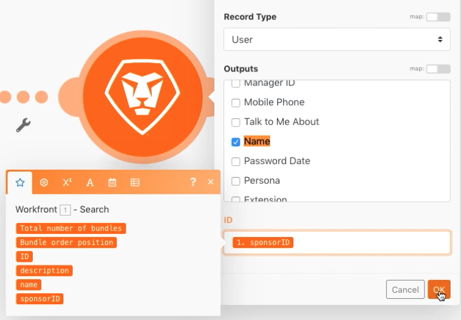
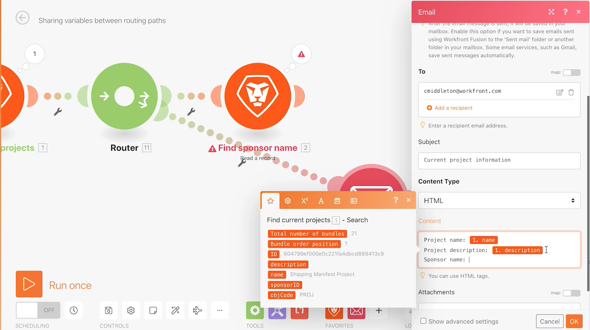

# Variabelen instellen/ophalen

Leer hoe u de modules Set en Get Variable gebruikt om de velden in één pad in een ander pad te gebruiken.

## Overzicht van oefening

Zoek informatie over een project in Workfront en verzend een e-mail met verwante informatie.

## Te volgen stappen

1. Creeer een nieuw scenario en noem het &quot;het Delen van variabelen tussen het verpletteren van wegen.&quot;
1. Selecteer voor de trigger de module Zoeken in de Workfront-app.

   + Stel het recordtype in op Project.
   + Kies Alle overeenkomende records voor de resultatenset.
   + Voor de criteria van het Onderzoek, plaats het aan Status Gelijk aan CUR.
   + Kies Id, Naam, Beschrijving en Sponsor-id voor Output.

   

   

1. Klik op OK en wijzig de naam van deze module in &quot;Huidige projecten zoeken&quot;.
1. Voeg nog een module toe en selecteer Workfront Een recordmodule lezen.

   + Kies Gebruiker bij Recordtype.
   + Kies Naam voor Output.
   + Wijs de sponsor-id van de module Zoeken toe aan het veld Id.

1. Klik op OK.
1. Wijzig de naam van de module &#39;Naam sponsor zoeken&#39;.

   

1. Sla het scenario op en klik eenmaal op Uitvoeren.

   Als u een fout op Lees een verslagmodule ontvangt, is het waarschijnlijk toe te schrijven aan de module van het Onderzoek die een project vindt zonder een sponsor vermeld.

   **Om deze fout te vermijden, creeer twee wegen: voor projecten die een sponsidentiteitskaart en voor projecten hebben die niet hebben.**

1. Voeg een router tussen de twee modules toe door het moersleutelpictogram tussen de router en Gelezen een verslagmodule te klikken. Stel een filter met de naam &quot;Sponsor bestaat&quot; in en stel de voorwaarde in op Sponsor-id bestaat.

   

1. Klik de router om een andere weg tot stand te brengen. Voeg een module Een e-mailbericht verzenden vanuit de e-mailtoepassing toe.

   + Plaats uw eigen e-mailadres in het veld Aan.
   + Typ in het veld Onderwerp de tekst &quot;Huidige projectinformatie&quot;.
   + Plaats de projectnaam, beschrijving en sponsor in het veld Inhoud.
   + U kunt de uitvoer van de naam van de sponsor niet ophalen uit de module Een record lezen. U kunt tot sponsidentiteitskaart van de onderzoeksmodule slechts toegang hebben vóór de router. U zult een manier moeten vinden om tot de sponsor naam van de andere routerweg toegang te hebben.

   

1. Klik op OK voor nu en wijzig de naam van deze module &quot;Projectinfo verzenden&quot;

   **Gebruik variabelen instellen/ophalen om gegevens tussen verschillende paden te delen.**

1. Voeg een module voor het gereedschap Variabele instellen toe na de naammodule Zoeken naar sponsor.

   + Plaats &quot;Sponsor name&quot; als naam van de variabele.
   + Laat de levensduur van de variabele bij één cyclus staan.
   + Wijs het veld toe aan de naamuitvoer vanuit de module Naam sponsor zoeken.

1. Klik op OK en wijzig de naam van de module &quot;Naam sponsor instellen&quot;.

   

1. Daarna, klik tussen de router en Send een e-mailmodule met de rechtermuisknop aan om een Get veranderlijke hulpmiddelmodule toe te voegen. Voer &quot;Sponsor name&quot; in het veld Naam variabele in.
1. Klik op OK. Wijzig de naam van de module &quot;Naam van sponsor ophalen&quot;.

   

1. Ga terug naar Send een e-mailmodule en wijs de waarde van de Get Sponsor naammodule in het inhoudsgebied toe. Klik op OK.

   

   >[!IMPORTANT]
   >
   >Voordat u het scenario test, raden we u aan het aantal projecten dat u verwerkt te beperken om te voorkomen dat er een stroom e-mailberichten ontstaat.

1. Ga naar je Workfront teststation en zoek het Northstar Fashion Exhibitors Booth-project. Dit is een huidig project met een sponsor. Kopieer de project-id van de URL.

   

1. In uw scenario, klik de Huidige de projectmodule van de Vondst. Voeg een andere voorwaarde aan de onderzoekscriteria toe door de groene &quot;Add EN knoop&quot;te klikken. Geef op dat de id gelijk moet zijn aan de project-id die u hebt gekopieerd. Klik op OK.
1. Sla uw scenario op en klik eenmaal op Uitvoeren.
1. Controleer de controleurs van de uitvoering en het e-mailbericht dat u ontvangt.

   
