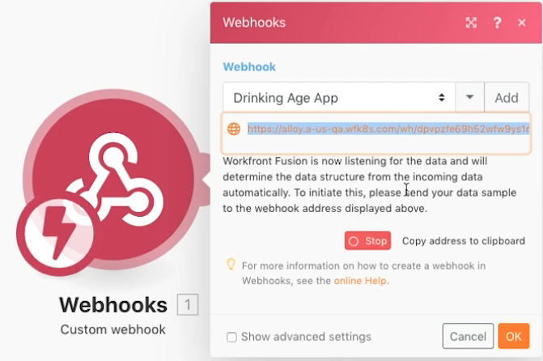

# Webhaken-oefening

Leer hoe u scenario&#39;s maakt, activeert en beheert die met een webhaak zijn gestart.

## Overzicht van oefening

Het doel van dit scenario is een app te maken om te verkopen aan winkels met gemak, zodat ze gemakkelijk kunnen bepalen of een klant oud genoeg is om alcohol te kopen. De kassier hoeft alleen de naam en geboortedatum van de klant te posten naar een URL die deze heeft opgegeven. Die post zal het scenario in werking stellen dat het antwoord zal berekenen en aan de aanvrager zal terugkeren.

1. Het scenario bestaat uit drie webhaken.
1. De triggermodule is een aangepaste webhaak die luistert naar een bericht.
1. Wanneer het een post ontvangt zal het het aan één van de volgende modules uitvoeren.
1. De volgende module keert een antwoord op de aanvrager terug.

   

## Te volgen stappen

**opstelling de trekker webhaak.**

1. Maak een nieuw scenario en noem het &quot;Webhaken gebruiken&quot;.
1. Voor de trigger voegt u de aangepaste webhamodule uit de toepassing Webhooks toe.
1. Klik op Toevoegen om een nieuwe WebHaak te maken.
1. Voer de naam Webhaak in van &quot;De app Drinking age&quot;.
1. Laat de IP-beperkingen leeg, wat betekent dat iedereen gegevens naar de IP-beperkingen kan verzenden.
1. Klik op Opslaan.

   

1. In het kaartpaneel Webhooks is een URL gemaakt voor deze specifieke webhaak. Klik op &quot;Adres kopiëren naar klembord&quot; om die URL te kopiëren.
1. Klik op OK.
1. Klik eenmaal op Uitvoeren.
1. Gebruik de URL in Postman om een naam en geboortedatum naar uw aangepaste webhaak te verzenden. Voor instructies bij vestiging Postman, zie de [ analyse van Webhooks ](https://experienceleague.adobe.com/docs/workfront-learn/tutorials-workfront/fusion/beyond-basic-modules/webhooks-walkthrough.html?lang=nl-NL) leerprogramma.

   **het de modulepaneel van Webhooks zou als dit moeten kijken:**

   

   **Webhaak is nu in een staat waar het naar gegevens luistert om de gegevensstructuur te bepalen.**

1. U kunt de gegevensstructuur van de lading bepalen die u verwacht te krijgen (gegevensstructuren zullen later worden besproken). Als u geen gegevensstructuur definieert, bepaalt Fusion automatisch de gegevensstructuur wanneer de post wordt verzonden.
1. Aan de Postman-zijde wilt u de gekopieerde URL verzenden. De post moet basisformuliergegevens bevatten. Voor dit voorbeeld hebt u drie velden nodig: Naam, Verjaardatum en ClientToken.

   

1. Nadat je op Verzenden vanuit Postman hebt geklikt, kun je aangeven dat de advertentie is geaccepteerd.
1. Dit is het punt waar uw scenario zal tonen dat de gegevensstructuur met succes is bepaald.
1. U kunt zien dat de gegevens zijn ontvangen door de uitvoeringscontrole te openen.

   

   **opstelling die voor cliënttokens verplettert.**

1. Voeg een router aan de trekkermodule toe.
1. Voeg in het bovenste pad een WebHaakmodule toe. Dit is ons pad voor wanneer het clienttoken niet overeenkomt.
1. Stel de status in op 401.
1. Stel de hoofdtekst in op {&quot;error&quot;: &quot;Failed to authenticate request. Controleer uw clienttoken&quot;}.

   

1. Creeer een filter tussen de router en de de reactiemodule van de Webhaak. Geef deze de naam &quot;Client token does not match&quot;.
1. Voor Voorwaarde, gebruik het clientToken gebied van de trekkermodule en doe een numerieke &quot;niet gelijk aan&quot;vergelijking aan aantal 5121933.

   

1. Voeg in het onderste pad een andere WebHaak-reactiemodule toe. Dit is ons pad voor wanneer het clienttoken overeenkomt.
1. Stel de status in op 200.
1. Gebruik bij het instellen van de hoofdtekst de functies van het deelvenster Toewijzing om te testen of de persoon 21 of ouder is. Als ze zijn, ga dan terug &quot;Je bent oud genoeg om te drinken!&quot;, anders ga je terug &quot;Je hebt geen geluk..&quot;

   

1. Creeer een filter tussen de router en de de reactiemodule van de Webhaak op de lagere weg. Geef het de naam &quot;Clienttoken komt overeen.&quot;
1. Voor Voorwaarde, gebruik het clientToken gebied van de trekkermodule en doe een numerieke &quot;Gelijk aan&quot;vergelijking aan aantal 5121933.

   

1. Klik op de Plannende knoop onder Looppas eens om uw scenario te activeren zodat om het even welke tijd er een nieuwe post is het zal worden ontvangen, ga neer één van beide weg, en produceer een reactie.
