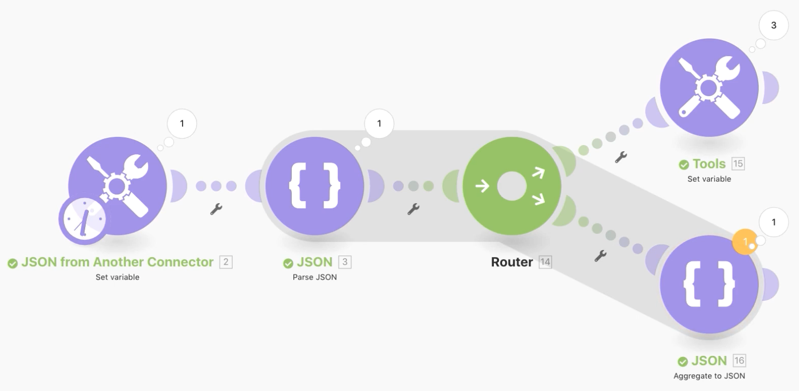
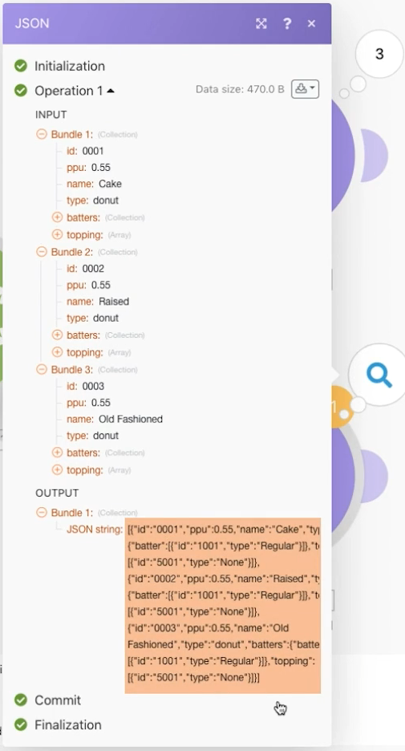

# Werken met JSON

Leer JSON maken en parseren in een scenario dat uw ontwerpbehoeften ondersteunt.

## Overzicht van oefening

Het doel van deze oefening is conceptueel te tonen hoe te om informatie te gebruiken die in een scenario in een formaat JSON wordt verzonden, die het in gebieden en punten parseert die u door uw scenario kunt in kaart brengen. Vervolgens kunt u ofwel informatie van die toegewezen arrays ophalen ofwel de informatie samenvoegen in JSON om vervolgens naar een ander systeem te worden verzonden dat JSON als ontvangende invoer verwacht.

## Te volgen stappen

**Maak een gegevensstructuur en parseer JSON.**

1. Maak een nieuw scenario en noem dit &quot;Werken met JSON-gegevens voor donut&quot;.
1. Gebruik voor de triggermodule de module Variabele instellen.
1. Typ voor de naam van de variabele de tekst &quot;Gegevens donut&quot;.
1. Voor de waarde Variabele kopieert en plakt u de inhoud van het document &quot;_Donut Data - Sample JSON.rtf&quot; in de map Fusion Exercise Files in uw teststation.

   

1. Wijzig de naam van deze module &quot;JSON vanaf een andere connector&quot;.
1. Voeg een Parse JSON-module toe.
1. Klik op Toevoegen voor het veld Gegevensstructuur.
1. Selecteer de Generator en plak de gegevens van de Donut - de Gegevens van de Steekproef JSON die u in het de gegevensgebied van de Steekproef kopieerde.

   

1. Klik op Opslaan en geef de gegevensstructuur de naam &#39;&#39;Gegevens negeren&#39;&#39;. Klik vervolgens op Opslaan.
1. Wijs de gegevens van de Donut van de Vastgestelde veranderlijke module aan het JSON koordgebied toe.

   

1. Sla uw scenario op en klik vervolgens eenmaal op Uitvoeren om de uitvoer weer te geven.

   **De uitvoer van de Parse JSON-module ziet er als volgt uit:**

   

   **Toewijzen aan specifieke arrayvariabelen.**

1. Voeg een router na de Parse JSON module toe.
1. Voeg in het bovenste pad een module voor de variabele Set toe.
1. Typ bij de naam van de variabele &quot;Battertypen per donut&quot;.
1. Voor de waarde van de Variabele, gebruik de kaartfunctie om de partijtypes van de partijserie te krijgen.

   

1. Klik op OK en voer vervolgens één keer uit.
1. Open de uitvoeringscontrole om de outputbundel voor elk van de drie verrichtingen te zien, die de partijtypes voor elk tonen.

   

   **Samengevoegde scenario-gegevens aan JSON.**

1. Voor de lagere verpletterende weg, voeg een Samenvoeging aan module JSON toe.
1. Voor de BronModule, kies iterator-Parse JSON module.
1. Maak of kies een gegevensstructuur voor de gegevensstructuur. In dit voorbeeld gebruikt u Donut-gegevens.
1. Voor dit voorbeeld kunt u de velden direct toewijzen, zoals hieronder wordt weergegeven.
1. Wanneer u naar batter en topping gaat, ziet u dat dit arrays zijn. U moet dus op Item toevoegen klikken om de arrays toe te wijzen.

   

1. Sla het scenario op en klik eenmaal op Uitvoeren.

Bekijk de uitvoeringscontrole voor de module Aggregate to JSON en zie hoe u drie bundels kon samenvoegen tot één JSON-tekenreeks. Vervolgens kunt u deze tekenreeks verzenden naar andere systemen die JSON verwachten.

