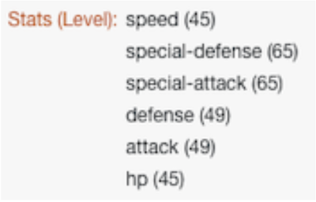

# Routers doorlopen

Gebruik een router om de bundels van Pokemon versus van superhelden onderaan de correcte weg over te gaan, dan creeer een taak voor elk karakter.

## Routers doorlopen

Workfront raadt u aan om de video met een doorlichting te bekijken voordat u probeert de oefening opnieuw te maken in uw eigen omgeving.

>[!VIDEO](https://video.tv.adobe.com/v/335272/?quality=12&learn=on&enablevpops)

## URL&#39;s uitvoeren

* Superhero API-website: `https://www.superheroapi.com/`
* Eerste URL voor oefening: `https://www.superheroapi.com/api/{access-token}/{character-id}/appearance`
* Tweede URL voor oefening: `https://www.superheroapi.com/api/{access-token}/{character-id}/powerstats`

Als u moeite hebt om uw eigen superheldtoken te openen, kunt u dit gedeelde token gebruiken: 10110256647253588. Houd rekening met het aantal keren dat u de superheld-API aanroept, zodat dit gedeelde token voor iedereen blijft werken.

## Items zoeken in het deelvenster Toewijzing

Met het veld Zoeken-items boven aan de deelvensters met toewijzingen kunt u snel velden in het deelvenster zoeken, zelfs als deze in arrays zijn genest. De zoekopdracht is niet hoofdlettergevoelig.

## Tips en trucs voor het werken met API&#39;s

Tot dit punt, hebt u met zeer eenvoudige API (de Interface van de Programmering van de Toepassing) gewerkt die geen extra authentificatie vereist om informatie nodig in het scenario te trekken. Hier volgen enkele tips voor het navigeren met API&#39;s en universele connectors.

## Stap 1: Bepaal het type API

Workfront en veel softwaresystemen zijn gebouwd met behulp van de REST-API (Representational State Transfer), het eenvoudigste en meest standaard type API dat momenteel wordt gebruikt. Er zijn echter een paar andere, zoals:

* SOAP (Simple Object Access Protocol) (Bewijs-API van Workfront is gebaseerd op SOAP)
* FTP (File Transfer Protocol)
* SFTP (Secure File Transfer Protocol)
* Zoek op internet naar API-typen en trefwoorden voor meer informatie.

>[!NOTE]
>
>Wanneer u verbinding maakt met grotere platforms, zoals Salesforce, bieden verschillende onderdelen van die platforms verschillende API&#39;s. Zorg ervoor u juiste voor de dienst vindt u wilt verbinden met.

## Stap 2: Bepaal het type verificatie dat door de API wordt vereist

API-verificatie is een vorm van identificatie die wordt gebruikt om de toegang tot een service te regelen, bijvoorbeeld wanneer u verbinding probeert te maken via Workfront Fusion. Het helpt u aan een ander systeem bewijzen dat u gemachtigd bent om tot het systeem toegang te hebben. OAuth 2 is het gemeenschappelijkste type van authentificatie die vandaag wordt gebruikt. Meer informatie vindt u met een internetzoekopdracht over API-verificatie.

Verificatie kan het moeilijkste aspect zijn van het werken met een API. Een van de meest waardevolle functies van de universele connectors van Workfront Fusion is dat Workfront Fusion verificatie voor u kan afhandelen bij het gebruik van veelgebruikte verificatiemethoden zoals basisverificatie, zoals OAuth 2, API Key en andere. Zodra u een verbinding gebruikend de aangewezen module van de Fusie van Workfront voor uw authentificatiemethode (b.v. OAuth 2) creeert, zal de Fusion van Workfront voortdurend API sleutels en/of tekenen produceren telkens als u uw scenario wilt in werking stellen.

Meer informatie over de verschillende verificatietypen die Workfront biedt, vindt u in het artikel met uitgebreide verificatieoverzichten op Experience League.

## Stap 3: Lees de API-documentatie en zoek de benodigde eindpunten

Wanneer een API met een ander systeem in wisselwerking staat, worden de aanraakpunten van deze mededeling beschouwd als eindpunten. Een eindpunt is de plaats waar APIs verzoeken verzenden en waar het middel leeft.

Wanneer u met een API werkt via een universele aansluiting, moet u begrijpen welke eindpunten door de API worden ondersteund en welke gegevens voor elke aanvraag zijn vereist. API-documentatie moet de eindpunten van een API beschrijven en aangeven hoe algemene bewerkingen zoals maken, lezen, bijwerken of verwijderen moeten worden uitgevoerd. Het uitvoeren van deze vraag vereist één of andere praktijk, vooral als u aan het maken van API vraag of aan het werken met nieuwe API nieuw bent.

Meer informatie over Workfront Fusion Universal Connectors en hoe u deze kunt instellen voor verbinding met de API&#39;s die u nodig hebt op Experience League.

## Slotopmerking

U kunt de volledige lijst van onze vooraf gebouwde appendconnectors in Experience League controleren. Als u een nieuwe app-aansluiting wilt voorstellen aan het Workfront Fusion-productteam, dient u uw idee in bij Innovation Lab. Als u nog niet eerder hebt ingediend, leert u meer over het Innovatielaboratorium, plus hoe u op ideeën kunt stemmen en kunt deelnemen aan de tweemaandelijkse prioriteit van het Leaderboard. Als u reeds toegang tot het laboratorium van Innovatie hebt, login en leg uw ideeën voor.

## Uw beurt

>[!NOTE]
>
>Praktische oefeningen en uitdagingen zijn optioneel en zijn niet nodig om Fusion-training te voltooien.

Deze oefening bouwt op wat u in de analyse leerde, maar de oplossing wordt niet verstrekt.

Maak in de module Meerdere variabelen instellen voor Pokemon-tekens een variabele met de naam &quot;Status (niveau)&quot;. Wijs de naam van de Stats van Pokemon in deze variabele toe. Gebruik de mogelijkheid van de arraywaarde om de weergave van de array te wijzigen, zodat elke status een nieuwe regel is, zoals hieronder wordt weergegeven.

**Hint:** Er zijn slechts zes verschillende verklaringen Pokemon met een overeenkomstig niveau.

**Uitdaging:** zie of kunt u de serieformules gebruiken om de Ababilities te krijgen om de zelfde manier zoals hierboven als verschillende rijen eerder dan een koord van waarden te tonen die door een komma worden gescheiden. Er staat een tip in de schermafbeelding hieronder.

## Meer informatie? We raden het volgende aan:

[ de documentatie van de Fusie van Workfront ](https://experienceleague.adobe.com/nl/docs/workfront-fusion/using/get-started-with-fusion/understand-workfront-fusion/workfront-fusion-overview)
