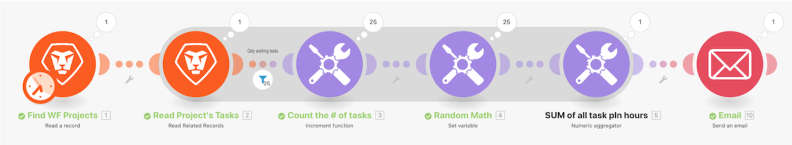

# Samentellinganalyse

## Overzicht

Gebruikend het &quot;Inleiding aan herhaling&quot;scenario u in de laatste analyse bouwde, voegt de geplande uren op elke het werk taak in het project samen en verzendt een e-mail naar zich met die informatie.

## Samentellinganalyse

Workfront raadt u aan om de video met een doorlichting te bekijken voordat u probeert de oefening opnieuw te maken in uw eigen omgeving.

>[!VIDEO](https://video.tv.adobe.com/v/335280/?quality=12)

>[!TIP]
>
>Voor geleidelijke instructies bij de voltooiing van de analyse, ga naar [Samentellinganalyse](https://experienceleague.adobe.com/docs/workfront-learn/tutorials-workfront/fusion/exercises/aggregation.html?lang=en) oefening.

## Meer informatie? We raden het volgende aan:

[Workfront Fusion-documentatie](https://experienceleague.adobe.com/docs/workfront/using/adobe-workfront-fusion/workfront-fusion-2.html?lang=en)
