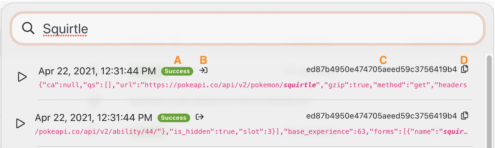

# Analyse van de uitvoeringshistorie

Herzie de uitvoeringsgeschiedenis voor het &quot;Gebruikend het machtige filter&quot;scenario om te begrijpen wat gebeurde toen de uitvoeringen voorkwamen en hoe zij werden gestructureerd toen zij werden in werking gesteld.

## Analyse van de uitvoeringshistorie

Workfront raadt u aan om de video met een doorlichting te bekijken voordat u probeert de oefening opnieuw te maken in uw eigen omgeving.

>[!VIDEO](https://video.tv.adobe.com/v/335283/?quality=12&learn=on)

>[!TIP]
>
>Voor geleidelijke instructies bij de voltooiing van de analyse, ga naar [Analyse van de uitvoeringshistorie](https://experienceleague.adobe.com/docs/workfront-learn/tutorials-workfront/fusion/exercises/execution-history.html?lang=en) oefening.

## Volledige-tekstzoekopdracht op het tabblad Historie

De fullText onderzoek is beschikbaar in het geschiedenislusje van een scenario, toestaand u om naar om het even welke gegevens te zoeken die in het scenario worden verwerkt.

In plaats van elke uitvoering te openen om naar gegevens te zoeken, zoekt Fulltext over alle uitvoeringen binnen één enkel scenario. De zoekresultaten bevatten een lijst met uitvoeringen waarin de gegevens zijn gevonden. U kunt op elke gewenste uitvoering klikken om verder te zoeken.

De zoekresultaten bevatten enkele handige pictogrammen in de onderstaande afbeelding.

A - De status van de uitvoering.

B-Of de gegevens in de input of de output van de module waren waarin het werd gevonden.

C - De uitvoerings-id.

D—Kopieer de uitvoerings-id.

Wanneer u op een uitvoering klikt, laadt Workfront Fusion de uitvoering en de module waarin het zoekresultaat is gevonden. En het opent de uitvoeringsinspecteur op de module die de onderzoeksgegevens bevat.

## Meer informatie? We raden het volgende aan:

[Workfront Fusion-documentatie](https://experienceleague.adobe.com/docs/workfront/using/adobe-workfront-fusion/workfront-fusion-2.html?lang=en)
