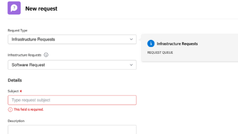

# Workfront Tutorials {#overview}

Een bibliotheek met trainingsvideo&#39;s en artikelen die zijn ontworpen om u te helpen de functies en instellingen van Workfront beter te begrijpen.  Hieronder vindt u een verzameling van best practices, gekrulde oefeningen en andere bronnen die u en uw organisatie helpen om met Workfront succesvol te zijn.

>[!VIDEO](https://video.tv.adobe.com/v/335063/?quality=12)

<!-- 

This is the landing page of the user guide. It should be the first list item in the TOC.md file. 
See other user landing pages to get ideas. 

-->

## Wat is nieuw?

Bekijk de nieuwste updates van de zelfstudies voor elke Workfront-productrelease. Dit is wat met de recentste versie werd bijgewerkt:

* In de bovenste navigatie op Workfront is het pictogram voor favorieten en curven gescheiden. Een korte samenvatting van elk kan in <a href="/help/manage-work/projects/find-projects.md">Projecten zoeken</a> zelfstudie.

* Een aangepast formulier configureren om met meerdere objecttypen te werken. Zie hoe in <a href="/help/custom-data/custom-forms/custom-forms-creating-and-sharing-a-custom-form.md">een aangepast formulier maken en delen</a> zelfstudie.

## Personeelsselectie

<table>
  <tr>
   <td>
      
      

         <a href="/help/administration-and-setup/layout-templates/find-layout-templates.md"><strong>Lay-outsjablonen zoeken en maken</strong></a>
<!----          <em>foo</em> --->
      

      

         
         Leer hoe u een standaardlay-outsjabloon maakt.
      

    </td>
   <td>
      
      

         <a href="/help/manage-work/issues-requests/make-a-request.md"><strong>Een aanvraag indienen</strong></a>
<!----          <em>foo</em> --->
      

      

       
         Leer hoe u aanvragen maakt, weergeeft en bewerkt.
      

<td>
      
      

         <a href="/help/reporting/basic-reporting/create-a-simple-report.md"><strong>Een eenvoudig rapport maken</strong></a>
<!----          <em>foo</em> --->
      

      

         
         Leer hoe u een eenvoudig aangepast rapport maakt.
      

    </td>
  </tr>
</table>

