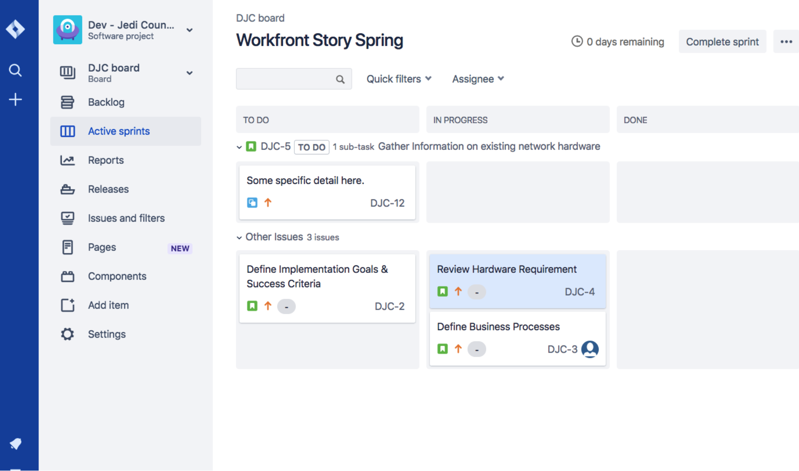
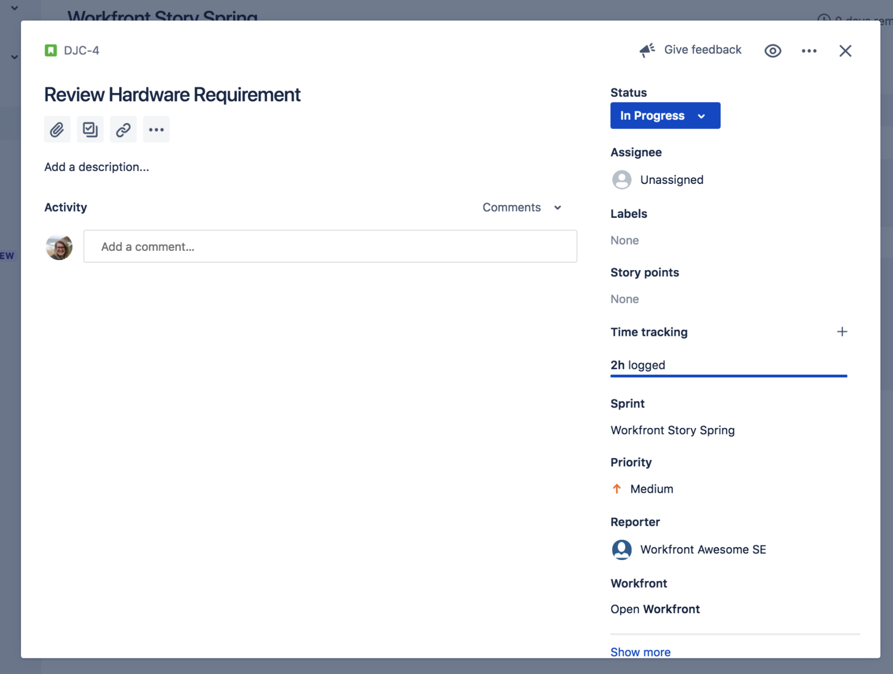

# Zichtbaarheid maken met de [!DNL Jira] -integratie

[!DNL Jira] is een product dat wordt gebruikt om projecten en kwesties voor ontwikkelings en technische steunteams te volgen. Hoewel veel teams Jira gebruiken om de voortgang op taakniveau bij te houden, gebruiken ze [!DNL Workfront] om waar het projectbeheer toe te passen, omdat ze een voortgangsweergave op hoog niveau kunnen krijgen. Met de native integratie van [!DNL Jira] kan deze informatie automatisch worden overgedragen tussen de twee toepassingen.

## Wat is [!DNL Jira] ?

[!DNL Jira] is een product dat door [!DNL Atlassian] wordt gecreeerd om projecten en kwesties voor ontwikkelings en technische steunteams te volgen. Veel teams gebruiken [!DNL Jira] om de voortgang op taakniveau bij te houden, maar gebruiken [!DNL Workfront] ook om projecten te beheren. Dit betekent dat teams hun inspanningen verdubbelen door taken te maken in [!DNL Workfront] en [!DNL Jira] . Maar met de [!DNL Jira] native integratie kan dat soort informatie automatisch worden overgedragen tussen de twee toepassingen.

## Hoe kan ik Adobe Workfront voor Jira installeren?

Ga naar [&#x200B; Adobe Workfront voor Jira &#x200B;](https://experienceleague.adobe.com/docs/workfront/using/adobe-workfront-integrations/workfront-for-jira/workfront-for-jira.html?lang=nl-NL) leren hoe te om Adobe Workfront voor Jira te installeren en te vormen.

## Wat kan een [!DNL Jira] integratie doen?

Hier ziet u een sprint in [!DNL Workfront] met de naam &quot;[!DNL Workfront] Story Spring.&quot;

Joan Harris, het team van de Raad van ministers van Buitenlandse Zaken van Dev-Jedi, gebruikt het rumbord en het burndown-diagram als een manier om de vooruitgang van de algemene sprint te meten. Het geeft het team een mooie visuele weergave van wat er gaande is. Bovendien levert deze informatie een uitvoerend rapport op dat elk kwartaal wordt herzien. Het grootste deel van het team werkt echter bij in [!DNL Jira] , niet in [!DNL Workfront] .

Het team van Joan gebruikt [!DNL Jira] al jaren en vindt het een goede manier voor hen om individuele taken en/of insecten te volgen die zij aan het werk zijn toegewezen. Maar Joan heeft die informatie echt nodig om met [!DNL Workfront] te verbinden en, uiteindelijk, die uitvoerende rapporten te voeren.

Door de [!DNL Jira] native integratie kunnen updates van taken, artikelen of bugs automatisch de taken, artikelen en/of problemen in [!DNL Workfront] bijwerken.

Dus wanneer het teamlid dat is toegewezen aan het artikel Hardware-eis controleren een update uitvoert naar de status in [!DNL Jira] en deze vervolgens verplaatst van &quot;Nieuw&quot; naar &quot;Bezig&quot;, wordt de status van het artikel ook automatisch gewijzigd in [!DNL Workfront] .

