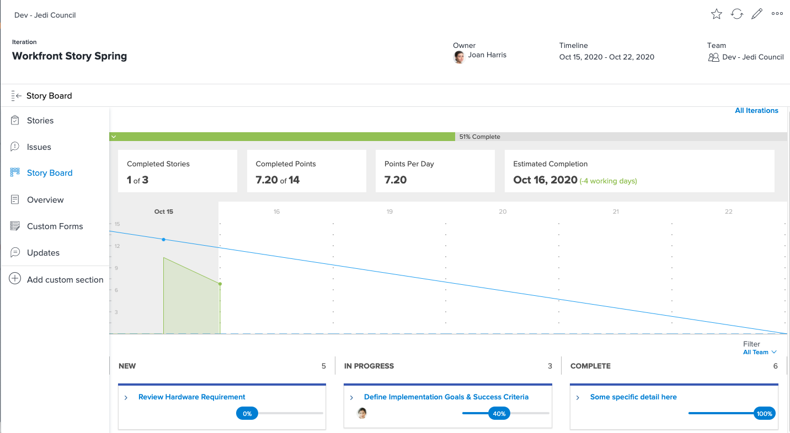

# Zichtbaarheid maken met de [!DNL Jira] Integratie

[!DNL Jira]  is een product dat wordt gebruikt om projecten en kwesties voor ontwikkelings en technische steunteams te volgen. Hoewel veel teams Jira gebruiken om de voortgang op taakniveau bij te houden, gebruiken ze [!DNL Workfront] om waar projectbeheer te doen omdat zij een high-level vooruitgangsmening kunnen krijgen. Met de [!DNL Jira]  native integratie, kan deze informatie automatisch worden overgedragen tussen de twee toepassingen.

## Wat is [!DNL Jira] ?

[!DNL Jira]  is een product dat is gemaakt door [!DNL Atlassian] projecten en kwesties voor ontwikkelings- en technische ondersteuningsteams volgen. Veel teams gebruiken [!DNL Jira]  om de vooruitgang op taakniveau te volgen, maar zij gebruiken ook [!DNL Workfront] projecten te beheren. Dit betekent dat teams hun inspanningen verdubbelen door taken te maken in zowel [!DNL Workfront] en [!DNL Jira] . Toch met de [!DNL Jira]  native integratie, kan dat soort informatie automatisch worden overgedragen tussen de twee toepassingen.

## Hoe kan ik Adobe Workfront voor Jira installeren?

Ga naar [Adobe Workfront voor Jira](https://experienceleague.adobe.com/docs/workfront/using/adobe-workfront-integrations/workfront-for-jira/workfront-for-jira.html?lang=en) voor meer informatie over het installeren en configureren van Adobe Workfront for Jira.

## Wat kan een [!DNL Jira]  integratie doet dat?

Hier hebben we een sprint [!DNL Workfront] getiteld &quot;[!DNL Workfront] Story Spring.&quot;

Joan Harris, het team van de Raad van ministers van Buitenlandse Zaken van Dev-Jedi, gebruikt het rumbord en het burndown-diagram als een manier om de vooruitgang van de algemene sprint te meten. Het geeft het team een mooie visuele weergave van wat er gaande is. Bovendien levert deze informatie een uitvoerend rapport op dat elk kwartaal wordt herzien. Het grootste deel van het team maakt echter updates beschikbaar in [!DNL Jira] , niet [!DNL Workfront].

Joan&#39;s team heeft [!DNL Jira]  en vinden het een goede manier voor hen om individuele taken en/of insecten te volgen die zij aan het werk zijn toegewezen. Maar Joan heeft echt die informatie nodig om met te verbinden [!DNL Workfront] en tenslotte de uitvoerende verslagen te voeden.

Via de [!DNL Jira]  native integratie, kunnen updates van taken, artikelen of bugs automatisch de taken, artikelen en/of problemen bijwerken in [!DNL Workfront].

Dus wanneer het teamlid dat is toegewezen aan het artikel Hardware-eis controleren een update uitvoert naar de status in [!DNL Jira] Als u het artikel verplaatst van &quot;Nieuw&quot; naar &quot;Bezig&quot;, wordt de status van het artikel in [!DNL Workfront] ook.

