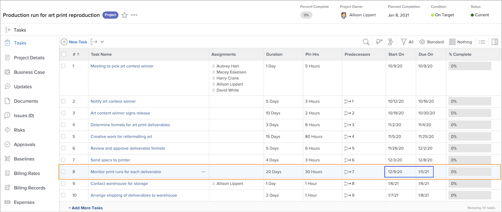
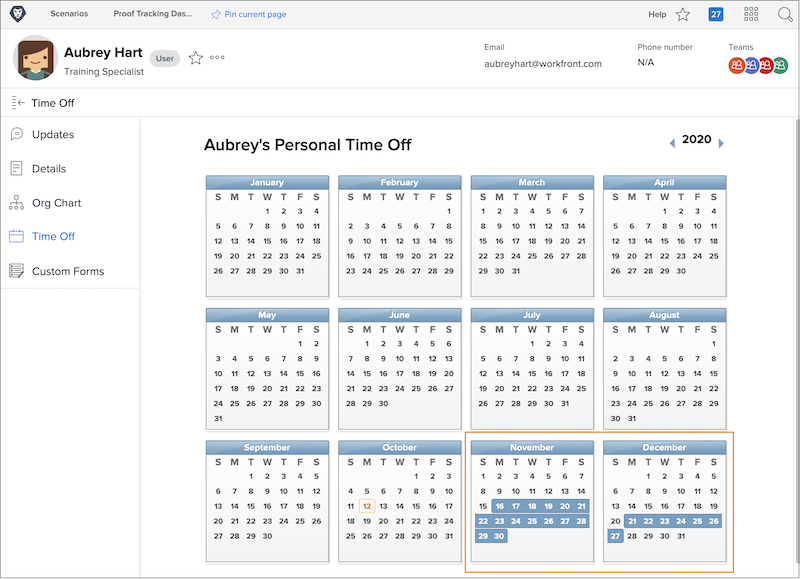

# Hoe tijd van invloed is op projecttijdlijnen

Of de tijd van factoren van een toegewezen gebruiker in de projectchronologie afhangt van een project het plaatsen genoemd [!UICONTROL User Time Off]. Deze instelling bepaalt of de tijd voor de primaire taakontvanger de geplande datums voor die taak voor het project aanpast.

Kijk wat met een projectchronologie gebeurt wanneer elk van de montages wordt geselecteerd-C [!UICONTROL onsider user time off in task durations] of [!UICONTROL Ignore user time off in task durations].

## Overweeg de gebruikerstijd in taakduur

Dit is de standaardinstelling van Workfront.

In dit voorbeeld heeft de primaire ontvanger voor de taak dagen vrij gemarkeerd op hun persoonlijke kalender.

De projectmanager wil deze persoon aan een taak toewijzen die data heeft gepland die de tijd van de gebruiker weg overlappen.

Wanneer deze gebruiker aan de taak wordt toegewezen, passen de geplande data automatisch aan. De geplande voltooiingsdatum van de taak is nu enkele dagen verlengd om rekening te houden met de tijd van de gebruiker. Het is belangrijk om op te merken dat deze wijziging van invloed kan zijn op de geplande data van andere taken in het project en mogelijk op de geplande afsluitdatum van het project.

## [!UICONTROL Ignore user time off in task durations]

Met deze optie blijven de geplande data van de taak zoals oorspronkelijk gepland, ook al heeft de primaire ontvanger tijdens de duur van die taak geen tijd meer.

Het teamlid heeft dagen vrij gemarkeerd op zijn kalender.

De projectmanager wijst hen een taak toe die de tijd weg overlapt. Zodra de gebruiker wordt toegewezen, blijven de taak geplande data zoals oorspronkelijk gepland.

 aan

Om ervoor te zorgen dat het werk op tijd wordt gedaan, zou het nuttig kunnen zijn om een andere persoon toe te wijzen die aan de taak kan werken terwijl de oorspronkelijke ontvanger uit het bureau is.

## Pas het plaatsen op het projectniveau aan

U wijzigt als volgt de instelling voor de tijd van de gebruiker bij een project:

* Open het project door op de naam ervan te klikken in Workfront.

* Selecteer [!UICONTROL Edit] in het menu met drie punten in de paginakoptekst rechts van de projectnaam.

* Blader naar de sectie [!UICONTROL Project Settings] en zoek het veld [!UICONTROL User Time Off] .

* Selecteer de optie u op dit project wilt toepassen - [!UICONTROL Consider user time off in task durations] of I [!UICONTROL gnore user time off in task durations].

* Klik op de knop [!UICONTROL Save] in de rechterbovenhoek van het venster.

**Nota**: Dit het plaatsen is niet beschikbaar wanneer u [!UICONTROL Project Details] van het linkerpaneelmenu van de projectpagina selecteert.

Een algemene instelling hiervoor staat in de projectvoorkeuren in het menu [!UICONTROL Setup] . Deze instelling wordt beheerd door uw systeembeheerder. Groepbeheerders kunnen deze instelling mogelijk aanpassen voor de groepen die ze beheren.

Workfront raadt u aan deze instelling in te stellen op de manier waarop u wilt dat de meeste projecten binnen uw organisatie tijd kunnen afhandelen.

Het plaatsen kan ook in projectmalplaatjes, door de malplaatjedetails worden gebouwd.
