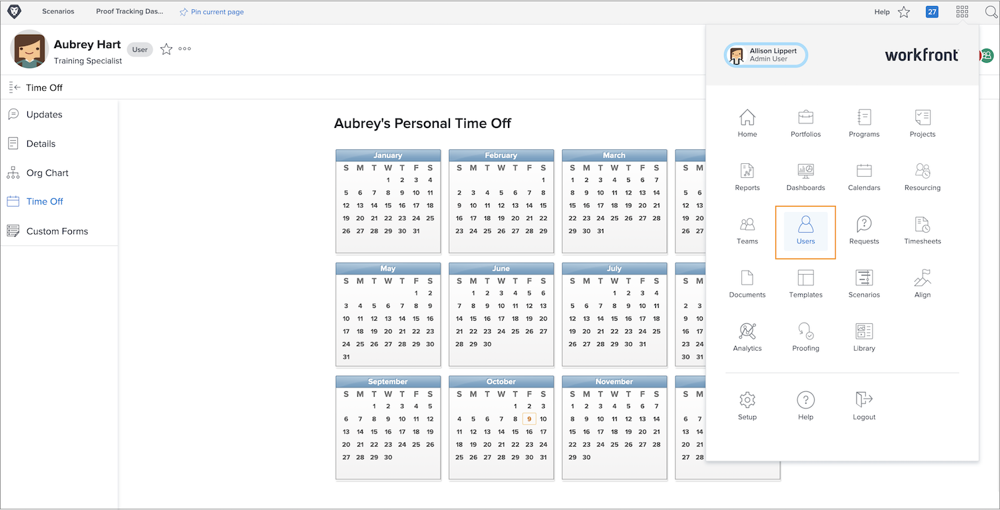

# De tijd van andere gebruikers beheren uitgeschakeld

Managers of andere leiders kunnen de time-off kalenders van hun teamleden beheren als zij de toestemmingen van de Gebruiker van de Edit hebben die door hun Workfront toegangsniveau worden toegewezen. Toegangsniveaus worden gemaakt en toegewezen door Workfront-systeembeheerders.

Workfront raadt aan dat uw organisatie een beleid of procedure heeft voor het geval dat een manager de persoonlijke tijd van een werknemer van kalender bijwerkt.

De kalender van een andere gebruiker beheren:

* Klik op [!UICONTROL Main Menu] en selecteer Gebruikers.

* Gebruik het zoekpictogram om de gebruiker te zoeken of door de lijst te bladeren.

* Klik op de naam van de gebruiker in de lijst.

* Klik op [!UICONTROL Time Off] in het menu van het linkerdeelvenster op de profielpagina van de gebruiker.

* Klik op een datum in de kalender.

* Workfront gaat uit van een volledige dag. Als dat het geval is, gaat u verder en klikt u op de knop [!UICONTROL Save] .

* Voor meerdere opeenvolgende dagen korting wijzigt u de datum Tot in de laatste dag van het kantoor. Klik op [!UICONTROL Save] .

* Schakel het selectievakje [!UICONTROL All Day] uit als u een gedeeltelijke dag wilt markeren. Geef vervolgens de uren op waarop de gebruiker die dag zal werken (de uren dat deze beschikbaar zijn). Klik op [!UICONTROL Save] .
