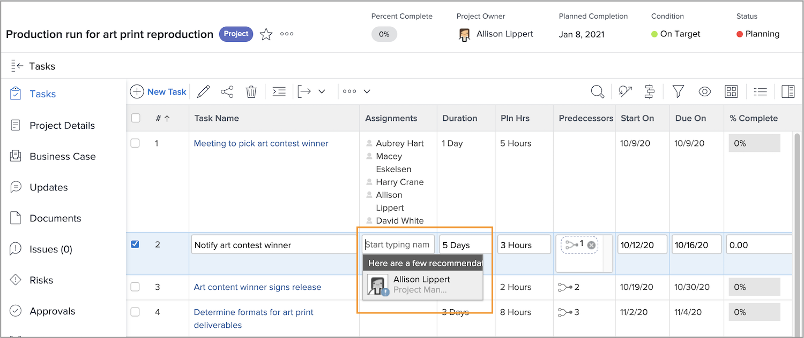

# Ontdek de tijd bij het toewijzen van taken

Een klein pictogram geeft aan dat een gebruiker tijdens de duur van de taak tijd vrij op zijn persoonlijke agenda heeft wanneer u gebruikers toewijst.

Wanneer u vanuit het projectplan een gebruiker een naam geeft, ziet u de naam grijs en een blauw waarschuwingspictogram naast de avatarafbeelding.

Als u via de koptekst van de taakpagina toewijst, ziet u een klein blauw vliegtuigpictogram naast de avatar van de persoon om u te waarschuwen dat deze tijdens de duur van deze taak geen tijd meer heeft.

