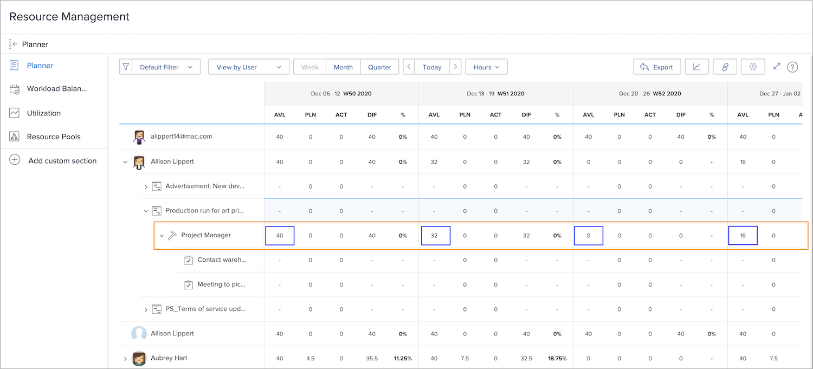

# Zichtbaarheid in hulpmiddelen voor middelenbeheer

Kennis van wie beschikbaar is en wanneer essentieel is voor de planning en het beheer van bronnen. Wanneer gebruikers hun persoonlijke tijd in de kalender in Workfront merken, kan die informatie ook in de middelhulpmiddelen van Workfront worden gezien.

## Resourceplanner

De tijd van een gebruiker weg wordt weerspiegeld in Beschikbare (AVL) kolom in de middelplanner. Workfront trekt de tijd van gemarkeerd op hun kalender van de beschikbare tijd af, zoals berekend door Workfront op basis van toegewezen planning, taakrolpercentage, enz.

## Werklastverdeling

In de werklastbalans wordt de tijd uit weergegeven als grijze balken in de kalender. Deze zichtbaarheid helpt bronnenbeheerders en anderen om beter geïnformeerde beslissingen te nemen bij het toewijzen van werk.

De time-off-indicator belet echter niet dat het werk aan de gebruiker wordt toegewezen via Workload Balancer. Als het werk wordt toegewezen, toont de Balancer van de Werklast de persoon over-toegewezen tijdens de tijd van periode is.

