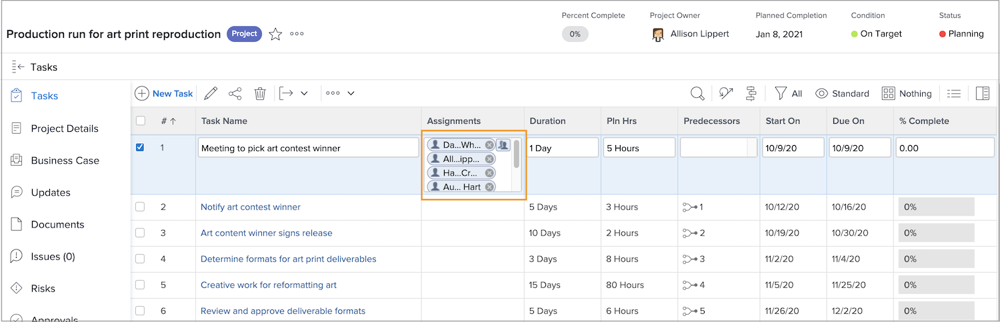
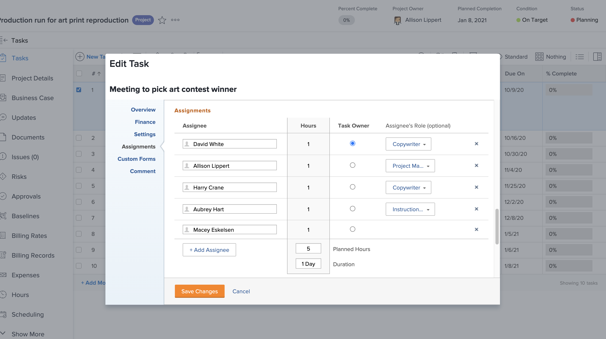

# Wat is een primaire ontvanger?

Een primaire toegewezen persoon bestaat wanneer twee of meer gebruikers aan een taak zijn toegewezen. De tijd van de agenda van de primaire ontvanger is wat Workfront bekijkt wanneer het toepassen van de Gebruikerstijd van het plaatsen.

Kom te weten wie de primaire ontvanger van de projectpagina is. Klik in het veld Toewijzingen en klik vervolgens op het pictogram Geavanceerde toewijzingen in de hoek.

In het Geavanceerde venster van Toewijzingen, wordt de primaire ontvanger, of de taakeigenaar, aangewezen met een groen controleteken. Houd de muisaanwijzer boven een andere gebruiker en klik op de koppeling Primair maken om de eigenaar van de taak te wijzigen.

U kunt de primaire toegewezen persoon ook aanpassen vanaf de taakpagina. Controleer de doos op de taak in de projectlijst, dan klik het Edit pictogram. Blader naar de sectie Toewijzingen en klik op de knop om de eigenaar van de taak aan te wijzen.

