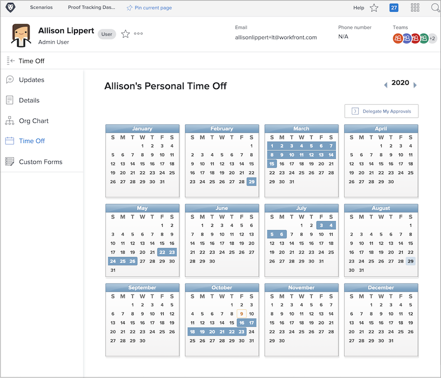

# Waarom de tijd van de kalender gebruiken?

Wanneer planners en projectmanagers taken in Workfront toewijzen, draagt het weten van welke teamleden beschikbaar zijn om toegewezen werk te voltooien bij aan projectvoltooiing op tijd.

Nauwkeurige beschikbaarheidsgegevens spelen ook in huidige en toekomstige het werkplanning als heroverzicht van middelmanagers toewijzing in het middelplanning en beheersinstrumenten van Workfront.

Gebruikers van Workfront Work and Plan-licenties kunnen de persoonlijke tijd van de kalender gebruiken om aan te geven wanneer ze niet beschikbaar zijn tijdens de normale werktijden. Zelfs een halve dag korting zou van invloed kunnen zijn op de uitvoering van de taken die aan hen zijn toegewezen.

**Opmerking**: Workfront is niet ontworpen om de bestaande systemen van uw organisatie voor het beheren van, het oplopen van of het volgen van persoonlijke tijd uit te repliceren of te vervangen. Volg de richtlijnen van uw organisatie voor het vragen van en het beheren van tijd weg.

## Uw tijd uit markeren

Je persoonlijke tijd van de agenda staat op je gebruikerspagina in Workfront, die je kunt openen via het hoofdmenu. Klik in de linkerhoek op uw naam.

* Klik op Tijd uit in het menu van het linkerdeelvenster op de gebruikerspagina in Workfront.

* Standaard wordt het huidige jaar weergegeven. Gebruik indien nodig de pijlen om een ander jaar te selecteren (rechtsboven in het kalendervenster).

* Klik op een datum in de kalender.

* Workfront gaat ervan uit dat u de hele dag van start gaat. Als dat het geval is, gaat u verder en klikt u op Opslaan.

* Als u opeenvolgende volledige dagen afsluit, wijzigt u de datum Tot in de laatste dag van het kantoor. Klik op de knop Opslaan.

* Als u de hele dag niet afhaalt, schakelt u het vakje Alle dag uit. Geef vervolgens de uren aan waarop u die dag zult werken (de uren die u beschikbaar hebt). Klik op de knop Opslaan.

De tijd uit wordt aangegeven met blauwe vakken op de kalender. Deze keer verschijnt ook op andere plaatsen in Workfront om te helpen met project en middelplanning.

**Pro-tip**: Als een taak al aan u is toegewezen, markeert u de tijd van de kalender. Er wordt dan geen melding verzonden naar de projectmanager om deze te laten weten dat u niet beschikbaar zult zijn. Vergeet niet de projectmanager bij te werken met nieuwe tijd die van invloed kan zijn op de huidige projecten of het werk dat u hebt toegewezen.
