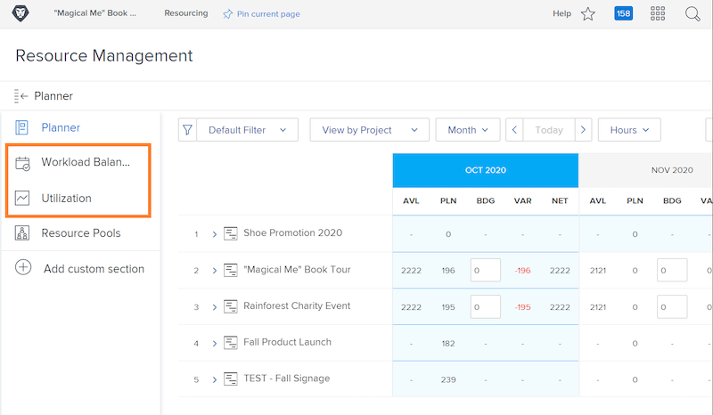

# Instellingen voor hulpbronnenbeheer, werklastverdeling en gebruiksrapport

[!DNL Workfront] biedt gegevens aan over meerdere gereedschappen in [!DNL Workfront], zodat u eenvoudiger kunt beslissen over uw bronnen en uw processen vloeiender verlopen. Om te zien wat er gebeurt met uw middelen, zou u uw managers, uw gebruikers, en uw projecten moeten ervoor zorgen behoorlijk worden gevormd. Deze configuraties zijn nuttig zelfs als u niet bij het gebruiken van elk van [!DNL Workfront's] hulpmiddelen voor resourcebeheer.

In deze sectie leert u:

* Hoe te opstellings middelmanagers met de juiste toegang
* Hoe te om het rapport van de Balancer en van het gebruik van de Werkbelasting te bekijken

## Instellingen voor beheer van bronnen

Laten we beginnen met ervoor te zorgen dat de juiste mensen toegang hebben tot en de middelen van uw organisatie kunnen beheren.

&lt;!Download the guide for step-by-step instructions.&gt;

## Werklastbalans en gebruiksrapport

Samen met de Planner van het Middel en de Pools van het Middel, hebben de gebruikers toegang tot extra hulpmiddelen zoals de Balancer van de Werkbelasting en het gebruiksrapport wanneer gegeven geef toestemming op het toegangsniveau uit.

Er is geen andere instelling nodig voor toegang tot of beheer van bronnen via deze gereedschappen.

