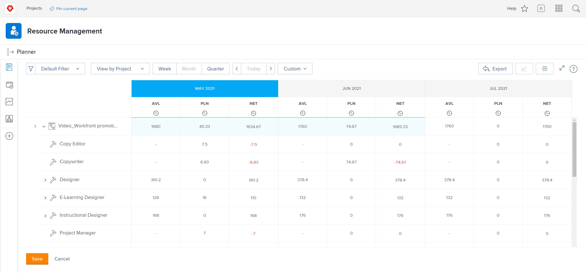

# Weergeven op taakrol in de [!DNL Resource Planner]

In deze video zult u:

* Zie [!UICONTROL View by Job Role] weergave
* Leer hoe de middelinformatie in deze mening wordt getoond

>[!VIDEO](https://video.tv.adobe.com/v/335169/?quality=12&learn=on&enablevpops=1)

Voor de Mening door de optie van de Rol van de Baan, is het gebrek om de Begroeide kolom te tonen, die het geschatte aantal middelen nodig voor een project van een bedrijfscase trekt, als het is ingevuld. Dit betekent ook de Netto kolom is, door gebrek, gebruikend de aantallen van de Beoogde kolom om u te vertellen hoeveel middelen worden verlaten.

Het is echter mogelijk dat uw organisatie geen gebruik maakt van zakelijke gevallen of deze kan gebruiken om deze bedragen te schatten. In plaats daarvan gebruikt u de geplande uren die al voor een project zijn ingevoerd. Via de optie Aanpassen kunt u kiezen welke kolommen in de gekozen weergave worden weergegeven en hoe u de kolom Net wilt berekenen.

Om de kolommen te veranderen die verschijnen en de Netto kolomberekening zodat is het gebaseerd op geplande uren:

* Klik op het vervolgkeuzemenu Uren en selecteer Aanpassen.

* In het Customize getoonde metriekvakje, bepaal welke kolommen verschijnen en controleer het vakje naast Geplande (PLN) waarden van het Gebruik in NETTO berekeningen.

**Nota**: U kunt de kolommen en de berekeningen voor de verschillende meningstypes in de Planner van het Middel uitgeven door een optie op de linkerkant van de doos te selecteren.

* Nadat u op Opslaan hebt geklikt, wordt het vak gesloten en wordt het scherm vernieuwd.

De Planner van het Middel toont wat u over uw vraag en aanbod zonder complexe spreadsheets en round-robin mededeling moet weten.

Met de informatie en de hulpmiddelen bij uw bevel, kunt u de capaciteit van uw team verfijnen om het werk uit te voeren dat voor u belangrijk is.
